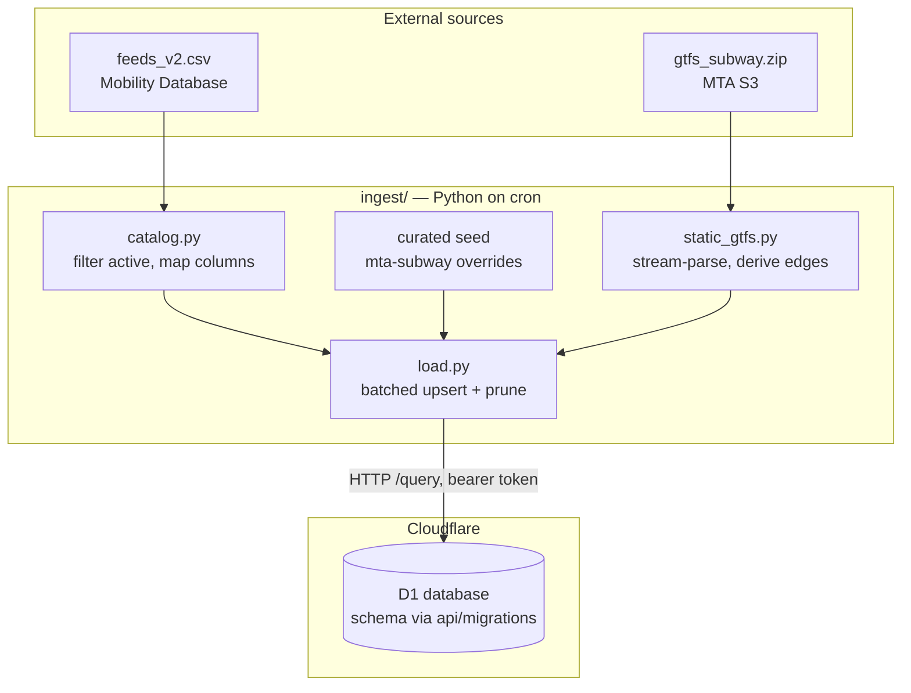

# feat: Phase 1 — data model and ingest

## Summary

Create the D1 schema (owned by the `api/` Worker project via wrangler migrations) and the Python ingest package that seeds the feeds catalog from the Mobility Database CSV, parses MTA subway static GTFS, and loads results into D1 over the HTTP API. Runnable on cron on the opti box; cron installation itself is a later step.

## Problem Frame

Everything downstream (feed DOs, the read API, the device) reads from D1. Phase 1 per `docs/plans/01-guiding-spec.md` builds that foundation: the full schema with `feed_id` discipline from day one, and an ingest job that runs outside the Worker because the trips×stop_times join is too heavy for one. The spec's "verify, don't assume" items (catalog CSV URL/schema, MTA URLs) are resolved — see Sources.

---

## Requirements

**Schema**

- R1. A wrangler D1 migration creates all tables from the spec — `feeds`, `stops`, `routes`, `stop_routes`, `users`, `sessions`, `devices`, `favorites`, `origins`, `locate_log`, `walk_times` — plus `idx_stops_bbox` and the `ingest_lock` coordination table, applied cleanly to local and remote D1.
- R2. Nothing assumes a single agency: every transit table keys on `feed_id`; route colors come from feed data with no hardcoded palette.

**Catalog**

- R3. Catalog ingest seeds `feeds` from the full active Mobility Database catalog (~2,800 active static-GTFS rows; the earlier ~4,500 estimate counted RT rows), carrying bounding boxes, license URLs, and status.
- R4. A curated seed defines the v1 `mta-subway` feed row (adapter `nyct`, current static + RT URLs), applied after catalog rows so curated values win.

**Static GTFS**

- R5. Static ingest for MTA subway produces `stops` (stations and platforms with `parent_station`), `routes` (GTFS `route_color`/`route_text_color` stored in the schema's `color`/`text_color`), and `stop_routes` edges derived from the trips×stop_times join.

**Operations**

- R6. Re-running any ingest step is idempotent: same input produces the same D1 state, no duplicates, and rows absent from the source are pruned.
- R7. `.env.example` documents every required and optional variable; `README.md` lets an outside user go from clone to loaded D1 database; both ship in this phase along with the MIT `LICENSE`.

---

## Key Technical Decisions

- **D1 writes go through the HTTP `/query` endpoint** with batched, parameterized statements from Python. Needs only an API token on the opti box — no Node toolchain. The `/import` endpoint blocks the database and is built for one-shot restores; a Worker write-path is Phase 2+ territory. Whether the REST endpoint accepts multiple parameterized statements per request is undocumented — verify empirically at the start of U2; a full run is several hundred statements either way, so the client paces itself under the token-wide 1,200 req/5 min limit regardless.
- **Schema lives in `api/` as wrangler migrations** (`wrangler.jsonc`, wrangler v4, `api/migrations/0000_initial_schema.sql`). The Worker project owns the database it will later serve; the ingest job is a client, not the schema owner.
- **Schema hardening beyond the spec's verbatim DDL** (the retrofit-hostile items — SQLite can't add constraints later without a table rebuild):
  - `NOT NULL` on every primary-key column. SQLite's documented quirk: non-INTEGER PKs accept NULLs, NULLs compare distinct, and `ON CONFLICT` upserts never fire on them — a malformed row would become an unmergeable, un-prunable duplicate.
  - Account tables (`sessions`, `devices`, `favorites`, `origins`, `walk_times`, `locate_log`) declare FKs to `users` with `ON DELETE CASCADE` now (`devices.user_id` nullable until paired; `walk_times` also cascades from `favorites`/`origins`). Declaring is free in 0000; adding later means rebuilding six populated tables, and the spec's account-deletion acceptance criterion becomes one atomic `DELETE` instead of a seven-statement application cascade that can strand `locate_log` PII. Consequence for Phase 5: `AUTH_MODE=single`'s synthetic user must exist as a real `users` row.
  - Transit tables (`stops`, `routes`, `stop_routes`) get **no** FKs — deliberate: both sides derive from the same parse, load ordering maintains consistency, and FK enforcement (on by default in D1) would make every ingest ordering choice load-bearing.
  - Column-name authority: the DDL's `routes.color` / `text_color` is authoritative; GTFS source fields `route_color`/`route_text_color` map onto them. (The spec's prose and DDL disagree; pinning here prevents migration and ingest from diverging.)
- **No transactions over the HTTP API, so idempotency is the safety mechanism:** every load is `INSERT ... ON CONFLICT DO UPDATE` keyed on natural PKs (index-backed conflict targets), with all upserts for a table completing before any prune begins. Prune is **select-diff-delete**: SELECT existing keys for the scope, diff against the keep-set in Python, `DELETE ... IN (<chunk>)` over the delete-set. Chunked `IN` on a delete-set is safe; chunked `NOT IN` on a keep-set is a mass delete and is forbidden. Prune refuses an empty keep-set and aborts when it would delete more than a sanity threshold of scoped rows without `--force` — a truncated source download becomes a loud no-op, not a wipe.
- **stdlib `csv` streaming, no pandas.** Pass 1 builds `trip_id → route_id` from `trips.txt`; pass 2 streams `stop_times.txt` accumulating `stop_id → {route_id}`. Regular feed (~563K rows) parses in seconds on the opti box; read directly from the zip via `zipfile`.
- **Regular feed, not supplemented.** `gtfs_subway.zip` (5 MB) fully covers stops/routes/edges; the supplemented feed (2.3M stop_times rows) adds service-change trips that matter for RT, not for topology.
- **Catalog mapping:** only `data_type=gtfs` rows with `status=active` become `feeds` rows; `gtfs_rt` rows attach via `static_reference` (`entity_type` containing `tu` → `rt_trip_url`, `sa` → `rt_alert_url`); `rt_needs_key` from `urls.authentication_type != 0`; adapter defaults to `gtfs_rt`.
- **Curated seed keeps friendly ids and suppresses catalog duplicates.** The curated `mta-subway` row keeps its stable human-readable id (favorites will reference it in Phase 5), and the seed carries a suppression list of MDB ids covering the same system — those catalog rows get a non-active `status` after load, so proximity queries never return two subway feeds. Plain last-write-wins can't work here: MDB rows are keyed `mdb-*`, so a curated row under its own id would otherwise coexist with the catalog's NYC row forever.
- **GBFS is absent from `feeds_v2.csv`** (verified 2026-08-02). Citi Bike enters later via the curated seed, not the catalog. No Phase 1 work needed beyond the seed mechanism existing.
- **Python tooling:** `uv`-managed `pyproject.toml`, runtime dependency `requests` only, `pytest` for tests, console entry point `gtfs-compass-ingest` with subcommands (`catalog`, `static <feed_id>`, `all`).

---

## High-Level Technical Design



Directional guidance, not implementation specification.

---

## Output Structure

```
gtfs-compass/
├── LICENSE
├── README.md
├── .env.example
├── .gitignore
├── api/
│   ├── package.json            # wrangler devDependency
│   ├── wrangler.jsonc          # D1 binding
│   └── migrations/
│       └── 0000_initial_schema.sql
└── ingest/
    ├── pyproject.toml
    ├── src/gtfs_compass_ingest/
    │   ├── __init__.py
    │   ├── __main__.py         # CLI entry
    │   ├── catalog.py
    │   ├── static_gtfs.py
    │   ├── load.py             # D1 HTTP client + batching
    │   └── seeds.py            # curated v1 feed rows
    └── tests/
```

Scope declaration, not a constraint — per-unit file lists are authoritative.

---

## Implementation Units

### U1. api/ scaffold and initial schema migration

- **Goal:** The D1 database exists, schema applied, owned by the Worker project.
- **Requirements:** R1, R2
- **Dependencies:** none
- **Files:** `api/wrangler.jsonc`, `api/package.json`, `api/migrations/0000_initial_schema.sql`, `api/.gitignore`
- **Approach:** wrangler v4, `wrangler.jsonc` with the `d1_databases` binding and a current `compatibility_date`. Migration transcribes the spec's SQL with the hardening from the schema KTD: `NOT NULL` on all PK columns, account-table FKs with `ON DELETE CASCADE` (`devices.user_id` nullable until paired), no FKs on transit tables, `routes.color`/`text_color` as the authoritative column names. All eleven tables + `idx_stops_bbox`, plus a one-row `ingest_lock` table (holder, expiry) backing the U5 cross-host run lock. Database created once with `wrangler d1 create`; the resulting `database_id` goes in `wrangler.jsonc`. No Worker source yet — `main` is omitted until Phase 2.
- **Test scenarios:** Test expectation: none — pure config and DDL; verification is applying the migration.
- **Verification:** `wrangler d1 migrations apply` succeeds against `--local` and `--remote`; `.tables` on local D1 shows all twelve tables; re-applying is a no-op.

### U2. Ingest package scaffold and D1 client

- **Goal:** Installable Python package with a working D1 HTTP client and CLI skeleton.
- **Requirements:** R6 (client-level idempotency primitives)
- **Dependencies:** U1
- **Files:** `ingest/pyproject.toml`, `ingest/src/gtfs_compass_ingest/{__init__,__main__,load}.py`, `ingest/tests/test_load.py`, `ingest/tests/test_schema_sync.py`
- **Approach:** `load.py` wraps the `/query` endpoint: bearer auth from env (`CLOUDFLARE_ACCOUNT_ID`, `CLOUDFLARE_D1_DATABASE_ID`, `CLOUDFLARE_API_TOKEN`), chunks rows into parameterized multi-row upserts respecting the 100-bindings/100 KB statement limits, retries on 429/5xx with backoff, paces requests, raises on partial failure. First task: empirically verify whether `/query` accepts multiple parameterized statements per request, and shape batching accordingly. Generic surface: `upsert(table, columns, pk_columns, rows)` + `prune(table, scope_where, keep_keys)` implementing select-diff-delete per the idempotency KTD, with the empty-keep-set refusal and deletion-threshold guard. Composite keys (e.g. `stop_routes`' three-column PK) prune via row-value `IN (VALUES ...)` chunks. `test_schema_sync.py` parses `api/migrations/0000_initial_schema.sql` and asserts every Python `(table, columns, pk_columns)` spec matches the migration — closing the schema-drift seam at commit time.
- **Test scenarios:**
  - Chunking: 10-column rows chunk to ≤10 rows/statement; SQL stays under limits with wide rows.
  - Upsert SQL names the PK as conflict target and updates all non-PK columns.
  - HTTP: 429 then success → retried; `success: false` in body → raises; requests carry bearer header (mocked transport, no live calls).
  - Prune correctness with a keep-set larger than one chunk: rows matching later chunks survive (the chunked-`NOT IN` regression test — this scenario exists to catch the mass-delete bug).
  - Prune with an empty keep-set → refuses, non-zero result, no DELETE issued.
  - Prune that would delete >threshold of scoped rows → aborts without `--force`.
  - Composite-key prune builds row-value `IN` chunks within the 100-param limit.
  - Schema-sync: a column list that disagrees with the migration SQL fails the test.
- **Verification:** `uv run pytest` green; `gtfs-compass-ingest --help` lists subcommands.

### U3. Catalog ingest

- **Goal:** `feeds` table seeded from the full active Mobility Database catalog plus curated v1 rows.
- **Requirements:** R3, R4, R2
- **Dependencies:** U2
- **Files:** `ingest/src/gtfs_compass_ingest/catalog.py`, `ingest/src/gtfs_compass_ingest/seeds.py`, `ingest/tests/test_catalog.py`
- **Approach:** Download `feeds_v2.csv` (URL env-overridable), stream-parse with `csv.DictReader`, filter `status == "active"`, map per the catalog KTD into spec `feeds` columns. Two-pass: index `gtfs_rt` rows by `static_reference` first, then emit one row per `gtfs` feed with RT URLs attached. `seeds.py` holds the curated `mta-subway` row (adapter `nyct`, static URL `https://rrgtfsfeeds.s3.amazonaws.com/gtfs_subway.zip`, RT URL base `https://api-endpoint.mta.info/Dataservice/mtagtfsfeeds/nyct%2Fgtfs`, `rt_needs_key = 0`, NYC bounding box) plus the suppression list of MDB ids covering the same system (marked non-active after load, per the curated-seed KTD). Seeds are an inseparable final step of catalog ingest — there is no catalog-without-seeds operation, so a standalone `catalog` run can never revert curated state. The feeds prune keep-set is catalog ids ∪ curated ids, so seed rows are never pruned as "absent from source." `updated_at` is written only when a row's mapped values actually change (compare before upsert), so re-runs with identical input produce byte-identical D1 state and R6 holds literally. How the eight NYCT group URLs are represented beyond the base row is deferred to Phase 2 planning (see Open Questions).
- **Test scenarios:**
  - Fixture CSV with active/deprecated/future rows → only active rows emitted.
  - `gtfs_rt` row with `entity_type` `tu|sa` and matching `static_reference` → both RT URLs attached to its static feed; unmatched RT rows dropped without error.
  - Dotted column names (`location.bounding_box.minimum_latitude`) map to `min_lat` etc.; empty bbox → NULLs, row still loads.
  - `urls.authentication_type` `2` → `rt_needs_key = 1`; empty/`0` → 0.
  - Suppression: a catalog row whose id is on the suppression list ends non-active after a full catalog+seeds run.
  - Prune keep-set includes curated ids: a re-run with the same fixture leaves `mta-subway` in place.
  - Malformed row (missing id) skipped with a warning, run continues.
- **Verification:** Live run loads ~2,800 rows into D1; `SELECT` for `mta-subway` shows adapter `nyct` and both URLs; the MDB NYC-subway catalog row is non-active; re-run writes zero rows (client-reported write counts, not just row counts).

### U4. Static GTFS ingest for MTA subway

- **Goal:** `stops`, `routes`, `stop_routes` populated for `mta-subway`.
- **Requirements:** R5, R2, R6
- **Dependencies:** U2 (client), U3 (feed row supplies the static URL)
- **Files:** `ingest/src/gtfs_compass_ingest/static_gtfs.py`, `ingest/tests/test_static_gtfs.py`
- **Approach:** Fetch the feed's `static_url` zip, parse members via `zipfile` + `io.TextIOWrapper` without extraction. `stops.txt` → only rows with `location_type` empty/`0` (platforms, with `parent_station`) or `1` (stations) into `stops`; skip entrances/nodes/boarding areas (`location_type` 2/3/4) with a counted log line — the MTA feed has none, but general GTFS does, and loading them would surface entrance ids in proximity results at the second-agency seam test. `routes.txt` → `routes` (`color`/`text_color` per the naming KTD), colors verbatim from the feed, NULL when absent (hash-fallback rendering is a consumer concern, not ingest's). Edge derivation per the streaming KTD; edges are platform-level (`stop_times` references platforms; station grouping happens at query time via `parent_station`). Loads keyed on `(feed_id, *)` PKs; prune scoped to the feed. Fixed order so no reader ever sees an edge pointing at a missing stop: upsert `stops` and `routes` before `stop_routes`; prune `stop_routes` before `stops`/`routes`.
- **Test scenarios:**
  - Fixture zip (2 routes, 1 station + 2 platforms, handful of trips/stop_times): station row carries `location_type=1` and empty parent; platforms carry `parent_station`.
  - Fixture row with `location_type=2` (entrance) is excluded from `stops` and counted in the skip log.
  - Edges: platform served by both routes gets two `stop_routes` rows; station id itself gets none.
  - `trips.txt` row with unknown `route_id`, and `stop_times` row with unknown `trip_id` → skipped with warning, not crash.
  - Colors: populated `route_color`/`route_text_color` stored verbatim; missing column → NULL.
  - Feed with headers in different column order still parses (DictReader semantics).
  - Removed stop disappears after re-ingest of a fixture without it (prune).
- **Verification:** Live run: ~1,500 stop rows, ~30 routes, plausible `stop_routes` count; spec build-order step 1's "verify by eye" — spot-check a known station (e.g. Jay St–MetroTech platforms list A/C/F/R) via `wrangler d1 execute --remote`.

### U5. CLI orchestration and cron readiness

- **Goal:** One command runs the whole pipeline, exit codes and logging fit unattended cron use.
- **Requirements:** R6, R7
- **Dependencies:** U3, U4
- **Files:** `ingest/src/gtfs_compass_ingest/__main__.py`, `ingest/tests/test_cli.py`
- **Approach:** `gtfs-compass-ingest all` → catalog (with seeds), then static ingest. The static-feed selector is data, not code: the set of curated-seed feed ids flagged for static ingest, overridable via `INGEST_STATIC_FEEDS` — agency #2 must be reachable with config only (spec's seam acceptance test). Two-layer run lock: a local `fcntl` lock in `__main__.py` (second same-host invocation exits non-zero immediately) plus a D1-side lock row claimed via conditional UPDATE with an expiry timestamp, acquired before any write and released at exit — the local lock alone can't stop a dev-laptop run overlapping the opti cron run against the same remote database. Non-zero exit on any failure; timestamped stderr logging (row counts, durations); `--dry-run` parses without writing. Document the crontab line in the README; installing it on opti is its own later step per the spec.
- **Test scenarios:**
  - `all` invokes catalog then static in order (module-level mocks).
  - A step raising → non-zero exit, subsequent steps skipped.
  - `--dry-run` performs no D1 calls.
  - Second invocation while the local lock is held exits non-zero without any D1 calls.
  - A held (unexpired) D1 lock row → run exits non-zero without writes; an expired lock row is claimed and the run proceeds.
  - `INGEST_STATIC_FEEDS` override changes which feeds static ingest targets.
- **Verification:** Full live run from a clean database completes; second run is idempotent (R6).

### U6. Open-source hygiene: env example, README, license

- **Goal:** An outside user can clone, configure, and reach a loaded D1 database following docs alone.
- **Requirements:** R7
- **Dependencies:** U1–U5 (documents what they built)
- **Files:** `.env.example`, `.gitignore`, `README.md`, `LICENSE`
- **Approach:** `.env.example` with commented entries: `CLOUDFLARE_ACCOUNT_ID`, `CLOUDFLARE_D1_DATABASE_ID`, `CLOUDFLARE_API_TOKEN` (D1 Edit scope — creation steps linked), optional `MOBILITY_DB_CSV_URL`, `INGEST_STATIC_FEEDS` (comma-separated feed ids to static-ingest; defaults to the curated seed list), and per-feed URL overrides. Root `.gitignore` excluding `.env`, `.wrangler/`, and other local secret/state files — the README walks users through creating a real `.env` holding a D1-Edit token, so the exclusion must exist before the walkthrough does. README: what the project is, architecture sketch, current status (Phase 1), prerequisites, setup walkthrough (create D1 → apply migrations → configure env → run ingest), cron example, feed licensing/attribution note (`feeds.license_url` exists precisely because terms vary), and the WiFi-scanning privacy disclosure deferred until the feature exists. MIT `LICENSE`.
- **Test scenarios:** Test expectation: none — documentation; verification is walkthrough fidelity.
- **Verification:** Dry-run the README steps in order against a scratch D1 database; every referenced command exists and works.

---

## Scope Boundaries

- **Out:** Feed Durable Objects, adapters, and all `/v1` endpoints (Phases 2–3); firmware (Phase 4, explicitly parked); accounts/auth/config UI (Phase 5); MTA Bus (API-key custody deferred by spec); GBFS/Citi Bike ingest (later build-order step; only the curated-seed mechanism lands now).
- **Out:** Installing the cron job on opti — spec marks it its own step; this phase delivers the runnable command and documented crontab line.
- **Deferred to follow-up work:** account-table lifecycle behaviors (retention purge, cascade deletes) — schema lands now, behavior belongs to Phase 5.

## Open Questions

- **NYCT eight-group RT URL representation.** `feeds.rt_trip_url` is a single column; NYCT has eight group endpoints. Phase 1 seeds the base row and defers the representation (adapter-internal suffix map vs. a child table) to Phase 2 planning, where the DO-per-feed-group discussion the spec mandates will settle it.

## Risks & Dependencies

- **External file drift:** `feeds_v2.csv` columns or MTA S3 URLs may change. Mitigation: URLs env-overridable; parser warns-and-skips malformed rows rather than crashing; catalog schema verified as of 2026-08-02.
- **HTTP API has no transactions:** a failed mid-run leaves partial state. Accepted shape: because all upserts complete before any prune, partial state is always a *superset* (stale extras, never missing or mixed-key rows), and the next successful run converges. Non-zero exit makes cron failure visible. Same-host concurrent runs are excluded by the U5 local lock and cross-host runs by the D1 lock row; truncated-source wipes are excluded by the U2 prune guards.
- **Readers during ingest see mixed-generation rows** for the seconds a run takes. Accepted deliberately at this scale (slow-changing reference data, Phase 2 DO caching in front of reads); the U4 load ordering guarantees no dangling edges, which is the only anomaly the Phase 3 proximity join would notice.
- **D1 quotas:** free tier is 500 MB / 10 databases — the full catalog plus MTA subway data is well under. Row-read billing on upserts is index-backed by PK conflict targets.

## Sources & Research

- Spec: `docs/plans/01-guiding-spec.md` (Phase 1 tables verbatim; constraints #2, #3, #5).
- Mobility Database: catalog CSV `https://files.mobilitydatabase.org/feeds_v2.csv` (verified live 2026-08-02, no auth; legacy `catalogs-csv` deprecated 2025-07-30); column schema and status values verified from the live file; no GBFS rows present.
- MTA: `https://rrgtfsfeeds.s3.amazonaws.com/gtfs_subway.zip` (5.2 MB, no key, 563K stop_times rows; legacy web.mta.info URL 301s here); RT base `https://api-endpoint.mta.info/Dataservice/mtagtfsfeeds/nyct%2Fgtfs` verified keyless; current feed omits `stop_desc`.
- Cloudflare D1: HTTP query endpoint, limits (100 bindings, 100 KB statement, 30 s query, 1,200 req/5 min token-wide), migrations, and no-transaction semantics per developers.cloudflare.com/d1 (fetched 2026-08-02). Wrangler v4; `wrangler.jsonc` recommended for new projects.
- GTFS reference (gtfs.org): `location_type`/`parent_station` semantics; colors are six-digit hex without `#`.
