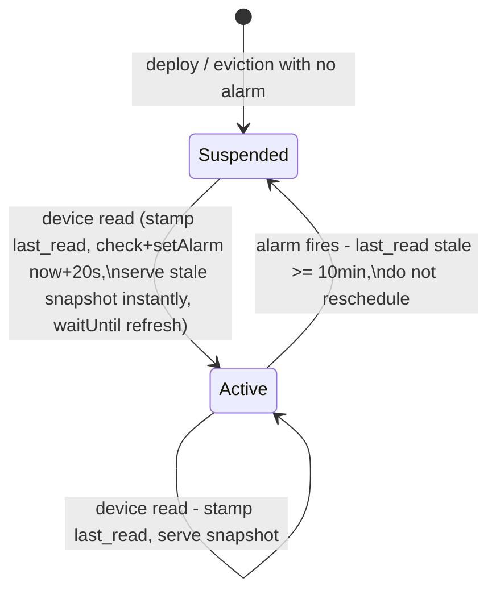

# feat: Phase 2 — feed Durable Object and realtime layer

## Summary

Build the realtime layer: a Worker entry point and a per-feed-group Durable Object that polls GTFS-RT on a 20 s alarm loop while devices are reading, self-suspends after 10 idle minutes, parses via the adapter seam (base GTFS-RT + statically compiled NYCT extension), reduces to per-stop arrival lists, and serves them with `fetched_at` — first reads return last-known data instantly and refresh behind. Testable end-to-end with curl.

## Problem Frame

Phase 1 put static topology in D1; nothing consumes realtime data yet. The spec's constraint #2 (one parse per feed, not per device) makes this layer the difference between a pet project and something that survives ten users. The spec mandated a billing/latency discussion before design; that discussion happened with verified Cloudflare numbers and settled the model (see Key Technical Decisions — Settled by discussion).

---

## Requirements

**Polling and lifecycle**

- R1. Any number of concurrent readers of one feed group causes exactly one upstream MTA fetch per 20 s window (spec acceptance criterion).
- R2. A feed DO with no reads for 10 minutes stops polling entirely (no alarm rescheduled); the next read re-arms the loop and fresh data arrives within one 20 s interval.
- R3. A read against a cold or suspended DO returns last-known arrivals with honest `fetched_at` immediately — it never blocks on an upstream fetch (device renders stale-then-corrects).
- R4. A DO evicted and re-instantiated (warm restart) serves its last snapshot from `state.storage` before any new fetch completes.

**Parsing**

- R5. The NYCT adapter parses all eight subway feed groups through build-time-generated static protobuf bindings — no runtime codegen (Workers ban eval), no protobuf on any device.
- R6. The adapter seam stays as narrow as the spec's interface: `parse(buf, now) → Map<stop_id, Arrival[]>` where Arrival carries `routeId` and epoch `time`; a second GTFS-RT agency needs a feeds-row `adapter` value and nothing else.
- R7. NYCT parse cost is measured against a real captured feed and recorded (spec's "verify, don't assume"). Off-peak measurement (Saturday PM): 2.0 ms decode for the largest group — four orders of magnitude inside the 30 s paid budget, so even generous rush-hour inflation cannot threaten it; U5's live `wrangler tail` check records real production CPU as the final word.

**Read path**

- R8. `GET /stop/:stop_id` on a feed DO returns the next N arrival epochs with route ids plus `fetched_at`; minute math stays server-side in Phase 3, not here and not on the device.
- R9. A Worker debug route reaches any feed group's DO by explicit feed + group for curl testing; the public `/v1` surface remains Phase 3.

**Hygiene**

- R10. `.env.example` and README updated for the Worker layer (no new secrets — MTA subway RT is keyless); deploy steps documented.

---

## Key Technical Decisions

**Settled by discussion with Mario (2026-08-02, verified Cloudflare pricing/lifecycle docs):**

- **Alarm loop + self-suspend, exactly as the spec sketched.** The decisive verified fact: an idle DO with a scheduled alarm is hibernation-eligible and bills zero duration between firings; each firing is one billed request. The full design runs at ~2% of even free-tier caps, ~$5.00 flat on paid. Pure fetch-on-request was rejected for first-poll latency (0.5–1.5 s against the device's 1 s budget); 24/7 polling rejected as waste (35,000 upstream fetches/day for a device glanced at a few times).
- **Workers Paid ($5/mo) is the target.** Removes the documented ambiguity about whether free-plan DO invocations get 10 ms CPU (paid gets 30 s default) — the 50–200 ms estimated parse becomes a non-issue, and hard daily caps disappear for later phases.
- **Stale-instantly, refresh behind.** A read serves the cached snapshot immediately, stamps `last_read`, and (if no alarm is pending) triggers the refresh + re-arms the loop via `waitUntil` — never blocking the response on MTA.

**Architecture:**

- **One DO per NYCT feed group** (eight for the subway), addressed by name `"{feed_id}:{group}"`. Isolates a broken group, matches the spec's "per feed (or per NYCT feed group)", and avoids the 6-simultaneous-connection cap a single all-groups DO would hit.
- **Eight-group URLs live in an adapter-internal suffix map** derived from the feed's base `rt_trip_url` (`-ace`, `-bdfm`, `-g`, `-jz`, `-nqrw`, `-l`, `-si`, base = `1234567S`). No schema change, no ingest change; a child table was rejected as a migration + ingest cost for config nothing else reads. Suffixes verified by curl during U1. Settles the Phase 1 open question.
- **Static protobuf bindings generated at build time** (`pbjs -t static-module` + `pbts` over `gtfs-realtime.proto` + `nyct-subway.proto`, runtime dep `protobufjs/minimal` only). Reflection mode is banned in Workers (runtime codegen). Generated module committed to the repo so builds are hermetic; regeneration script included. Int64 times normalized to numbers at the adapter boundary.
- **Feed config read through the D1 binding** (`env.DB`), not the HTTP API — the Worker/DO layer is inside Cloudflare; the HTTP API remains the external-ingest path only. Config (rt_trip_url, adapter) cached in the DO and refreshed on wake.
- **Snapshot stored as one storage value per cycle** (the whole reduced map), not per-stop rows — per-stop writes would be ~200 rows × 4,320 cycles/day/group and blow the row-write budget; one value per cycle is ~35 K writes/day across all groups. If the snapshot exceeds the storage value-size limit, chunk by stop-id prefix. Value-size limit verified empirically in U3 (see Open Questions).
- **Alarm-loop concurrency discipline (deepening + review findings — load-bearing):**
  - **Reschedule-first ordering.** `alarm()` runs: suspend check → `setAlarm(+20 s)` *before* any upstream I/O → fetch/parse/store inside a catch-all. A read arriving during the upstream fetch then sees a pending alarm and correctly skips self-arming; and because the next tick is armed before the risky work, no exception can kill the loop.
  - **`alarm()` never throws — but duplicates remain possible.** Exception-driven retries (2 s × 6) are unreachable by design; the 20 s cadence *is* the retry policy, and the 90 s staleness contract absorbs four failed cycles. Alarm delivery is still at-least-once at the infrastructure level, so the handler must be idempotent under duplicate invocation.
  - **One refresh in flight, ever.** A single in-memory `refreshInFlight` flag guards *both* the read-path `waitUntil` refresh and `alarm()`'s fetch. The upstream fetch carries `AbortSignal.timeout(~10 s)` (safely under the cadence), and a snapshot store is rejected when its fetch began before the currently stored fetch time — a slow old fetch can never overwrite newer data or regress `fetched_at`.
  - **Read-path atomicity via storage awaits only.** DO input gates cover storage operations: the read handler's `getAlarm()`-check → `setAlarm()` sequence must contain no non-storage await between them, and the `waitUntil` refresh launches only after.
  - **Config loads through a memoized single-flight promise** whose rejection clears the memo (a transient D1 error must not pin the DO to failure; reads always serve the stored snapshot regardless of config state). No periodic re-read: the 10-minute self-suspend already forces a cold-start config refresh on any idle DO, which is the propagation path for a changed `rt_trip_url`; a continuously hot DO picks changes up on the next deploy or suspend (noted in Risks).
  - `getAlarm()` guard in the constructor (never clobber a pending alarm).
- **Testing via `@cloudflare/vitest-pool-workers`** (workerd-accurate DO + alarm + storage semantics), with captured real MTA protobuf fixtures checked into the repo; upstream fetches mocked at the boundary.

---

## High-Level Technical Design

DO lifecycle — the suspend/resume machine R1–R4 hang on:



Read path across components:

```mermaid
sequenceDiagram
    participant C as curl / device (Phase 4)
    participant W as Worker (index.ts)
    participant DO as FeedDO ("mta-subway:ace")
    participant M as MTA GTFS-RT
    C->>W: GET /internal/mta-subway/ace/stop/A32N
    W->>W: allowlist + group check (D1 feed_id->adapter, cached)
    W->>DO: idFromName + fetch
    Note over DO: stamp last_read; getAlarm-check -> setAlarm(+20s)
    DO-->>C: snapshot arrivals + fetched_at (instant, possibly stale)
    Note over DO: waitUntil refresh (refreshInFlight-guarded)
    DO->>M: fetch group feed (protobuf, 10s timeout)
    M-->>DO: ~500KB buffer
    Note over DO: adapter.parse -> Map(stop_id, Arrival[])<br/>store snapshot if newer
```

---

## Implementation Units

### U1. Worker project bring-up, proto toolchain, and parse-cost spike

- **Goal:** `api/` becomes a real Worker project; static NYCT bindings exist; parse cost and group-URL suffixes are verified facts.
- **Requirements:** R5, R7
- **Dependencies:** none
- **Files:** `api/package.json`, `api/tsconfig.json`, `api/wrangler.jsonc` (add `main`, DO binding + `new_sqlite_classes` migration), `api/scripts/generate-proto.sh`, `api/proto/{gtfs-realtime,nyct-subway}.proto`, `api/src/gen/gtfs-realtime.js` + `.d.ts` (generated, committed), `api/test/fixtures/` (captured real feeds), `api/test/parse-cost.test.ts`
- **Approach:** Add TypeScript, vitest + `@cloudflare/vitest-pool-workers`, `protobufjs-cli` (dev — pbjs/pbts moved out of the main package in protobufjs v7) and `protobufjs` (runtime dependency; the generated static module imports `protobufjs/minimal`). Generation script fetches nothing — protos vendored. **Capture fixtures during a weekday AM rush window** (a 4 a.m. capture badly understates the entity-count ceiling) — one real feed per group with curl (verifies the suffix map empirically), committing the smallest + largest. The spike test decodes the largest fixture N times, reports per-decode timing, **and serializes each fixture's reduced snapshot to record its byte size** — closing the storage-value-size question at U1 against the documented 2 MB SQLite per-value limit rather than at first live deploy. Record the measured numbers in this plan's R7 verification and the README.
- **Test scenarios:**
  - Generated module decodes a real ACE fixture; entity count > 0; NYCT extension field is reachable on a trip descriptor (exact property name recorded once known).
  - Int64 `header.timestamp` and arrival `time` normalize to JS numbers matching known fixture values.
  - Parse-cost spike: decode + reduce of largest fixture completes well under the 30 s paid CPU budget; measured value logged.
- **Verification:** `npx vitest run` green inside workerd pool; all eight group URLs returned HTTP 200 protobuf during capture; measured parse cost recorded.

### U2. Adapter seam: base GTFS-RT + NYCT

- **Goal:** The spec's narrow `FeedAdapter` interface with two implementations.
- **Requirements:** R5, R6
- **Dependencies:** U1
- **Files:** `api/src/adapters/types.ts`, `api/src/adapters/gtfs_rt.ts`, `api/src/adapters/nyct.ts`, `api/src/adapters/index.ts` (registry keyed by feeds.adapter), `api/test/adapters.test.ts`
- **Approach:** `gtfs_rt` walks trip_updates → stop_time_updates, taking departure time falling back to arrival, emitting `{routeId, time}` per stop, dropping entries in the past (`time >= now` included — the same boundary rule U3 uses) or missing stop_id/time. `nyct` wraps the same walk (the extension adds direction/track detail we don't need for arrivals yet) and owns `groupUrls(baseUrl) → {group: url}` plus the group list. (A route→group map was considered here for Phase 3's stop→group resolution and deliberately moved to Phase 3, where its consumer and test live — build-in-order discipline.) Registry maps `feeds.adapter` values (`gtfs_rt`, `nyct`) to implementations; unknown adapter is an explicit error.
- **Patterns to follow:** the seam discipline from `docs/plans/01-guiding-spec.md` (adapter interface verbatim); CONCEPTS.md "Adapter".
- **Test scenarios:**
  - Real ACE fixture → known stop (e.g. `A32N`) appears with route `A` and plausible epoch ordering (ascending).
  - Trip update with arrival-only and departure-only stop_time_updates → both produce arrivals; missing both → skipped.
  - Entries with time in the past relative to `now` are excluded; boundary time == now is included.
  - Empty feed buffer → empty map, no throw; truncated/garbage buffer → typed parse error, not a crash.
  - `groupUrls` produces the eight verified URLs from the base; unknown adapter name → registry error.
- **Verification:** adapter tests green; parse of every captured group fixture yields non-empty maps during a one-off check.

### U3. FeedDO: alarm loop, self-suspend, snapshot storage

- **Goal:** The Durable Object implementing the settled lifecycle.
- **Requirements:** R1, R2, R3, R4, R8
- **Dependencies:** U2
- **Files:** `api/src/feed_do.ts`, `api/test/feed_do.test.ts`
- **Approach:** State: in-memory snapshot (`Map<stop_id, Arrival[]>`, `fetched_at`, feed `header_timestamp`) + same as one storage value (`snapshot`), `last_read`, feed config. Constructor restores from storage (R4) and `getAlarm()`-guards. Read handler, in this order: update `last_read` in memory **and persist it whenever the stored value is >20 s old** (hibernation between sparse reads is the *common* case, not rare eviction — memory-only stamps would be routinely forgotten and an actively-read DO could wrongly self-suspend; cost ≤1 extra row-write per 20 s window per group), inside the same input-gated storage sequence as the `getAlarm()`-check → `setAlarm()` (no non-storage await between); serve snapshot immediately (R3); launch the refresh via `waitUntil` last, guarded by `refreshInFlight`. `alarm()` follows the reschedule-first, never-throws, idempotent-under-duplicates discipline from the KTD: suspend check (R2) → `setAlarm(+20s)` → guarded fetch (10 s abort), parse, trim to **next 4 arrivals per (stop_id, route_id)** (a flat per-stop N would let a frequent route starve an infrequent one below Phase 3's n=3 on shared platforms), store snapshot + timestamps only if newer than what's stored; on failure keep the old snapshot, log, next tick already armed.
  **Freshness semantics:** `fetched_at` = fetch wall-clock time, but a fetch whose feed `header.timestamp` has not advanced past the stored one is treated as a *failed* fetch — old snapshot and old `fetched_at` retained — so a frozen-but-HTTP-200 upstream feed goes visibly stale instead of being re-stamped fresh every cycle (spec constraint #5).
  **Response contract:** `GET /stop/:stop_id` → `{fetched_at, group, arrivals:[{routeId, time}...]}` (`group` included so Phase 3's multi-group merges are auditable). Unknown or serviceless stop → empty arrivals with the real `fetched_at` ("no service" is a fact). **First-ever read (no snapshot has ever existed) → empty arrivals with `fetched_at: null`** — "no data yet," distinct from no-service, per the spec's dash-vs-zero constraint; this shape flows into Phase 3's departures response. The `time >= now` boundary rule applies identically at write-trim and read-filter so the two passes can't disagree by one entry.
  **Test mechanics:** idle-time scenarios manipulate persisted `last_read` via `runInDurableObject` and fire alarms via `runDurableObjectAlarm` (from `cloudflare:test`) — Vitest fake timers do not control workerd's clock or alarm scheduling.
- **Test scenarios (vitest-pool-workers, mocked upstream):**
  - One fetch per window: two reads 1 s apart trigger exactly one upstream fetch (R1).
  - Self-suspend: advance time past 10 min idle, fire alarm → no new alarm scheduled, no fetch (R2); subsequent read re-arms and a fetch happens (R2 second half).
  - Cold read: fresh DO instance with storage snapshot present serves it with old `fetched_at` without any upstream call completing first (R3/R4).
  - Upstream 500/timeout during alarm → old snapshot retained, `fetched_at` unchanged, alarm rescheduled.
  - Snapshot trims to next N arrivals, ascending; past arrivals dropped at read time relative to current time.
  - Unknown stop_id → `{arrivals: [], fetched_at}` not 404.
  - First-ever read on a DO with empty storage → `{arrivals: [], fetched_at: null}`, and the refresh still triggers.
  - Read delivered while `alarm()` is awaiting a slow mocked upstream fetch → exactly one live upstream fetch total, exactly one pending alarm afterward, and no `fetched_at` regression when the slow fetch finally resolves (the mid-flight race + stale-write guard).
  - Hanging upstream (never resolves) → aborted at the 10 s timeout; old snapshot retained; loop cadence unaffected.
  - Frozen upstream: fetch succeeds but `header.timestamp` has not advanced → old snapshot and old `fetched_at` retained (feed goes visibly stale).
  - Alarm failure path: upstream throws → alarm() completes without throwing and the next alarm is already scheduled (exception-driven retries never engage).
  - Duplicate alarm invocation in quick succession → idempotent: one pending alarm, snapshot not regressed.
  - Sparse-reader suspend correctness: reads every ~40 s with hibernation between them (persisted `last_read` refreshed per the >20 s rule) → DO does not self-suspend mid-usage.
  - Per-route trim: interleaved frequent/infrequent two-route fixture → the infrequent route retains 4 entries at a shared stop.
  - D1 config load rejects on cold start → read still serves the stored snapshot; the next trigger retries the load (memo cleared).
  - Constructor with pending alarm does not reset it (getAlarm guard).
- **Verification:** DO test suite green under workerd; storage row-write count per cycle is ~2 (snapshot + last_read at most), not per-stop.

### U4. Worker entry point and debug route

- **Goal:** Routable Worker exposing the DO for curl; bindings wired.
- **Requirements:** R9, R1 (routing by name is what makes "same DO for same group" true)
- **Dependencies:** U3
- **Files:** `api/src/index.ts`, `api/wrangler.jsonc` (DO namespace binding `FEED_DO`, D1 binding `DB`), `api/test/router.test.ts`
- **Approach:** `GET /internal/:feed_id/:group/stop/:stop_id`. The Worker performs a lightweight D1 lookup of `feed_id → adapter` (cached in-isolate) and **allowlists**: the feed must be on the curated allowlist (Worker config constant, v1: `mta-subway`) *and* its adapter must have a registered group-capable implementation; the group must be in that adapter's group list. Anything else → 404 JSON, **no DO instantiated** — this single mechanism both resolves the routing contradiction (the Worker owns the existence check) and closes the security hole (crowd-sourced catalog rows with attacker-influenceable `rt_trip_url` are unreachable by design, not by accident). Then `FEED_DO.idFromName("{feed_id}:{group}")` → forward. The DO still loads its own config on wake; a missing feeds row there → 404 JSON (defined error shape). **Per-IP rate limit** on `/internal/*` (lightweight in-memory token bucket keyed by `CF-Connecting-IP`, best-effort per isolate) — the route is internet-reachable on a metered plan before Phase 3/5 auth exists. No auth in Phase 2 — README states this plainly.
- **Test scenarios:**
  - Valid route reaches a DO and returns its response shape.
  - Unknown group / unknown feed_id → 404 JSON error, no DO instantiated.
  - A real catalog (non-curated) feed_id with a plausible adapter value → 404 by allowlist, even though the feeds row exists.
  - Requests over the per-IP rate limit → 429; under it → unaffected.
  - Same feed+group on two requests resolves to the same DO instance (observable via a counter in test).
- **Verification:** `wrangler dev` + curl round-trip against a mocked-upstream local run; deployed curl against real MTA returns plausible arrivals for `A32N` within one alarm interval of first poll.

### U5. Deploy, measure, document

- **Goal:** Deployed to the paid plan, live-verified, docs current.
- **Requirements:** R7, R10, plus live confirmation of R1–R3
- **Dependencies:** U4
- **Files:** `README.md`, `.env.example` (comment-only note that the Worker layer needs no new secrets), `docs/plans/01-guiding-spec.md` untouched (spec stays authoritative)
- **Approach:** Deploy via `wrangler deploy` (Mario upgrades the account to Workers Paid first — prompt at execution time). Live checks: first curl returns instantly with stale-or-empty + `fetched_at`; second curl ~25 s later returns fresh arrivals; `wrangler tail` confirms one fetch per 20 s window and captures real parse CPU ms (recorded against R7); after 10+ idle minutes, tail shows no alarm activity, and the next curl re-arms. README gains a "Realtime layer" section (architecture, curl examples, deploy steps, the no-auth-yet caveat).
- **Test scenarios:** Test expectation: none — live verification checklist above is the coverage; automated coverage lives in U1–U4.
- **Verification:** all live checks pass; README walkthrough reproduces them; measured parse cost written into R7's record.

---

## Scope Boundaries

- **Out:** the public `/v1` API (departures with server-computed minutes, stops/near, locate, config — Phase 3); walk times (`walk.ts`, Phase 3); any auth on the internal route (Phase 3/5); firmware (Phase 4, parked); MTA Bus and its API key custody; GBFS/Citi Bike adapter (later build-order step); alerts feeds (`rt_alert_url` unused until a later phase).
- **Deferred to Follow-Up Work:** stop→feed-group resolution (which groups serve stop X — needs the stop_routes join plus an NYCT route→group map, both defined in Phase 3 where their consumer and tests live); per-feed staleness thresholds beyond the fixed 90 s contract; multi-agency RT regression test (spec build-order step 16).
- **Shape note:** FeedDO's snapshot and `/stop/:stop_id` contract are GTFS-RT-arrival-specific. GBFS (bikes/docks counts) is a different snapshot shape — the Citi Bike build-order step means a shape variant or sibling DO class, not a silent reuse of FeedDO.

## Open Questions

- **NYCT extension property name** in the generated static module (dotted extension field) — recorded in U1 when the module is first generated; shapes nothing architectural.
- **For Phase 3 planning:** the multi-group `fetched_at` merge rule when one departures response spans feed groups (min across groups is the honest candidate) — the Phase 2 response now carries `group` so the merge is auditable; whether the per-response feed `header_timestamp` should be exposed alongside `fetched_at` for diagnostics; and direction labeling for the departures response (cardinal vs terminal-name vs user-defined — Mario's interface research confirmed directional platform grouping is native to the data; the label choice freezes with the Phase 3 response shape).

## Risks & Dependencies

- **MTA endpoint drift or outage:** catch-and-reschedule keeps the loop alive; stale snapshots stay honestly stamped; the device's staleness contract (90 s) does the user-facing signaling. Suffix map is env-overridable only via the feeds row's base URL — a group-URL scheme change is a seeds update, not a code change.
- **Alarm precision is undocumented:** 20 s cadence is common practice but not contractually guaranteed; R1's acceptance is per-window, tolerant of ±seconds of jitter.
- **Account plan dependency:** U5 requires the Workers Paid upgrade ($5/mo, settled by discussion); until then everything through U4 runs locally under workerd.
- **Storage write budget:** design holds writes to ~2 rows/cycle plus ≤1 `last_read` refresh per 20 s window under active reading; the 24/7 worst case stays ~4 M rows/month against a 50 M included allowance. Regression risk only if snapshot storage ever becomes per-stop — U3's verification pins this.
- **Parse-cost contingency (spec's second branch):** if U1's spike measures parse cost that is not comfortably under budget, the fallback is the spec's — move parsing to the ingest box and have the DO fetch pre-reduced JSON. Design deferred unless the spike triggers it.
- **Hot-DO config staleness:** with no periodic re-read, a continuously read DO holds its config until it next suspends or a deploy restarts it — acceptable for a v1 whose config changes via curated seeds; redeploy is the manual fast path.

## Sources & Research

- Spec: `docs/plans/01-guiding-spec.md` (Phase 2 section; adapter interface verbatim; discussion mandate).
- Discussion with Mario 2026-08-02: alarm loop + self-suspend / Workers Paid / stale-instantly settled; suffix-map and per-group-DO call-outs accepted with recommended arms.
- Cloudflare docs (fetched 2026-08-02): DO pricing (alarm = billed request; hibernation-eligible idle bills no duration; SQLite storage rows-written billing incl. `setAlarm`), lifecycle (10 s hibernation, constructor-before-alarm, eviction), alarms (at-least-once, 2 s × 6 retries, self-reschedule pattern), limits (paid 30 s CPU default, 15 min alarm wall, 6 simultaneous connections, free-plan 10 ms CPU ambiguity for DOs — mooted by the paid decision).
- protobufjs/gtfs-realtime-bindings: static-module generation is the Workers-safe path (no runtime codegen); NYCT extension requires custom generation; int64 → Long normalization.
- Phase 1 artifacts: `CONCEPTS.md` (Feed, Adapter, Station/Platform vocabulary), `docs/solutions/design-patterns/d1-http-api-idempotent-bulk-sync.md` (why the DO layer reads D1 via binding while external ingest keeps the HTTP API).
