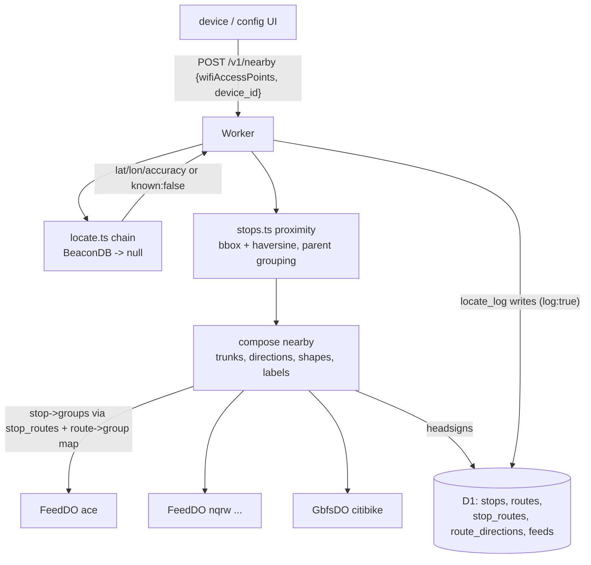

# feat: Phase 3 — /v1/nearby read API for the Transit Watch design

## Summary

Build the device-facing read API around the design handoff's contract: `POST/GET /v1/nearby` does locate→proximity→composition in one round trip, returning distance-sorted stops with color-grouped trunks, direction-split arrivals with headsigns, upstream staleness, and bike station status — everything the "dumb renderer" needs. Adds the data the design requires (route-direction headsigns, feed direction labels, Citi Bike GBFS) and the locate provider chain with its diagnostics endpoints.

## Problem Frame

The finished app design (`design_handoff_transit_watch/README.md`, reviewed 2026-08-02) specifies a single thinking-API contract that diverges from the spec's original endpoint sketch. Discussion with Mario settled the divergences: explore-first (favorites/walk-time timer is a follow-up phase), one-round-trip BSSID→nearby, alerts stubbed, GBFS pulled forward. Phases 1–2 provide the substrate: D1 topology, per-group realtime snapshots, the adapter seam.

---

## Requirements

**Data additions**

- R1. Ingest derives a `route_directions` table (dominant `trip_headsign` per route + direction from static `trips.txt`) and per-station `capacity`; the migration also adds feed-level `direction_labels` (curated: NYC `["Uptown","Downtown"]`; null means mixed — device shows compass tags).
- R2. Citi Bike enters as a curated GBFS feed: `station_information` ingested into `stops` (feed-scoped, with capacity), verified live URLs and the data-sharing-policy license recorded.

**Realtime**

- R3. A GBFS status poller (sibling of FeedDO, same alarm-loop discipline from `docs/solutions/architecture-patterns/durable-object-alarm-loop-discipline.md`) snapshots `station_id → {bikes_classic, bikes_electric, docks_open}` from `vehicle_types_available` (ids 1/2 — the spec-standard field; the legacy `num_ebikes_available` is known-inconsistent), respecting the feed's 60 s ttl.

**Locate**

- R4. `locate.ts` is an ordered provider chain behind one interface: BeaconDB (identifying User-Agent, `fallbacks.ipf: false`) → `{known: false}`; Unwired Labs remains an empty env-gated slot per the spec's build order. Results with `accuracy > LOCATE_MAX_ACCURACY_M` (default 500) or the `"fallback":"ipf"` marker are treated as unknown, never passed through.
- R5. `POST /v1/locate` (with `log`/`label`), `POST /v1/locate/ref`, and `GET /v1/locate/log` implement the spec's diagnostic capture: ref pairs to the most recent unpaired estimate for that device within 60 s; haversine `delta_m` computed on pairing; `bssid_count` stored on every row. Device identity is a client-supplied `device_id` (trust-on-first-use stand-in until Phase 5 tokens). Locate results cached ~10 min keyed by a hash of the normalized BSSID set (in-isolate, best-effort — see the privacy KTD).

**The nearby contract**

- R6. `POST /v1/nearby` accepts `wifiAccessPoints` (locate + nearby in one round trip); `GET /v1/nearby?lat=&lon=` serves the config UI and curl. Response follows the design README's schema: `systems[]` by mode with `direction_labels`, stops sorted by distance with `distance_label` (imperial/metric per feed config), trunks grouped by `route_color` with `routes[{label, shape}]`, `directions[{direction_id, arrivals[{route, headsign, eta_min}]}]`, `alert: null` and `note: null` (stubs), top-level `generated_at`, and bike `stations[{bikes_classic, bikes_electric, docks_open, capacity}]`.
- R7. Server-side presentation rules per the design: bullet `shape` (circle for rail short-names ≤2 chars, pill otherwise, disc when no short name), missing-color fallback = deterministic hash of `route_id` into the design's fixed 8-color palette, `text_color` honored else black/white by luminance.
- R8. Direction facts: NYC platform N/S maps to `direction_id` 0/1; arrivals split per direction within a trunk; headsign comes from `route_directions`. Labels come from the feed's `direction_labels`; the API never invents label text.
- R9. Upstream staleness is explicit: each system carries the min `fetched_at` across the group DOs consulted (null when never fetched), so the device can honor "never show stale data as live" beyond its own fetch age.
- R10. Rail arrivals resolve stop→feed-groups via the `stop_routes` join plus an NYCT route→group map (module-level beside the nyct adapter, as pinned in Phase 2); `eta_min` is server-computed integer minutes; unknown location (`{known:false}`) with no lat/lon → 422 with a distinct error shape the device maps to its empty/error states.

**Operational**

- R11. The Worker's curated-feed allowlist is promoted from a code constant to configuration (wrangler vars), settling the Phase 2 standards finding; `/v1/*` shares the per-IP rate limit.
- R12. `.env.example` (`LOCATE_MAX_ACCURACY_M`, commented `UNWIREDLABS_KEY` slot) and README (new endpoints, BeaconDB attribution + privacy note on BSSID handling, Citi Bike data-policy link) stay current.

---

## Key Technical Decisions

- **`/v1/nearby` is the device contract; the spec's `/v1/departures` + `walk.ts` defer to the follow-up favorites phase** (discussion-settled explore-first). The `stops.ts` proximity seam is still built as the spec demands — `nearby` composes on top of it.
- **One round trip:** POST body carries `wifiAccessPoints` + `device_id`; the Worker runs the locate chain, then composition, and includes the resolved `location {lat, lon, accuracy}` in the response so the device can display/debug it. Unknown location → 422, distinct from empty-but-located systems.
- **The 500-byte constraint is superseded for this endpoint** (it was written for the tiny favorites-departures shape): the nearby payload is a few KB over WiFi; the follow-up favorites endpoint keeps the tiny-shape discipline.
- **GBFS gets a sibling DO (`GbfsDO`), not a FeedDO variant** — the Phase 2 shape note anticipated this: different snapshot shape (station counts vs arrivals), same discipline (reschedule-first never-throw alarm, single-flight refresh, hibernation-aware `last_read`, ttl-respecting 60 s cadence, self-suspend).
- **BeaconDB specifics are pinned by verified research:** mandatory identifying User-Agent; `fallbacks: {ipf: false}` so IP guesses surface as the structured 404 (`reason: "notFound"`) rather than a 25 km "fix"; ≥2 known APs needed for a WiFi resolve. The provider interface returns `{lat, lon, accuracy, provider} | null` exactly per spec. **Every provider fetch carries `AbortSignal.timeout(LOCATE_TIMEOUT_MS)` (default 2000 ms, env-overridable)** — the external call sits at the front of the device's 1–2 s budget and BeaconDB has no SLA; timeout → null → the designed `{known:false}` degrade.
- **Locate privacy posture (pre-Phase-5):** `device_id` is pinned as a ≥128-bit random opaque string (capability-by-knowledge — an unguessable id is the interim access control). The diagnostics surfaces (`GET /v1/locate/log`, `POST /v1/locate/ref`) are additionally gated by a shared-secret `DIAG_TOKEN` env var — they exist for Mario's accuracy measurement, not devices. `log:true` inserts carry a per-device daily cap; unbounded-growth acceptance ends at the Phase 5 retention purge. The 10-min locate cache is keyed by a hash of the normalized BSSID set (correct semantics, works without device_id, removes cache-poisoning entirely); BSSIDs themselves are never stored anywhere.
- **Headsigns are per-arrival, derived from the realtime trip's terminal** (review finding — branched routes break the per-direction join: the A train has three southern terminals, and a dominant-headsign label would be wrong for roughly half of southbound A trains; MTA's own clocks show per-train terminals). The adapter captures each trip's last `stop_time_update` stop id (`Arrival.terminalStopId` — NYCT feeds list all remaining stops, so the last entry is that train's terminal); composition resolves it to a station name via the stops table. The ingested `route_directions` dominant headsign remains as the **fallback** when the realtime terminal is missing or unresolvable.
- **Bike stations live in `stops`** (feed-scoped rows with a new nullable `capacity` column) so the same bbox+haversine proximity seam serves all modes; realtime bike counts come from GbfsDO, keyed by `stop_id` = GBFS `station_id`.
- **Trunk grouping is computed at composition — by feed-supplied color only.** Routes whose color came from the hash fallback each form a single-route trunk (key `r:{route_id}`) — grouping by post-fallback color would merge unrelated colorless routes (~1/8 collision odds on an 8-color palette), contradicting the design's own "single-route groups are the normal case outside NYC." Trunk keys are opaque and deterministic (real color hex, or the per-route key); the key-format divergence from the design's illustrative color-hex key is surfaced to Mario.
- **Direction bucketing is a per-adapter strategy, not generic code.** The N/S platform-suffix resolver lives beside the nyct adapter (same placement pattern as the route→group map); the composer calls through it. Feeds without a strategy need either `Arrival.direction_id` (adapter-seam widening) or their own resolver — decided when the second rail/bus feed lands.
- **Fan-out resilience:** group and GBFS DO fetches run concurrently via `Promise.allSettled`; a rejected group fetch degrades identically to never-fetched (empty arrivals, no `fetched_at` contribution); a rejected GbfsDO leaves stations with capacity and null counts. Whole-request 5xx is reserved for D1/topology failure. Each system carries `partial: true` (additive field) when any consulted source was null/failed, so the device can distinguish "no service" from "no data" during the ~30 s cold-group window.
- **Depth serves the detail view:** `ARRIVALS_PER_ROUTE` bumps to 8 (the design's trunk-detail screen scrolls "all upcoming arrivals"; 4 barely fills one screen for single-route trunks). The full trimmed depth passes through `/v1/nearby` — the board renders index 0, the detail view the rest. Stops per system cap at the nearest 5 (payload ~15–25 KB at depth 8 — stated, not emergent).
- **Bus mode returns an explicitly empty system** (no bus feed configured in v1) so the device renders its designed empty state — mode presence is config-driven, not hardcoded.
- **Contract pins for Phase 4:** both `directions` entries (0 and 1) are always emitted even when one is empty (the device's global direction flip indexes the array); `modes=` is honored as a filter; top-level `units` reflects the primary (rail) feed's config while `distance_label` stays pre-formatted per feed; when a configured system has zero in-radius results, the system carries `nearest_distance_label` from an unbounded nearest-1 lookup so the empty-mode screen can render "Closest station is 2.4 mi away."
- **Abuse posture for the public locate surface (security review):** BeaconDB-proxy abuse is in-scope harm to prevent — `/v1/locate` and `/v1/nearby` get their own tighter rate bucket (burst 10, refill 1/s per IP — sized for the fan-out cost) separate from the debug route's; `wifiAccessPoints` capped at 50 entries, oversized bodies rejected before parsing; **`log: true` requires `DIAG_TOKEN`** (the diagnostic walk is operator-driven per the spec, so this costs nothing and closes the device_id-rotation cap bypass entirely); `DIAG_TOKEN` travels only as an `Authorization: Bearer` header, never a query param.
- **Allowlist → wrangler `vars`** (JSON array of feed ids): config-only second agency at the routing layer, closing the documented Phase 2 exception.

---

## High-Level Technical Design

Composition sequence for one rail stop: parent station → constituent platforms → routes at station (stop_routes) → trunks by color → feed groups needed (route→group map) → per-group DO snapshots → arrivals bucketed into direction 0/1 by platform suffix → per-trunk direction arrays with headsigns → min fetched_at.

---

## Implementation Units

### U1. Migration 0001 and ingest additions

- **Goal:** D1 carries everything composition needs: headsigns, direction labels, bike stations with capacity.
- **Requirements:** R1, R2
- **Dependencies:** none
- **Files:** `api/migrations/0001_nearby_data.sql`, `ingest/src/gtfs_compass_ingest/static_gtfs.py`, `ingest/src/gtfs_compass_ingest/gbfs.py`, `ingest/src/gtfs_compass_ingest/catalog.py` (new FEEDS spec columns: `direction_labels: None`, `units` default for catalog rows — sync KeyErrors otherwise), `ingest/src/gtfs_compass_ingest/seeds.py`, `ingest/src/gtfs_compass_ingest/tables.py`, `ingest/src/gtfs_compass_ingest/__main__.py` (static loop branches on the feed's adapter: `gbfs` → gbfs ingest, else run_static — a GBFS JSON through the zip pipeline is a BadZipFile crash), `ingest/tests/test_static_gtfs.py`, `ingest/tests/test_gbfs.py`, `ingest/tests/test_catalog.py`, `ingest/tests/test_cli.py`, `ingest/tests/test_schema_sync.py`
- **Approach:** Migration adds `route_directions(feed_id, route_id, direction_id, headsign, PRIMARY KEY(feed_id, route_id, direction_id))` with NOT NULL PKs per house rules, `stops.capacity INTEGER` (nullable), `feeds.direction_labels TEXT` (JSON array or null), `feeds.units TEXT` (default imperial). Static ingest gains a trips.txt pass deriving the dominant headsign per (route, direction) — counted vote, deterministic tie-break — synced via the existing engine. New `gbfs.py` ingests `station_information` (verified URL) into `stops` rows for the curated `citibike` feed (name/lat/lon/capacity) with the standard sync+prune scoping. Curated seeds add `citibike` (adapter `gbfs`, status URL as `rt_trip_url`, license `https://citibikenyc.com/data-sharing-policy`, static-ingest flagged) and set `direction_labels` on `mta-subway`. Schema-sync test extends to the new columns/table.
- **Patterns to follow:** the sync engine and prune guards in `ingest/src/gtfs_compass_ingest/load.py`; seeds/suppression conventions in `seeds.py`.
- **Test scenarios:**
  - trips.txt fixture with two headsigns for one (route, direction) → dominant wins; tie → lexicographic winner, deterministic across runs.
  - Missing `direction_id` rows in trips.txt → skipped with a counted warning, not a crash.
  - GBFS station_information fixture → stops rows with capacity; re-run writes zero rows; a removed station prunes.
  - `direction_labels` round-trips as JSON; null stays null.
  - Migration applies cleanly on a database that already has Phase 1 data (additive only).
  - Catalog run with the widened FEEDS spec → no KeyError; catalog rows carry null direction_labels.
  - `all` command routes citibike to the GBFS ingest path and mta-subway to run_static (adapter dispatch).
  - N/S→direction_id mapping spot-verified against trips.txt `direction_id` during the route_directions pass (a swapped mapping fails ingest-time, not on-device).
- **Verification:** local migration applies; live ingest run loads ~2,400 Citi Bike stations and `route_directions` rows for all subway routes; re-run writes zero rows.

### U2. GbfsDO — bike station status poller

- **Goal:** Realtime bikes/docks per station with the established DO discipline.
- **Requirements:** R3
- **Dependencies:** U1 (feed row)
- **Files:** `api/src/gbfs_do.ts`, `api/src/adapters/gbfs.ts`, `api/test/workers/gbfs_do.test.ts`, `api/wrangler.jsonc` (binding + migration tag)
- **Approach:** Single-group DO (`"citibike:all"`). Alarm cadence 60 s (the feed's ttl; faster is wasted). Snapshot: `station_id → {classic, electric, docks}` derived from `vehicle_types_available` (id 1/2) and `num_docks_available`; stations with `is_renting === 0` surface as zero bikes. Same lifecycle discipline as FeedDO (reschedule-first, never-throw, single-flight, `last_read` persistence, self-suspend, `fetched_at`/`last_updated` freshness gate using the GBFS `last_updated` epoch as the header-timestamp analogue). `GET /station/:id` + `GET /stations?ids=` internal reads.
- **Patterns to follow:** `api/src/feed_do.ts` and `docs/solutions/architecture-patterns/durable-object-alarm-loop-discipline.md` — deliberately parallel structure; extract shared helpers only where identical (constants, tag logging), not speculative abstraction.
- **Test scenarios:**
  - Status fixture → correct classic/electric/docks split per station; `vehicle_types_available` is the source of truth even when `num_ebikes_available` disagrees.
  - `is_renting: 0` station → zero bikes, docks still reported.
  - Frozen `last_updated` across two cycles → treated as failed fetch, old stamp retained.
  - Self-suspend and re-arm (mirrors FeedDO scenarios).
  - First-ever read → `fetched_at: null` contract.
- **Verification:** deployed DO returns live Citi Bike counts for a known station; suspend/re-arm observed via tail.

### U3. stops.ts proximity seam

- **Goal:** The spec's proximity query behind one interface, serving all modes.
- **Requirements:** R6 (substrate), R10
- **Dependencies:** U1
- **Files:** `api/src/stops.ts`, `api/test/workers/stops.test.ts`
- **Approach:** `nearbyStops(db, {lat, lon, radiusM, feedIds, limit})`: bbox prefilter on the indexed lat/lon (degree deltas from radius), haversine sort in JS, group rail platforms by `parent_station` (group carries constituent platform ids + station name + routes via stop_routes join), bike stations pass through ungrouped with capacity. Returns per-feed groups so composition can mode-split. Distance labels (`460 ft` / `0.2 mi` / metric) formatted here per feed `units`.
- **Patterns to follow:** spec's proximity section (bbox → haversine → group); keep it one file so a PostGIS future is one file's change.
- **Test scenarios:**
  - Seeded D1: station with N/S platforms returns once, grouped, with both platform ids and route list.
  - Radius boundary: stop just outside bbox excluded; just inside included and distance-sorted.
  - Bike stations interleave correctly by distance with rail stations when both feeds requested.
  - Distance labels: <1000 ft renders feet, else miles at one decimal; metric feed renders m/km.
  - Zero results → empty array, not error.
- **Verification:** curl against seeded local D1 returns Jay St–MetroTech grouped with A/C/F/N/R/W routes and plausible distances.

### U4. locate.ts chain and diagnostics endpoints

- **Goal:** The spec's locate design, verified-BeaconDB edition.
- **Requirements:** R4, R5
- **Dependencies:** none (parallel with U1–U3)
- **Files:** `api/src/locate.ts`, `api/src/routes/locate.ts`, `api/test/workers/locate.test.ts`
- **Approach:** Provider interface per spec; BeaconDB provider POSTs with identifying User-Agent (`gtfs-compass/<version> (+repo url)`), `considerIp: false`, `fallbacks: {ipf: false}`, and `AbortSignal.timeout(LOCATE_TIMEOUT_MS)` (default 2000 ms); 404/`notFound`, timeout, or network error → null; response `accuracy > LOCATE_MAX_ACCURACY_M` → null (gate lives in the chain, not the provider); defensive `"fallback"` marker check. `/v1/locate` handles `log: true` + `label` → `locate_log` insert (est fields + bssid_count + device_id) with a per-device daily insert cap. `/v1/locate/ref` and `GET /v1/locate/log?device_id=&since=` require the `DIAG_TOKEN` shared secret (diagnostics are operator surfaces); ref pairs to the newest unpaired estimate for the device within 60 s and computes haversine `delta_m`. In-isolate 10-min cache keyed by a hash of the normalized BSSID set. `device_id` (opaque, ≥128-bit) required for logging, optional for bare locate.
- **Test scenarios:**
  - Chain: BeaconDB 200 within gate → passed through with provider name; 200 with accuracy 25000 → null; 404 notFound body → null; network error → null (never throws to caller); hung provider aborted at LOCATE_TIMEOUT_MS with the caller unblocked inside the budget; response shape `{known:false}` when chain exhausts.
  - Diagnostics gating: locate/log, locate/ref, and `log:true` writes without the Bearer DIAG_TOKEN → 401; with it → normal flow. Daily insert cap → 429 once exceeded. Token in a query param is rejected (header only).
  - `wifiAccessPoints` array >50 entries → 400 before any parsing or provider call.
  - Cache hit/miss counter tag emitted per lookup (settles the flapping-hit-rate question empirically within a week of live use).
  - Cache: identical BSSID set (reordered) hits the cache; a different set misses.
  - Mandatory headers present on the outbound request (User-Agent, content-type).
  - Log flow: locate with log:true writes a row; ref within 60 s pairs and computes plausible delta_m (known coordinate pair fixture); ref with no unpaired estimate → 404; second ref cannot double-pair.
  - Accuracy gate env override respected.
- **Verification:** live: a locate with a real BSSID set from the opti/laptop resolves or cleanly returns `{known:false}`; a log+ref pair produces a row with delta_m via curl.

### U5. /v1/nearby composition

- **Goal:** The design's contract, end to end.
- **Requirements:** R6, R7, R8, R9, R10
- **Dependencies:** U1, U2, U3, U4
- **Files:** `api/src/nearby.ts`, `api/src/routes/nearby.ts`, `api/src/adapters/nyct.ts` (route→group map + direction-strategy exports), `api/src/feed_do.ts` (ARRIVALS_PER_ROUTE → 8), `api/test/workers/nearby.test.ts`, `api/test/workers/feed_do.test.ts` (trim depth update), `api/test/unit/presentation.test.ts`
- **Approach:** Route handler: resolve location (body BSSIDs → locate chain; or query lat/lon; neither/unknown → 422 `{error: "location unknown"}`). Compose per requested mode: rail — nearest N station groups from stops.ts; per station: routes → color-resolve (feed color → hash palette fallback) → trunks; needed feed groups from the route→group map (new module export beside nyct adapter, **explicitly enumerating shuttles and SIR: GS→1234567s, FS→bdfm, H→ace, SI→si, express variants to their parents** — letter-family intuition fails exactly there; an unmapped route_id logs a counted warning and renders as an empty-arrivals trunk excluded from fetched_at, never a throw); **FeedDO gains a `GET /stops?ids=` batch read** (mirroring GbfsDO's, same identity-binding/last_read/alarm-arming/refresh-behind discipline as the single-stop handler) so snapshots are fetched once per group (not per platform); bucket arrivals by platform suffix into direction 0/1, trunk-filtered, `eta_min = max(0, floor((time - now)/60))`, next-N per direction; headsigns joined from route_directions; per-system `fetched_at` = min of non-null across consulted groups (null only when ALL null) with `partial: true` when any consulted source was null/failed (per the KTD). Bike — stations from stops.ts + GbfsDO counts. Bus — configured-empty system. Presentation helpers (pure, unit-tested): shape rule, luminance contrast, hash palette (the design's exact 8 colors), distance labels (in stops.ts), direction_labels passthrough. `alert: null`, `note: null` stubs in the schema now so the device contract is stable.
- **Patterns to follow:** design README "API Contract" + "Server-side responsibilities" verbatim; Worker router conventions from `api/src/index.ts` (error shapes, rate limit).
- **Test scenarios:**
  - Golden-path integration: seeded D1 + mocked DO snapshots → response matches the README's schema shape for a two-trunk station (field-for-field, including shape/color/text_color and direction split).
  - Trunk grouping: two routes sharing a color → one trunk with two route entries; distinct colors → separate trunks; missing color → stable palette pick (same route_id → same color across calls).
  - Shape rules: `A` → circle; `M15-SBS` → pill; empty short_name → disc.
  - Direction split: platform `A32N` arrivals land in direction 0, `A32S` in 1; a station with only one platform direction yields an empty arrivals array for the other.
  - eta_min: arrival 90 s out → 1; arrival in the past (clock skew) → 0, not negative.
  - Staleness: one group never fetched, another fresh → system fetched_at is the fresh min, `partial: true` set, and the never-fetched group's trunks render with empty arrivals; all groups null → system fetched_at null.
  - Fan-out failure: one group DO rejecting → that group degrades to never-fetched semantics, request still 200; GbfsDO rejecting → stations carry capacity with null counts; all fetches concurrent (allSettled), verified via mock timing.
  - Trunk keys: two colorless routes at one stop → two single-route trunks with stable `r:{route_id}` keys and stable palette colors across calls.
  - Contract pins: both direction entries present when one is empty; `modes=rail` filters out bike; payload for 5 stops × depth 8 stays within the stated ~25 KB bound.
  - Location: BSSID body path resolves and composes; `{known:false}` → 422; GET with lat/lon bypasses locate.
  - Headsigns: branched-route fixture (two A trains, different terminalStopIds) → each arrival carries its own terminal's station name; arrival with missing/unresolvable terminal → route_directions fallback; both missing → null (device tolerates).
  - Shuttle station (GS at Times Sq analog) resolves to the 1234567s group and returns arrivals; a stop_routes row with an unmapped route id → counted warning, empty-arrivals trunk, request still 200.
  - Arrival keyed to a suffix-less stop id → dropped with a counted warning tag, never silently.
  - Zero in-radius stations for a configured system → `nearest_distance_label` present from the unbounded nearest-1 lookup.
  - Bike system: counts from GbfsDO merged onto stations by id; station missing from status → zeros with capacity still present.
- **Verification:** deployed curl with Jay St coordinates returns a schema-valid response the design prototype could render: correct trunks, directions, headsigns, distances, staleness; curl with BSSIDs from a real scan resolves end-to-end in one round trip.

### U6. Config promotion, hygiene, deploy, live verification

- **Goal:** Allowlist as config; docs current; everything live-verified.
- **Requirements:** R11, R12
- **Dependencies:** U1–U5
- **Files:** `api/src/index.ts`, `api/wrangler.jsonc` (`vars.CURATED_FEEDS`), `.env.example`, `README.md`
- **Approach:** Allowlist reads `env.CURATED_FEEDS` (JSON array, default in wrangler.jsonc: `["mta-subway","citibike"]`); the Phase 2 debug route and `/v1/*` share it and the rate limiter. README: new endpoints with curl examples, and the BSSID privacy disclosure the spec mandates — stating explicitly that submitted BSSIDs are **forwarded to BeaconDB, a named third-party geolocation service**, used only for the position lookup, never stored by this project (only a hash in a 10-minute in-memory cache and a count in diagnostics), and that operator-initiated `log:true` diagnostic rows **persist indefinitely until Phase 5 ships the retention purge**; plus BeaconDB experimental caveat, Citi Bike data-policy link, superseded-500-byte note. `.env.example`: `LOCATE_MAX_ACCURACY_M`, `LOCATE_TIMEOUT_MS`, `DIAG_TOKEN` (wrangler secret — instructions), commented `UNWIREDLABS_KEY` slot (documented as not yet wired).
- **Test scenarios:**
  - Allowlist from vars: feed present in vars but not in the old constant → routable; absent → 404 (test via miniflare vars override).
- **Verification:** deploy; run the full live checklist (migration 0001 remote, ingest run, nearby curl at Jay St, bike counts sanity vs the Citi Bike app, locate round-trip, tail for GbfsDO cadence); README walkthrough reproduces it.

---

## Scope Boundaries

- **Out:** firmware (Phase 4 — the design README's device-side guidance hands off there); config UI/PWA, accounts, device tokens (Phase 5); service-alert polling (stubbed `alert: null` — next follow-up); MTA Bus (bus mode ships as configured-empty); Unwired Labs implementation (env slot documented, unbuilt per build order).
- **Deferred to Follow-Up Work:** `walk.ts` + entry buffers + the favorites-oriented `/v1/departures` tiny-payload endpoint (explore-first decision — the spec's leave-by timer remains the destination and builds on this phase's seams); alert-feed DO; per-arrival compass tags for `direction_labels: null` feeds — these need both an additive response field *and* a bearing source not yet ingested (shapes or next-stop geometry; platform suffixes cannot produce compass bearings), landing together with the first mixed-orientation feed.

## Design-contract divergences for Mario's sign-off

The README schema is the contract; these are the places the plan deliberately extends or diverges from it (all additive except the first's key format):

1. **Trunk keys** are opaque deterministic ids (real color hex, or `r:{route_id}` for hash-fallback singles) — not always the color hex the design's example implies.
2. **`partial: true`** per system (additive) marks the ~30 s cold-group window; until firmware defines a rendering for it, that window displays as live-with-empty-trunks — the honest interim truth.
3. **Stops per system capped at nearest 5** — the design's stop-dot pagination is unbounded; 5 fits the payload and a watch screen but is a designer call.
4. **`nearest_distance_label`** (additive) on empty systems feeds the empty-mode screen's "Closest station is 2.4 mi away."
5. **Headsigns** come from each train's realtime terminal (per-arrival fidelity on branched routes) with static dominant-headsign fallback — more faithful than the mock's static strings, worth confirming the copy renders identically.

## Open Questions

- **Trunk membership vs direction asymmetry:** NYC trunks are color-stable, but a route can serve a station in one direction only (late-night patterns). The plan buckets whatever the realtime feed says; if the design's prototype assumes symmetrical direction arrays, an empty-arrivals direction is the honest degradation — verify against the prototype during U5 and flag to Mario only if it renders badly.
- ~~`device_id` format~~ — resolved during deepening: ≥128-bit random opaque, generated by the device at first boot; the API treats it as opaque. Phase 5 replaces it with pairing-issued tokens.

## Risks & Dependencies

- **BeaconDB is explicitly experimental** (their wording), no SLA, migration-related instability noted. The chain returns `{known:false}` on any failure — the device falls back to favorite/last-stop behavior by design. The diagnostic endpoints exist precisely to measure whether it suffices (spec build-order step 13).
- **Lyft GBFS 2.3 could migrate to 3.0** (MobilityData pressure; unannounced). URL and version live in the curated seed — a seed update, not code, unless field names shift (then it's adapter-contained).
- **Design-contract drift:** the README schema is the contract; any mismatch discovered while exercising the prototype against real responses is a response-field addition surfaced to Mario, not silently absorbed.
- **The nearby endpoint is the fan-out hot path**: one request touches locate + D1 + up to 8 FeedDOs + GbfsDO. Group snapshots are fetched once per group per request and the DOs serve from memory, so the request-latency budget (~device 1–2 s) holds; the composition unit's verification includes a latency spot-check.

## Sources & Research

- Design handoff: `design_handoff_transit_watch/README.md` (API contract + server-side responsibilities, reviewed and discussed 2026-08-02; discrepancies settled with Mario — explore-first, one round trip, alerts stubbed, GBFS forward).
- Citi Bike GBFS (verified live 2026-08-02): v2.3 at `gbfs.lyft.com/gbfs/2.3/bkn/` (3.0 is 403), ttl 60 s, 2,463 stations; e-bike split via `vehicle_types_available` ids 1/2 (`num_ebikes_available` inconsistent on ~2% of stations); license via `citibikenyc.com/data-sharing-policy` (no license field in-feed).
- BeaconDB (verified live + source 2026-08-02): free, no key, identifying User-Agent required; `fallbacks.ipf:false` suppresses IP guesses; structured 404 `reason:"notFound"`; ≥2 known APs for a WiFi fix; no documented rate limits; experimental.
- Spec: `docs/plans/01-guiding-spec.md` (Phase 3 sections; locate/walk designs; constraint #5, #7). Phase 2 plan: pinned questions this plan resolves (fetched_at merge, route→group map placement, allowlist promotion, direction facts).
- Phase 1/2 substrate: `ingest/` sync engine, `api/src/feed_do.ts` discipline, `docs/solutions/` both entries, `CONCEPTS.md` vocabulary.
