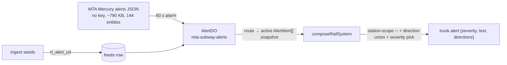

# feat: Alert feed layer — fill the /v1/nearby alert stubs

## Summary

Replace the `alert: null` stubs in the `/v1/nearby` contract with real MTA subway
service alerts: a third alarm-loop DO (`AlertDO`) polls the MTA's Mercury JSON
alerts feed, a pure adapter reduces it to per-route active alerts, and rail
composition attaches the design contract's `{severity, text, directions}` shape
to trunks by route membership, station scope, and direction. `note` stays null.

**Autonomous-run note:** planned and executed while Mario is away. Decisions he
would normally arbitrate are recorded under Assumptions — each is reversible
with a small localized change (composition for A2/A3/A4/A5/A6, the exported
severity-map constant in the adapter for A1). **A1 is the blocking morning
review item** — it controls the device's amber-vs-gray rendering.

---

## Problem Frame

The device design renders service alerts on trunks (amber "delay" badge with
amber countdowns vs gray "info" sub-line — design README "Interactions" +
alert example in the API contract), and the shipped Phase 3 response emits
`alert: null` on every trunk. The MTA publishes subway alerts in a no-key feed;
the missing piece is a poller + reduction + attachment consistent with the
established DO discipline and staleness honesty.

---

## Requirements

- R1. An alerts poller with the full alarm-loop discipline (reschedule-first
  never-throw alarm, single-flight refresh, persist-before-flip, hibernation-aware
  `last_read`, self-suspend, freshness gate incl. the Phase-3 far-future clamp),
  reading its URL from the feeds row (`rt_alert_url`).
- R2. A pure adapter reduction: raw alerts JSON → per-route active-alert lists
  carrying severity, English header text, direction ids, stop scope, and an
  ordering key; typed ParseError on garbage.
- R3. Rail composition fills `trunk.alert` with the design shape
  `{severity: "delay"|"info", text, directions: [0|1...]}` — attached by route
  membership, narrowed by the shown station's stop ids when the alert carries
  stop selectors, direction array from the selectors' direction ids.
- R4. Staleness honesty: alerts older than a freshness horizon degrade to
  `alert: null` (never silently shown); an unavailable alerts source degrades
  the same way and never fails the request. The system `fetched_at` remains
  arrivals-only.
- R5. Active-only: alerts render only when an `active_period` covers now (or no
  period is given). Pre-announced planned work (`display_before_active`) is not
  shown.
- R6. Hygiene: seeds/catalog carry `rt_alert_url` for mta-subway; README
  documents the alert field and feed attribution; no new env vars expected.

---

## Key Technical Decisions

- **Parse the Mercury JSON feed, not the protobuf feed.** Verified live
  (2026-08-03): the protobuf feed's standard `effect` field is `UNKNOWN_EFFECT`
  on all 144 entities — the effect-based severity heuristic is unusable. The
  JSON variant (`…camsys%2Fsubway-alerts.json`, 200/no-key/~790 KB) exposes
  MTA's `transit_realtime.mercury_alert.alert_type` strings ("Delays",
  "Planned - Stops Skipped", "Reduced Service", …) — a real severity signal —
  and makes selector presence explicit (no proto3 default-0 ambiguity on
  `direction_id`). Mercury is MTA-specific, so the parse lives in an
  **adapter module** (`api/src/adapters/mta_alerts.ts`), the same seam
  placement as the nyct group map; a second agency adds its own alerts adapter
  or the standard-GTFS-RT fallback later.
- **Severity map is data-driven and defaults to disruption-aware:** the design's
  two-band world reads "delay" as *your ride is disrupted now* — an active
  suspension satisfies that more than a delay does (adversarial review F2).
  `"delay"` = `alert_type === "Delays"` OR the type contains "Suspended",
  "Stops Skipped", or "Reduced Service"; everything else (and unseen types,
  with a counted warning) → `"info"`. Exported as one constant/predicate in
  the adapter. (Assumption A1 records the band for Mario's blocking review.)
- **Agency-scoped alerts apply everywhere:** an informed entity with only
  `agency_id` (a systemwide disruption — exactly the alert this feature exists
  for) is emitted under the sentinel route key `*`; composition applies `*`
  alerts to every trunk (adversarial review F1).
- **Route-id aliases are normalized in the adapter** (SIR↔SI seed — the repo's
  own NYCT_ROUTE_GROUP already hedges this drift), and live verification
  asserts emitted route ids resolve against the static routes table, counting
  unknowns (adversarial review F3).
- **Direction from platform-suffixed stop selectors counts:** when a stop
  selector carries an N/S suffix, `nyctDirectionId` folds into the direction
  union alongside explicit `direction_id` selectors; the raw selector ids are
  kept for station-scope intersection. Only an empty union after both sources
  → `[0, 1]` (adversarial review F4).
- **AlertDO is a third sibling, not a FeedDO mode.** Different cadence (60 s —
  alerts move slowly), different snapshot shape (route → alerts), different
  parse (JSON). Mirrors GbfsDO structurally; extracts nothing new into
  `do_shared.ts` unless identical (the established boundary). DO name
  `{feed_id}:alerts`; config from `feeds.rt_alert_url` (column exists since
  migration 0000 — no migration needed).
- **Snapshot shape: `route_id → AlertItem[]`**, where AlertItem carries
  `{severity, text, directionIds, stopIds, updatedAt}` with stop ids normalized
  to parent-station ids as published (MTA selectors use parent ids like "A33").
  Reduction happens in the adapter so the DO stays a dumb cache; per-route
  fan-out duplication of a multi-route alert is fine (~16 active alerts).
- **Attachment rules (composition):** for each trunk, collect alerts of its
  member routes; drop alerts whose stop selectors exist but do not intersect
  the station (parent id or platform ids); pick **one** alert per trunk —
  highest severity first ("delay" > "info"), then newest `updatedAt` — because
  the design renders a single alert object per trunk. `directions`: the union
  of selector direction ids for the matched route/station; empty union (no
  direction selectors) → `[0, 1]` (applies both ways).
- **Alert freshness horizon: 30 minutes** — deliberately 3× the 10-minute
  self-suspend threshold, not 10× cadence: a horizon equal to the suspend
  threshold would deterministically null the first post-idle read (the
  product's primary pocket-pull gesture), and a 25-minute-old alert for
  slow-moving data is still informative (adversarial review F5; recorded as
  A6). Composition requests the AlertDO snapshot with the same
  failure-isolation posture as GbfsDO; a null/old/failed alerts source yields
  `alert: null` on every trunk and does not set `partial` (alerts are an
  overlay, not an arrivals source — `partial` keeps meaning "arrivals data
  incomplete").
- **Active-now filtering is the DO read path's job** (canonical locus —
  coherence review): the parser keeps all periods, the DO's read evaluates
  "now" with its own clock, and composition consumes an already-active-only
  snapshot. `active_period` windows open and close between polls, which is
  why filtering happens at read, not parse.
- **Alert text is truncated in composition** (~200 chars at a whitespace
  boundary + ellipsis): unbounded vendor copy must not become a
  device-memory problem (adversarial review F7).
- **Mercury-presence health counter:** the adapter reports
  `entitiesWithMercury/entitiesParsed`; the DO warns loudly when the ratio
  collapses on a non-trivial count — severity-signal loss must be
  distinguishable from calm (adversarial review F8).

---

## Assumptions (Mario review points — each reversible in composition)

- A1. **Severity band (blocking morning review):** "delay" = Delays +
  active Suspended/Stops Skipped/Reduced Service types; the alternative
  (only "Delays") makes amber nearly never fire (2 of 144 probed entities).
  One exported constant to flip either way.
- A2. Pre-active planned work is hidden entirely (no `display_before_active`
  honor) — the board shows what affects riding *now*; the `note` field remains
  the future home for "starting tonight" copy. Sharp edge to confirm with
  Mario: a suspension starting in 15 minutes is invisible until it starts.
- A3. One alert per trunk (design's shape is a single object); severity-then-
  recency tiebreak.
- A4. `note` stays null this phase.
- A5. Alerts do not affect system `fetched_at`/`partial` (arrivals semantics
  preserved); staleness is handled by the freshness horizon → null degrade.
  Consequence to document in README: `alert: null` conflates no-alert /
  source-down / stale — acceptable under the current contract, stated so
  Phase 4 doesn't rediscover it.
- A6. Freshness horizon 30 min (3× suspend threshold) — a UX tradeoff, not
  arithmetic: guarantees the first post-idle read can still show an ongoing
  alert one cycle before refresh lands.

---

## High-Level Technical Design

Composition sequence per rail system: alerts snapshot (already active-only —
the DO read filters) fetched concurrently with the existing
routes/headsigns/group-snapshot `Promise.all`; per trunk: member routes +
`*` sentinel → candidate alerts → station-scope filter → direction union →
severity/recency pick → truncate → shape.

---

## Implementation Units

### U1. Seed and catalog carry the alerts URL

- **Goal:** `feeds.rt_alert_url` populated for mta-subway so AlertDO is config-driven.
- **Requirements:** R6
- **Dependencies:** none
- **Files:** `ingest/src/gtfs_compass_ingest/seeds.py`, `ingest/tests/test_catalog.py` (or the seeds test file if separate)
- **Approach:** mta-subway CuratedFeed gains `rt_alert_url =
  https://api-endpoint.mta.info/Dataservice/mtagtfsfeeds/camsys%2Fsubway-alerts.json`
  (verified live 2026-08-03, no key). The FEEDS TableSpec already has the
  column; sync picks it up as a normal diff.
- **Patterns to follow:** existing citibike seed addition (Phase 3 U1).
- **Test scenarios:**
  - Curated seed row for mta-subway carries the alerts URL; catalog rows keep null.
  - Re-run writes zero rows (idempotence unchanged).
- **Verification:** ingest run updates exactly the mta-subway feeds row.

### U2. mta_alerts adapter — pure reduction

- **Goal:** Raw Mercury JSON → `Map<route_id, AlertItem[]>` + feed timestamp
  (`*` sentinel key for agency-scoped alerts; route-id aliases normalized).
- **Requirements:** R2 (parser keeps periods; active filter is U3's read path)
- **Dependencies:** none
- **Files:** `api/src/adapters/mta_alerts.ts`, `api/test/unit/mta_alerts.test.ts`
- **Approach:** `parseMtaAlerts(text) → { timestamp, byRoute }`. Per entity:
  informed entities yield route ids (dedup), stop ids, direction ids (explicit
  keys only); severity from `mercury_alert.alert_type` via the exact-string map
  (default info + counted warning); text = `header_text.translation` en entry
  (skip `en-html`); active periods as `[{start?, end?}]`; `updatedAt` from
  `mercury_alert.updated_at` (fall back to created_at/0). Entities whose
  selectors carry only `agency_id` land under the `*` sentinel key; route ids
  pass through an alias map (SIR→SI seed); stop selectors with an N/S suffix
  contribute `nyctDirectionId` to the direction union AND keep the raw id for
  scope intersection. Entities with no route AND no agency selector are
  skipped with a count. The parse result carries the
  `entitiesWithMercury/entitiesParsed` counts for the health warning.
  Malformed JSON / missing `entity` → typed ParseError (reuse
  `adapters/types.ts`). Export `isActiveNow(item, nowSec)` (no periods →
  active) and the severity map constant.
- **Patterns to follow:** `api/src/adapters/gbfs.ts` (pure parse, ParseError, defensive field coercion).
- **Test scenarios:**
  - Severity band: "Delays" → delay; "Planned - Part Suspended" and "Reduced Service" → delay; "Boarding Change"/"Extra Service" → info; unseen type → info (and counted).
  - Agency-only selector → `*` key; route+agency mixed → route keys (not doubled under `*`).
  - Route/stop/direction selectors extracted; entity informing two routes lands under both; selector without direction id yields none (not 0); SIR normalizes to SI.
  - Platform-suffixed stop selector (A33S) → direction 1 in the union AND raw id retained for scope.
  - en translation picked over en-html; missing translations → entity skipped with count.
  - Active-period math: now inside window → active; before start → inactive; open-ended end → active; no periods → active.
  - Malformed JSON and `{}` → ParseError; entity with no route and no agency selector skipped; mercury-presence ratio reported.
- **Verification:** unit suite green; parse of the live 790 KB body (dev spot-check) completes in single-digit ms.

### U3. AlertDO — third alarm-loop poller

- **Goal:** Cached per-route alerts with the full established discipline;
  active-now filtering lives here (canonical locus).
- **Requirements:** R1, R5
- **Dependencies:** U2
- **Files:** `api/src/alerts_do.ts`, `api/test/workers/alerts_do.test.ts`, `api/wrangler.jsonc` (binding + migration tag v3), `api/src/index.ts` (export), `api/src/env.d.ts`
- **Approach:** Mirror `gbfs_do.ts` deliberately: 60 s cadence, config memo
  reads `rt_alert_url` from the feeds row (MissingFeedError semantics),
  freshness gate on the feed header timestamp **with the far-future clamp**,
  persist-before-flip, `last_read` at the 20 s bound, self-suspend, first-read
  `fetched_at: null`. Read: `GET /routes?ids=a,b` (batchIdsParam) →
  `{fetched_at, routes: {id: AlertItem[]}}` — active-now filtering applied at
  read time with the DO's clock; every requested id present (FeedDO batch
  convention — alerts are route-keyed like arrivals, not presence-keyed like
  stations). Reuse `do_shared.ts` as-is; extract nothing new unless identical.
- **Patterns to follow:** `api/src/gbfs_do.ts` + `docs/solutions/architecture-patterns/durable-object-alarm-loop-discipline.md` (authoritative for lifecycle).
- **Test scenarios (mirror the sibling suites' seams):**
  - First-read null contract; warm read serves; one upstream fetch per window; mid-flight race single-flights.
  - Frozen header timestamp → old stamp kept; far-future timestamp clamped and later correct body accepted.
  - Self-suspend after idle + re-arm on read.
  - Active-window boundary: an alert whose window opened between polls appears on read without a new fetch; one whose window closed disappears.
  - Batch read: comma-safe ids, prototype-named route ids as own keys, every requested id present.
  - configMissing (no rt_alert_url) → 404 with recovery after the row is fixed.
- **Verification:** suite green; deployed DO returns live alert rows for routes with current planned work.

### U4. Composition — fill trunk.alert

- **Goal:** The design shape on trunks, honestly stale-degraded (consumes the
  DO's already-active-only snapshot).
- **Requirements:** R3, R4
- **Dependencies:** U2, U3 (U1 for live only)
- **Files:** `api/src/nearby.ts`, `api/test/workers/nearby.test.ts`
- **Approach:** `composeRailSystem` adds the AlertDO batch fetch (route ids of
  the in-radius stations plus `*`) to the existing `Promise.all`;
  failure/timeout/cold (`fetched_at` null) or stamp older than the 30-min
  horizon → alerts map empty (all trunks `alert: null`, no `partial`).
  Attachment per trunk per the KTD (`*` alerts apply to every trunk;
  station-scope intersect using the station's parent id + platform ids;
  direction union; severity/recency pick; ~200-char whitespace truncation).
  Typed: `Trunk.alert` becomes
  `{severity: "delay" | "info", text: string, directions: number[]} | null`.
- **Patterns to follow:** the GbfsDO fetch's failure isolation in `composeBikeSystem`; typed contract additions from the review pass.
- **Test scenarios:**
  - Trunk with a member route carrying an active "Delays" alert → `{severity:"delay", text, directions}`; other trunks null.
  - Stop-scoped alert for a different station → not attached; for the shown station's parent id → attached; alert with no stop selectors → attached route-wide.
  - Direction: selectors all direction 0 → `[0]`; mixed/none → `[0,1]`.
  - Two alerts on one trunk (info + delay) → delay wins; two same-severity → newer `updatedAt` wins.
  - Agency-scoped `*` alert → attached to every trunk at every station.
  - Long alert text → truncated ~200 chars at whitespace with ellipsis.
  - AlertDO fetch rejecting → 200 with all `alert: null`, `partial` unchanged; stale stamp beyond horizon → same.
  - Multi-route trunk where only one member route is alerted → trunk still carries the alert.
- **Verification:** curl of the deployed endpoint at a station with current planned work shows the alert with sensible text; a station outside any alert scope shows null.

### U5. Hygiene, deploy, live verification, compound capture

- **Goal:** Docs current; everything live; the do_shared boundary captured.
- **Requirements:** R6
- **Dependencies:** U1–U4
- **Files:** `README.md`, `docs/solutions/architecture-patterns/` (new entry), `CONCEPTS.md`
- **Approach:** README: alert field in the nearby contract section (severity
  semantics, active-only, 10-min freshness degrade, MTA attribution). Deploy
  via `npm run deploy` (migration chain now built in — v3 DO migration tag
  rides it). Live checklist: ingest seed run; alerts read via curl of
  `/v1/nearby` at a planned-work station; assert live-emitted route ids all
  resolve against the static routes table (F3); confirm one directional
  alert's rendered direction against MTA's public status page (F4); tail for
  cadence. Also copy the design handoff README into
  `docs/design/transit-watch-handoff.md` (it currently lives only in /tmp —
  feasibility review FYI).
  Then the ce-compound capture the Phase 3 review queued: the do_shared
  identical-only extraction boundary, now validated by a third poller.
- **Test scenarios:** Test expectation: none — docs/deploy/capture unit; behavior covered by U2–U4 suites.
- **Verification:** live curl shows a real alert; README example matches reality; solution doc committed.

---

## Scope Boundaries

- **Out:** bus/bike alerts (no such curated feeds; Citi Bike has no alert
  concept in GBFS 2.3); the `note` field (A4); elevator/accessibility feed;
  pre-active planned-work display (A2); per-arrival alert badges.
- **Deferred to Follow-Up Work:** standard-GTFS-RT alerts adapter for
  non-Mercury agencies (the adapter seam is shaped for it); alert display in
  the detail view beyond the design's current spec; Mario's pass on the A1
  severity band.

---

## Open Questions

- None blocking. A1–A5 are the review points for Mario; all are one-line
  composition/map changes if he disagrees.

---

## Risks & Dependencies

- **Mercury is undocumented vendor surface** — `alert_type` strings could
  drift. Mitigation: default-to-info with counted warnings; the severity map
  is one exported constant.
- **790 KB JSON per minute** parses in single-digit ms (measured posture from
  Phase 2 parse-cost tests applies; verify in U2). Snapshot stored is the
  ~active subset per route — small.
- **Alert text length** — some MTA texts are long; the device truncates per
  design (server sends full text; no cap this phase).

---

## Sources & Research

- Live verification 2026-08-03: `…camsys%2Fsubway-alerts` (protobuf) — 200,
  no key, 144 entities, **effect uniformly UNKNOWN_EFFECT (8)**; id prefixes
  `lmm:alert` (2) / `lmm:planned_work` (142). JSON variant — 200, ~790 KB,
  `transit_realtime.mercury_alert.alert_type` histogram: Delays 2,
  Planned-* 115, Boarding Change 11, Reduced Service 6, Extra Service 8,
  Special Schedule 1, Station Notice 1; 16 of 144 active at probe time;
  informed entities carry `agency_id: MTASBWY`, parent `stop_id`s, explicit
  `direction_id` on directional alerts; translations en + en-html.
- Design contract: `/tmp/gtfs-design/design_handoff_transit_watch/README.md`
  (alert shape + severity rendering).
- Discipline: `docs/solutions/architecture-patterns/durable-object-alarm-loop-discipline.md`.
