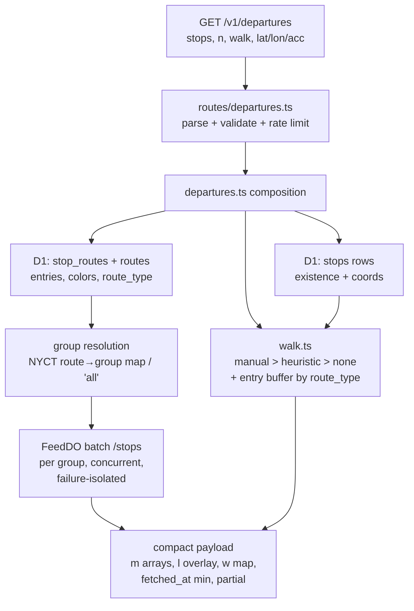

# /v1/departures Leave-By Timer API - Plan

## Goal Capsule

- **Objective:** build the spec's leave-by timer endpoint — `GET /v1/departures` with the <500-byte compact contract — plus the `walk.ts` walk-time seam (manual > heuristic tiers, entry buffers, provenance), composed from existing FeedDO snapshots.
- **Authority:** this plan > `docs/plans/01-guiding-spec.md` (Phase 3 "Departures response", `walk.ts` section) > repo conventions (`CLAUDE.md`, `docs/solutions/`). Mario settled the pre-Phase-5 walk-input question (hybrid: request params + origin heuristic); that decision is binding for this plan.
- **Stop conditions:** surface (don't guess) anything that would change the device-facing contract shape beyond what the KTDs pin — the firmware track on the other machine builds against it. All P1/P2 code-review findings must be fixed before done (`CLAUDE.md`).
- **Tail:** review via `ce-code-review`; commits per repo convention; no deploy required to declare done (tests prove the plan; the <300 ms warm check happens at next deploy).

---

## Product Contract

### Summary

Add `GET /v1/departures`: the device's favorites-timer read path. It takes platform ids directly (pre-Phase-5 favorites live on the device), returns server-computed arrival-minute arrays with feed-sourced colors in the spec's compact shape (500-byte target for the representative favorites payload; worst-case size at the input caps documented for firmware buffer sizing), and overlays leave-by minutes computed by a new `walk.ts` (manual walk seconds from the request > heuristic from an origin position, always plus a per-mode entry buffer, with `source` provenance).

### Problem Frame

The board screen ships on `/v1/nearby`, but the product's core promise — "minutes until you should leave" for favorite stops — has no endpoint. The spec defines the tiny departures contract and the walk-time model; Phase 3 deferred both (recorded in the Phase 3 plan's KTDs as the follow-up favorites phase). Pre-Phase-5 there are no server-side favorites/walk_times rows (the tables exist in migration 0000 but stay empty until accounts land), so the endpoint must get stop ids and walk context from the device. Firmware's timer mode lands later; the tracks converge on the contract this plan pins in the README.

### Requirements

**Endpoint contract**

- R1. `GET /v1/departures` accepts `stops=` (comma-separated namespaced refs `<feed_id>:<stop_id>`) and `n=` (arrivals per stop+route; default 3, cap 8), returning the spec-shaped compact JSON: `ts`, `fetched_at`, and `d` entries per (stop, route) with `s`/`r`/`c`/`t`/`m` keys, minutes computed server-side.
- R2. Colors come from the `routes` table via the existing presentation seam (`normalizeColor`, `paletteColor` fallback, `textColorFor`) — never hardcoded (spec constraint #3).
- R3. Staleness honesty: `fetched_at` is the oldest snapshot among consulted feed groups, `null` when none has ever fetched; `partial: true` appears when any needed group is cold or failed. A known stop with no upcoming service keeps its `d` entries with empty `m` — the device's dash state, distinct from a 0-minute arrival.
- R4. Nothing assumes a single agency: stop refs carry `feed_id`, feeds validate against `CURATED_FEEDS` plus the adapter-groups registry, and a second GTFS-RT agency works with config only.

**Walk times and leave-by**

- R5. New `walk.ts` seam: manual walk seconds (request-supplied, device-held) win over the heuristic (`haversine × 1.3 ÷ 1.3 m/s` from an origin position); both get `entry_buffer_s` added by route type (90 s rail, 0 bus); every result carries `source` (`"manual"` | `"heuristic"`).
- R6. When walk context exists for a stop, the response carries leave-by minute arrays (`l`, aligned index-for-index with `m`, negative values allowed — "too late" is a fact the device renders) and a per-stop `w` map with the applied seconds (`s`) and provenance (`src`).
- R7. An origin whose reported accuracy exceeds `LOCATE_MAX_ACCURACY_M` (same gate value as the locate chain, default 500) is ignored — no heuristic from an untrusted fix. At the route layer, `lat`/`lon` without `acc` is a 400 (constraint #5: coarse location is gated, never trusted silently; the device's locate response always carries accuracy); inside `walk.ts`, absent accuracy is trusted-caller behavior, tested as such. The Mapbox tier stays an env-gated documented slot, unbuilt (spec build order: "Mapbox later, if the heuristic annoys you"), mirroring the Unwired Labs slot precedent in `locate.ts`.

**Operational**

- R8. The route shares the standard per-IP rate bucket (no locate-provider fan-out on this path), enforces input caps (max 20 stop refs; walk seconds 0–7200; `n` 1–8), and remains unauthenticated until Phase 5, consistent with the other `/v1` routes. Origin (`lat`/`lon`/`acc`) and `walk` parameters are request-scoped only — never persisted, never emitted in logs or counted warnings (mirrors the BSSID never-stored posture in the locate route).
- R9. README documents the full request/response contract with curl examples in the same task — it is the coordination artifact for the firmware track. `.env.example` needs no new variables (the walk accuracy gate reuses `LOCATE_MAX_ACCURACY_M`; note that in its comment).

### Scope Boundaries

**Deferred to Follow-Up Work**

- Bike favorites in the timer contract — a GBFS favorite's bikes/docks stays `/v1/nearby` territory until favorites live server-side (confirmed call-out).
- `POST /v1/departures` with a WiFi scan body (locate + departures in one round trip, `/v1/nearby` symmetry) — noted as the likely firmware convenience; not built until the timer screen's wake flow demands it.
- Per-feed `entry_buffer_s` configuration — needs a `feeds` column (migration); the route-type constants cover both curated feeds today.
- Server-side manual tier from `walk_times` rows — Phase 5; the tier ordering in `walk.ts` is designed so it slots above the request-param manual without a contract break.
- Unwired Labs and Mapbox provider slots stay unbuilt.

**Outside this product's identity**

- No per-device state or auth on this endpoint before Phase 5's pairing tokens.

### Acceptance Examples

- AE1. **Given** `stops=mta-subway:A32N,mta-subway:A32S&n=3` with fresh ACE-group data, **when** the device polls, **then** each platform yields one `d` entry per serving route with up to 3 ascending minute values and the group's `fetched_at`.
- AE2. **Given** the same request plus `walk=mta-subway:A32N:420,mta-subway:A32S:420`, **then** both entries carry `l` arrays computed as `floor((arrival − 510 − now)/60)` (420 s manual + 90 s rail entry buffer, unclamped) and the `w` map reports `"src": "manual"`.
- AE3. **Given** no `walk=` but `lat=&lon=&acc=` within accuracy bounds, **then** `l`/`w` come from the heuristic with `"src": "heuristic"`, immediately, with no external routing call.
- AE4. **Given** a stop whose routes have no upcoming trips, **then** its entries return `"m": []` (dash), not absent and not `[0]`.
- AE5. **Given** a stop ref naming a non-curated feed, **then** the whole request fails 400 with an error naming the bad ref — the device is the only caller; fail loud, not partial-silent.

---

## Planning Contract

### Key Technical Decisions

- **Namespaced stop refs (`feed_id:stop_id`), split on the first colon.** One call covers mixed-agency favorites (matches the `favorites` schema where each row carries its `feed_id`); feed ids are curated and colon-free, stop ids may not be. The spec's bare-id example predates multi-feed discipline; the README documents the namespaced form as the contract.
- **Hybrid walk inputs (Mario-settled).** `walk=<feed>:<stop>:<seconds>` supplies the device-held manual tier; optional `lat`/`lon`/`acc` supply the origin for the heuristic tier. Precedence in `walk.ts`: manual > heuristic > none. Phase 5's `walk_times` rows later become a tier between those two without changing this contract.
- **Response contract pinned, budget-tested.** Shape: `{"ts", "fetched_at", "partial"?, "d":[{"s","r","c","t","m","l"?}], "w"?:{"<feed>:<stop>":{"s","src"}}}`. Each entry's `s` is the full namespaced ref (`<feed_id>:<stop_id>`), matching the `w` map keys — bare ids can collide across feeds and would break the `d`↔`w` join; this is a deliberate divergence from the spec's bare-id example, same reasoning as the request-side refs KTD. A workers test asserts the representative favorites payload (2 stations × 2 routes, n=3, walk overlay) stays under 500 bytes, the same way `nearby.test.ts` pins its ~25 KB bound; the 500-byte figure is the representative-payload target, not a maximum — U4's README section documents the worst-case size at the input caps (20 refs, n=8, full overlay) so the firmware track sizes receive buffers to the actual maximum.
- **Entry buffer by `route_type` constants in `walk.ts`.** Rail types (0/1/2) → 90 s, bus (3) → 0; a stop served by mixed types takes the max. Per-feed configurability is deferred until a feed needs a different value (Scope Boundaries).
- **Composition mirrors `nearby.ts`.** Static `stop_routes` defines which (stop, route) entries exist (realtime-only routes are dropped with a counted warning, same as nearby); FeedDO batch `/stops` reads per needed group, concurrent and failure-isolated; the NYCT route→group map is shared with nearby rather than duplicated (lift `groupForRoute` to a shared location — implementer's call where, single source of truth is the requirement).
- **Whole-request 400 on invalid refs.** Unknown feed, malformed ref, or out-of-cap input rejects the request with a specific error. A *valid* ref whose stop id simply isn't in `stops` yields no entries (favorites can outlive a stop across GTFS updates; that's data drift, not a caller bug) — logged with a counted warning.
- **`ts` and minute math.** `ts` = response epoch seconds; `m` = `floor((arrival − now)/60)` clamped at 0 like nearby's `eta_min`; `l` = `floor((arrival − walk_s − now)/60)` **unclamped** (negative = missed-this-train, a distinct renderable fact per the spec's zero-vs-negative rule).

### High-Level Technical Design

---

## Implementation Units

### U1. `walk.ts` — the walk-time seam

- **Goal:** pure module computing `{seconds, source}` per stop from manual/heuristic inputs plus entry buffer, or null when no trusted input exists.
- **Requirements:** R5, R7.
- **Dependencies:** none.
- **Files:** `api/src/walk.ts`, `api/test/unit/walk.test.ts`.
- **Approach:** input is per-stop `{manualSeconds?, origin?: {lat, lon, accuracyM?}, stop: {lat, lon}, routeTypes: number[]}`; tiers resolve manual > heuristic > null; entry buffer added inside the seam so every caller gets it (spec: "Always add `entry_buffer_s`"); accuracy gate reads the same default (500) as `locate.ts` with the env override parsed the same way. Keep it dependency-free (reuse `haversineM` from `stops.ts`).
- **Patterns to follow:** `presentation.ts` (small pure seam with exhaustive unit tests), `locate.ts` `intVar` env parsing, `stops.ts` `haversineM`.
- **Test scenarios:**
  - Manual 420 s at a rail stop → 510 s, `src: "manual"` (buffer added; covers AE2's arithmetic).
  - Heuristic golden value: origin 650 m from stop → `650 × 1.3 ÷ 1.3 = 650 s` + buffer, `src: "heuristic"`.
  - Origin without `accuracyM` → trusted (gate skipped): heuristic applies. (The route layer guarantees `acc` on the API path; the seam itself is trusted-caller.)
  - Bus-only stop gets 0 buffer; mixed rail+bus stop gets 90 (max rule).
  - Manual present *and* origin present → manual wins.
  - No manual, no origin → null. No manual, origin with `accuracyM` 501 → null (gate). Accuracy exactly 500 → allowed (boundary).
  - Manual seconds out of bounds (negative, > 7200, NaN) → treated as absent, falls through to next tier.
  - Env override `LOCATE_MAX_ACCURACY_M` respected; garbage env value falls back to 500.
- **Verification:** `npm test` unit suite green; every branch of the tier/gate table exercised.

### U2. Departures composition

- **Goal:** `composeDepartures(env, refs, params)` producing the pinned compact payload from D1 reference data + FeedDO batch snapshots + `walk.ts`.
- **Requirements:** R1–R4, R6; AE1–AE4.
- **Dependencies:** U1.
- **Files:** `api/src/departures.ts`, `api/src/nearby.ts` (share the route→group mapping), `api/test/workers/departures.test.ts`.
- **Approach:** group refs by feed; load feed adapter rows (curated allowlist already checked in U3); one `stops` query (coords for walk + existence), one `stop_routes`+`routes` join (entries, colors, `route_type`); resolve needed groups per feed via the shared mapping; batch-read each `{feed}:{group}` FeedDO concurrently with `Promise.allSettled` and `FETCH_TIMEOUT_MS` (failure → `partial`, nearby precedent); assemble `d` entries in request order (routes sorted within a stop), apply `n` trim, compute `m`/`l`, attach `w`. `fetched_at` = min across consulted groups with data.
- **Patterns to follow:** `nearby.ts` `fetchGroupSnapshots` (concurrent, failure-isolated, cold-group semantics), `feed_do.ts` batch `/stops` contract, boundary-safe eta fixtures from the golden nearby test (commit `2490dc2`), `Object.create(null)`/`Object.hasOwn` for caller-controlled ids.
- **Test scenarios:**
  - Golden contract test (AE1 shape): exact keys, request-ordered stops, per-route trim at `n`, ascending minutes.
  - Payload budget: representative favorites payload (2 stations × 2 routes, n=3, walk overlay) `< 500` bytes.
  - Boundary etas: arrival exactly `now` → `m` 0; past arrivals absent (DO-side filter); arrival at `now + 59 s` → 0, `now + 60 s` → 1.
  - Off-minute-boundary leave-by fixture: arrival − now = 630 s with walk 510 s → `m` 10, `l` 2 — distinguishes the `floor((arrival − walk − now)/60)` formula from any `m`-minus-walk-minutes shortcut.
  - Leave-by: `l` aligned with `m`; negative `l` preserved; no walk context → no `l`, no `w` entry for that stop.
  - Known stop, no service → entries with empty `m` (AE4). Valid-but-unknown stop id → omitted, counted warning, request still 200.
  - Golden two-feed assertion: every `d` entry's `s` is the namespaced ref, matching its `w` key.
  - Stop row with null lat/lon → no heuristic tier (manual still applies; no `l`/`w` when manual is also absent), mirroring `nearbyStops`' null-coordinate skip.
  - One group cold → `partial: true`, `fetched_at` from the fresh group; all cold → `fetched_at: null`. Group DO failure → same degrade, still 200.
  - Colors: feed color normalized; colorless route → palette fallback + luminance text color.
  - Two feeds in one request → both composed, groups fanned per feed (multi-agency proof, R4).
  - Realtime arrival for a route absent from static `stop_routes` → dropped with counted warning.
- **Verification:** workers suite green; golden test pins the README contract byte-for-byte on keys.

### U3. Route handler and wiring

- **Goal:** `routes/departures.ts` parsing/validating the request surface, wired in `index.ts` under the standard rate bucket.
- **Requirements:** R1, R8; AE5.
- **Dependencies:** U2.
- **Files:** `api/src/routes/departures.ts`, `api/src/index.ts`, `api/test/workers/departures.test.ts` (routes describe-block; extend `api/test/workers/router.test.ts` only if the 404 fall-through needs it).
- **Approach:** GET only; parse `stops` refs (first-colon split, percent-decoding per `batchIdsParam`'s comma-handling precedent), `n`, `walk` triplets (rightmost-colon split for seconds), `lat`/`lon`/`acc` (reuse the `validCoords` guard shape from `routes/nearby.ts`); validate feeds against `curatedFeeds(env)` and the adapter-groups registry; caps per R8; 400s carry specific error text.
- **Patterns to follow:** `routes/nearby.ts` (param validation, error shapes, `loadFeedInfo`-style feed query), `index.ts` routing + `rateLimited` standard bucket.
- **Test scenarios:**
  - Missing/empty `stops` → 400; malformed ref (no colon) → 400 naming the ref; non-curated feed → 400 (AE5).
  - `n=0`, `n=9`, `n=abc` → 400; valid `n` bounds 1 and 8 accepted.
  - `walk=` triplet with non-numeric or out-of-range seconds → 400; a `walk=` ref not present in `stops=` → 400 naming the ref (AE5's fail-loud rule); `lat` without `lon` → 400; `lat`/`lon` without `acc` → 400 (R7); out-of-range coords → 400.
  - 21 stop refs → 400 (cap); 20 → accepted.
  - POST/PUT → 404 (consistent with the router's method handling); rate-limit exhaustion → 429 on the standard bucket, not the locate bucket.
- **Verification:** router + departures suites green; a curl against `wrangler dev` returns the documented shape.

### U4. Documentation

- **Goal:** README carries the full device contract (the firmware track's coordination artifact); hygiene files stay current.
- **Requirements:** R9.
- **Dependencies:** U2, U3 (documents what shipped).
- **Files:** `README.md`, `.env.example`, `CONCEPTS.md`.
- **Approach:** README gains a `/v1/departures` section beside the Phase 3 endpoints: request params (namespaced refs, `n`, `walk`, origin), curl examples, the response contract with the `l`-negative and empty-`m`-dash semantics spelled out, the 500-byte note, and which spec acceptance criteria it satisfies. `.env.example`: extend the `LOCATE_MAX_ACCURACY_M` comment to mention the walk-heuristic gate reuse. `CONCEPTS.md`: Leave-By and Entry Buffer entries.
- **Test expectation:** none — documentation; reviewed for contract fidelity against the golden test.
- **Verification:** README examples copy-paste-run against `wrangler dev`; no contract key appears in code that isn't documented.

---

## Verification Contract

| Gate | Command | Proves |
|---|---|---|
| API unit + workers suites | `cd api && npm test` | U1 tier/gate table, U2 golden contract + payload budget + staleness semantics, U3 validation surface |
| Full-repo regression | `cd ingest && uv run pytest -q` | ingest untouched (no schema change in this plan) |
| Contract fidelity | golden test in `api/test/workers/departures.test.ts` vs README section | the firmware track can build from README alone |
| Review gate | `ce-code-review`; all P1/P2 fixed | `CLAUDE.md` pipeline requirement |

Spec acceptance criteria this plan advances (cite in review per `CLAUDE.md`): departures returns with `fetched_at` (the <300 ms warm half is measured at next deploy); walk time returns immediately from the heuristic with `source:"heuristic"` and no Mapbox key; `entry_buffer_s` applied to subway and not bus; no-service dash distinct from 0-minute arrival.

## Definition of Done

- U1–U4 landed; `npm test` green including the new suites; golden test and README agree on every response key.
- Walk tiers, entry buffer, provenance, and the accuracy gate behave per the KTD table with boundary tests at 500 m accuracy and 0/negative leave-by.
- README/`.env.example`/`CONCEPTS.md` updated in the same task (standing directive), with the negative-`l` and empty-`m` device semantics documented.
- `ce-code-review` run; every P1/P2 finding fixed; P3s logged with a note.
- No experimental or dead code left in the diff.
