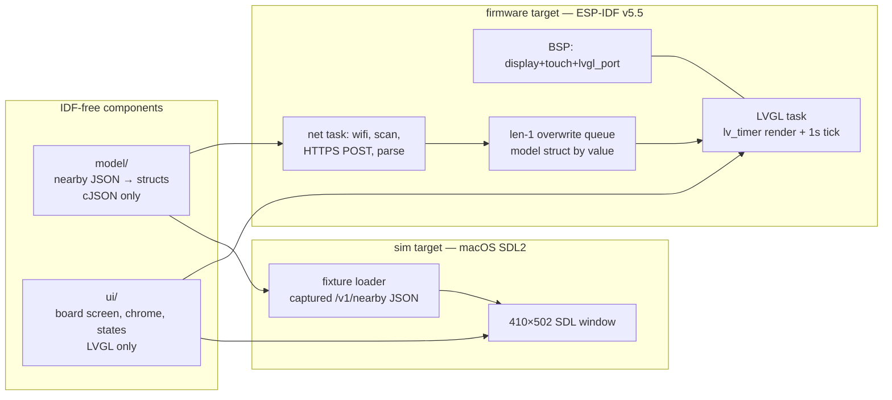

# feat: Phase 4 firmware bring-up — explore board on the device

## Summary

Bring the Waveshare ESP32-S3-Touch-AMOLED-2.06 to life as the spec's dumb
renderer, milestone 1 cut (Mario's pick): **board screen, read-only, against
the production API** — display bring-up via the board's official BSP, WiFi
join from NVS-stored credentials, scan → `POST /v1/nearby` → render the rail
board per the design handoff's exact tokens, with loading/offline/stale
states honest. UI and model code are IDF-free components shared with an SDL
simulator target on the Mac. Touch, gestures, detail views, bike screens,
IMU wake, and the full on_demand power model are the next milestones,
explicitly deferred.

**Decisions made interactively with Mario (2026-08-03):** ESP-IDF v5.5 +
official BSP; M1 = read-only board; NVS-first credentials with Kconfig seed;
simulator from the start.

---

## Problem Frame

Phases 1–3 built an API where the device does no thinking: one POST returns
everything the board renders. Nothing renders it yet. The risk profile is
classic embedded bring-up: vendor docs with copy-paste errors (the spec
documents them), a display that stays black if the init sequence is wrong,
and UI iteration at flash-cycle speed unless a simulator exists. The
architecture must survive milestone 2+ (gestures, power model) and a second
board (spec: "a second device should be a new HAL, not a fork").

---

## Requirements

- R1. Firmware builds with ESP-IDF v5.5.x and the official registry BSP
  (`waveshare/esp32_s3_touch_amoled_2_06`); the display lights with LVGL 9.5
  and touch enumerates (even though M1 ignores input).
- R2. `model/` parses a live `/v1/nearby` response into fixed-size C
  structs — no LVGL, no ESP-IDF includes, host-testable. Coverage: rail
  system fully (stops, trunks, routes/shapes/colors, direction-split
  arrivals, alerts); bike system into structs as forward-compat prep (M2
  renders it); bus presence noted; status fields `fetched_at` (null →
  NO_DATA), `partial`, `units`, and the top-level `location` echo (a debug
  passthrough — logged, not rendered in M1). The unknown-location case is
  NOT a body field: it is the HTTP 422 handled in U5 as its own UI state.
- R3. `ui/` renders the handoff's board screen from a model struct: global
  chrome (status chip, mode/stop dots), length-adaptive station header,
  direction pill (static in M1), trunk rows (bullet clusters with overlap
  rings, headsign + alert sub-line, countdown with amber alert tint), the
  loading skeleton, and the offline/stale treatment. IDF-free.
- R4. The simulator (`sim/`) runs the same `ui/` + `model/` on macOS in a
  410×502 SDL window, fed by fixture files including captured live
  responses.
- R5. On device: WiFi credentials read from NVS (seeded from gitignored
  build config), scan collects BSSIDs, `POST /v1/nearby` over HTTPS with
  the IDF cert bundle, model published to the LVGL task by value; auto-poll
  every 30 s (handoff), freshness counter ticks locally at 1 s, countdowns
  decrement locally between polls (spec: no other device time math).
- R6. Staleness honesty on-device, honoring the spec's "two different
  failures, two different displays" (Mario's call, 2026-08-03): content
  degrades identically (60% opacity, `~` prefixes) but the chip
  distinguishes — red `offline · Nm` when fetches fail, amber `stale · Nm`
  when connected but data age exceeds 90 s. Never stale-as-live.
- R10. Unknown location (API 422): M1 renders the adapted empty-mode
  pattern (dashed circle, "Can't find you" / "No known WiFi networks
  nearby." / "Retrying automatically.", red chip) — Mario's call; the
  handoff had no screen for this fact. The connected-phone fallback
  location he'd prefer needs Phase 5 pairing (config-stored fallback
  lat/lon → the GET path) and is recorded in Deferred work.
- R7. AMOLED basics from M1: pure black background, brightness via the
  panel's 0x51 command, idle dim then display-off timer, whole-layout
  ±4 px jitter applied on full renders only — new model arrival or
  dim-recovery — never on the 1 Hz label tick (spec's burn-in requirement
  without visible shaking).
- R9. The status chip's battery percentage is a real AXP2101 read (spec:
  "this is the main thing the board buys you — use it"), not a placeholder.
- R8. Repo hygiene: firmware CI (host tests + pinned IDF container build)
  path-filtered so api/ingest suites are untouched; README gains firmware
  setup (macOS toolchain, flash, simulator); CLAUDE.md's scope section
  rewritten (firmware in scope, current phase status); `.env.example`
  points at the `sdkconfig.local` convention.

---

## Key Technical Decisions

- **Toolchain: native ESP-IDF v5.5.x + the official BSP** (Mario's pick,
  research-verified): `waveshare/esp32_s3_touch_amoled_2_06` v2 on the
  Component Registry wires esp_lvgl_port + `waveshare/esp_lcd_sh8601` (the
  CO5300 is SH8601-command-compatible; the BSP carries the correct vendor
  init table) + FT3168 touch. The spec's Arduino pinned-library table is
  superseded by the BSP — the spec's own warning ("trust the pin-macro
  header, not demo prose") is exactly what the BSP encodes. IDF 6.0
  declined: breaking changes (bundled cJSON removed) buy nothing yet.
- **Layout realizes the spec's core/hal split as components:** `model/` and
  `ui/` are IDF-free (the spec's `core/`), `main/` + board glue are the HAL.
  Enforced structurally: those components' CMake must not require any esp
  component — the simulator build fails loudly if platform code leaks in.
- **Simulator from day one** (Mario's pick): LVGL 9.5 pinned identically in
  both builds; `sim/` is a small CMake target (SDL2 via Homebrew) with a
  fixture loader whose primary diet is **captured live `/v1/nearby`
  bodies** — the same JSON contract the API tests pin, making the sim a
  cheap firmware↔API contract check.
- **Credentials: NVS-first** (Mario's pick): the connect path reads
  SSID/password from NVS only; a dev-build boot hook seeds NVS from
  `CONFIG_*` values supplied via gitignored `sdkconfig.local`
  (`SDKCONFIG_DEFAULTS` merge). Phase 5 provisioning replaces the seeder,
  never the connect path. `sdkconfig` gitignored; `sdkconfig.defaults`
  committed, secret-free.
- **Task architecture: network task publishes, LVGL task renders.** The BSP/
  esp_lvgl_port owns the LVGL task and tick. A separate network task runs
  scan → HTTPS POST → cJSON parse → fixed-size model struct, published by
  value through a length-1 overwrite queue; an `lv_timer` consumes and
  re-renders. `ui/` never sees FreeRTOS; the net task never calls `lv_*` —
  no lock-ordering questions, and a slow TLS handshake can't stall
  rendering. A 1 s `lv_timer` decrements displayed minutes and ticks the
  freshness chip.
- **Framebuffer strategy: BSP default first** (partial refresh, ~80 KB
  internal-RAM draw buffer, panel GRAM holds the frame). The board updates
  ~once a second; tearing modes (full/direct buffers in octal PSRAM) are a
  measured escalation, not a default. The BSP's even-pixel rounder callback
  is load-bearing — never bypass BSP display init.
- **JSON: cJSON (IDF-bundled on 5.5)** with the parse-copy-free pattern:
  read body into one capped buffer (64 KB ceiling; live payloads ~5 KB),
  parse, `strlcpy` into fixed-size model fields, delete the tree in one
  exit path. Model structs are value types — the queue handoff and host
  tests fall out of that.
- **TLS posture:** `esp_crt_bundle` (covers workers.dev chains), ~50 KB
  transient heap budgeted for the handshake; connection reuse across the
  30 s poll only if measurement shows handshake latency matters (M1 keeps
  it simple: fresh connection per poll, measured).
- **Poll cadence 30 s** (handoff: "auto-poll every 30s, configurable") —
  the spec's 20 s is the DO-upstream cadence, not the device's. The device
  90 s staleness threshold (spec) drives the red-chip transition together
  with fetch failures.
- **Explore-first reconciliation:** the handoff is the product source of
  truth for screens (board, not the spec's timer card); the spec remains
  authoritative for device fundamentals — core/hal split, staleness
  honesty, burn-in jitter, dark-by-default, and (M3) wake-on-motion and
  deep sleep. The spec's timer card returns when the favorites/departures
  endpoint lands (opti track).
- **Fonts: built-in Montserrat at matched sizes for M1** (handoff:
  "acceptable"), converted IBM Plex/Public Sans faces with tabular numerals
  as a follow-up polish pass — font conversion is real scope and M1's job
  is the vertical slice, not typography finality.

---

## High-Level Technical Design

Component sharing — the same UI and model compile into both targets:



M1 device sequence: boot → BSP display up → render loading skeleton →
NVS creds → WiFi join → scan BSSIDs → POST `/v1/nearby` → parse → queue →
render board → 30 s poll loop, 1 s local tick, idle dim/off timer.

State machine (M1 subset of the handoff's, R6/R10 refined):
`LOADING → LIVE ⇄ {OFFLINE | STALE} ; any → NO_LOCATION on 422` — OFFLINE
on fetch failure, STALE on fetch-success-but-age>90 s, both back to LIVE
(with the 1.4 s green `now` flash) on a fresh successful fetch;
NO_LOCATION retries on the poll cadence.

---

## Output Structure

```
firmware/
├── main/                  # app_main, wifi/NVS creds, net task, queue, glue
│   └── Kconfig.projbuild  # dev-seed SSID/pass, API base URL
├── components/
│   ├── model/             # IDF-free: nearby structs + parser (cJSON)
│   └── ui/                # IDF-free: LVGL board screen, tokens, states
├── sim/                   # macOS SDL2 target (CMake), fixture loader
├── test/host/             # Unity host tests for model/ (+ ui smoke via sim libs)
├── fixtures/              # captured /v1/nearby bodies + synthetic cases
├── idf_component.yml      # BSP, lvgl 9.5 pin
├── sdkconfig.defaults     # committed, secret-free
└── partitions.csv
```

---

## Implementation Units

### U1. Toolchain, skeleton, first light

- **Goal:** `idf.py flash` puts an LVGL "hello" on the panel; repo scaffolding in place.
- **Requirements:** R1, R8 (partial)
- **Dependencies:** none
- **Files:** `firmware/main/`, `firmware/idf_component.yml`, `firmware/sdkconfig.defaults`, `firmware/partitions.csv`, `.gitignore` (build/, sdkconfig, managed_components/, sdkconfig.local)
- **Approach:** ESP-IDF v5.5.x installed via the documented macOS path; project skeleton with the BSP dependency; `bsp_display_start()` + a styled label proves display init, PSRAM config, and flashing from this Mac. Download the schematic PDF from the Waveshare wiki (linked per the spec) into `firmware/docs/` to settle the AXP2101→AMOLED rail question (research flag) and record the answer in a comment; do not write PMU rail code. Also copy the prototype HTML bundle (`Transit Watch Prototype.dc.html`, `Explorations`, `support.js` — currently only on Mario's machine) into `docs/design/prototype/` so U3's fidelity baseline is in-repo.
- **Patterns to follow:** the BSP's own `02_lvgl_demo_v9` example; spec's "trust the pin-macro header" warning (moot under the BSP, note why).
- **Test scenarios:** Test expectation: none — scaffolding; verification is on-device first light and a committed build that CI can compile (U6 wires it).
- **Verification:** photo-verifiable hello screen at full brightness; `idf.py build` clean from a fresh clone + documented setup.

### U2. model/ — nearby parser as a pure component

- **Goal:** `/v1/nearby` JSON → fixed-size C structs, host-tested.
- **Requirements:** R2
- **Dependencies:** none (parallel with U1)
- **Files:** `firmware/components/model/` (headers + parser), `firmware/test/host/` (CMake + Unity), `firmware/fixtures/` (captured live body + synthetic cases)
- **Approach:** Structs sized to the contract's stated caps (5 stops/system, 8 arrivals/direction, alert text ≤200 + margin) plus `MAX_TRUNKS_PER_STOP = 8` — the API does NOT cap trunks per stop (verified in composeRailSystem), 8 covers NYC's busiest color groupings, and retained-beyond-4 trunks are what U3's overflow tray renders (clamp-and-count past 8): value types, no heap ownership. Parser: capped-buffer + cJSON + null-checked field walks + `strlcpy`, single cleanup exit; unknown fields ignored (forward-compat). Parses the rail system fully; bike parsed into structs too (cheap now, M2 renders it); bus presence noted. Status fields: `fetched_at` (null → NO_DATA state), `partial`, `generated_at` ignored, `units` passthrough.
- **Execution note:** test-first — fixtures exist before the parser; start from the captured live body.
- **Test scenarios:**
  - Captured live fixture → struct spot-checks (station names, trunk count, arrival etas, alert severity/text/directions, bike counts incl. null-counts case).
  - `fetched_at: null` cold body → NO_DATA flag; `partial: true` lands in the struct (M1 renders nothing for it — logged only, an M2 candidate; documented so it reads as deliberate, not vestigial).
  - Top-level `location` echo parsed into the struct (debug logging only).
  - Trunk cap: 9-trunk synthetic stop → 8 retained, 1 counted as clamped.
  - Truncation: >caps counts of stops/trunks/arrivals → clamped, counted, no overflow (ASAN-clean on host).
  - Oversized/garbage/malformed JSON → parse error code, no crash, no leaks (host LeakSanitizer via Homebrew clang per simulator research note).
  - Missing optional fields (alert null, nearest_distance_label absent) → zero values, not errors.
  - Overlong strings (station name, headsign, alert text) → truncated to field size, NUL-terminated.
- **Verification:** host suite green on macOS; a fresh live capture parses.

### U3. ui/ — the board screen, IDF-free

- **Goal:** The handoff's board rendered from a model struct, all M1 states.
- **Requirements:** R3, R6 (presentation half), R7 (jitter hook), R10
- **Dependencies:** U2 (structs)
- **Files:** `firmware/components/ui/` (screen, tokens/styles, fonts config, state renderer)
- **Approach:** Two seams, deliberately: `ui_board_show(model*, ui_state*)` performs a full render (and applies a fresh ±4 px jitter offset), while `ui_board_tick()` updates only countdown/chip labels in place at 1 Hz — no re-layout, no jitter recompute, no visible shaking. Handoff-exact: chrome (chip at y=18 with live/offline/`now`-flash variants, battery glyph fed by a value the HAL supplies later — sim feeds a constant; mode/stop dots), adaptive header sizes (30/27/24 by length), direction pill (rendered, inert), trunk rows with hairlines and equal heights up to 4 + the 2a overflow tray beyond, bullet clusters (46 px circles, -12 px overlap with 3 px black ring; pill variant for >2-char labels), headsign + amber/grey sub-line, countdown 36/700 with amber tint on alerted trunks, `min` unit alignment; loading skeleton (shimmer blocks, 1.4 s sweep); the two degraded treatments per R6 — shared 60%-opacity/`~` content with red `offline · Nm` vs amber `stale · Nm` chips (the handoff's single offline treatment split per the spec, Mario-approved; "shake to retry" banner copy replaced by "retrying automatically" until shake lands in M2); the R10 unknown-location screen (adapted empty-mode pattern). Battery chip value comes through the `ui_state` struct (device: real AXP2101 read; sim: fixture constant). Layout parented to one container for the jitter offset. Colors/sizes as named constants mirroring the handoff's token list. Montserrat matched sizes (per Key Technical Decisions).
- **Test scenarios (via the sim harness — this unit's tests are U4's fixtures rendered):**
  - Golden-path fixture renders: two-trunk station, alert-tinted row, bike-less rail board.
  - Long station name → 24 px 2-line ellipsized header; 5+ trunks → overflow tray.
  - NO_DATA vs empty-but-live vs offline vs stale vs unknown-location render distinctly (spec: different facts; R6's chip split and R10's screen each verified against a fixture).
  - Jitter offset applied on each `ui_board_show` within ±4 px envelope; `ui_board_tick` calls leave the offset untouched (no shake at 1 Hz).
- **Verification:** side-by-side vs the prototype HTML at 410×502 — spacing/type/colors match within LVGL's capabilities; Mario eyeballs the sim.

### U4. sim/ — SDL simulator target

- **Goal:** `ui/`+`model/` running in a Mac window off fixtures.
- **Requirements:** R4
- **Dependencies:** U2, U3
- **Files:** `firmware/sim/` (CMake, main, SDL glue, fixture loader), README section
- **Approach:** LVGL 9.5 + SDL2 (Homebrew), `lv_sdl_window_create(410, 502)`; loader takes a fixture path argument (or cycles a directory); keyboard keys map to future gestures (stubbed). A `make capture` helper curls the live endpoint into `fixtures/` (documented; no secrets involved).
- **Test scenarios:**
  - Sim boots each committed fixture without assertion failures (scriptable smoke run in CI, headless SDL dummy driver if available; otherwise compile-only in CI).
  - Same fixture through host parser and sim renderer — no divergence crash.
- **Verification:** all U3 states demonstrable on the Mac; screenshot set saved for the plan's design-fidelity check with Mario.

### U5. Device vertical slice — WiFi, fetch, render, honesty

- **Goal:** The live board on hardware: scan → POST → render, polling, honest states.
- **Requirements:** R5, R6, R7, R9
- **Dependencies:** U1, U2, U3
- **Files:** `firmware/main/` (net task, wifi/NVS module, queue, app wiring, idle/brightness module, battery read), `firmware/main/Kconfig.projbuild`
- **Approach:** NVS-first creds (KTD); boot renders skeleton immediately, then join → scan (active, bounded record array, scan completes before the HTTP phase) → POST BSSIDs to `CONFIG_API_BASE_URL` with `esp_crt_bundle` → parse (U2) → publish. 30 s poll (esp_timer notifies the net task); 1 s `lv_timer` decrements minutes and advances the chip counter; fetch failure → OFFLINE chip, fresh-but-old data (>90 s age with fetches succeeding) → STALE chip (R6's two displays); success → LIVE + 1.4 s green flash. 422 (`location unknown`) → the R10 screen, retried on the normal poll cadence. Brightness: 0x51 via `bsp_display_brightness_set`; inactivity → dim at ~30 s, display off at ~2 min (M1 placeholders for the M3 power model); full renders re-apply the jitter offset, the 1 Hz tick never does. Battery percentage read from the AXP2101 over I2C (the vendor `01_AXP2101` telemetry path — reads only, no rail writes) feeding the chip via `ui_state`. Log heap watermarks around the TLS handshake once (research's 50 KB budget check). NVS-first creds per Key Technical Decisions.
- **Test scenarios:** (host-testable pieces live in U2; these are structured on-device checks)
  - First boot with empty NVS + seed config → creds seeded once, join succeeds; wrong password → offline state with red chip, no crash-loop.
  - Airplane-test: kill the AP mid-run → chip goes red with rising age; restore → recovers to LIVE with flash.
  - Poll cadence observable in Worker logs (~2/min from the device IP); countdown decrements between polls without drift vs a fresh fetch.
  - Latency, honestly budgeted against this plan's own research: the skeleton renders instantly at boot; the WiFi scan alone costs ~1.5–2 s (full 2.4 GHz sweep), then fetch+parse+render adds its share — first LIVE board within ~4 s of boot, measured and logged per stage. (The spec's ~1 s pocket-pull budget is the M3 wake-from-sleep path, which renders RTC-cached data before any networking — not an M1 target.)
  - Idle dim/off fire on schedule; any refresh while dimmed restores brightness.
- **Verification:** the device, held at Jay St–MetroTech (or fed that location via a GET-override dev flag), shows the same board the prototype shows for the live API; photos + a Worker-side log check (device UA) close the loop.

### U6. CI, docs, CLAUDE.md scope rewrite

- **Goal:** Firmware is a first-class citizen of the repo without taxing the existing suites.
- **Requirements:** R8
- **Dependencies:** U1–U5 (documents what exists)
- **Files:** `.github/workflows/firmware.yml` (new), `README.md`, `CLAUDE.md`, `.env.example`
- **Approach:** Path-filtered workflow: host tests (seconds, plain cc), pinned esp-idf-ci-action container build, optional sim compile. README: firmware section (macOS toolchain install, `sdkconfig.local` convention, flash, simulator, fixture capture). CLAUDE.md: scope section rewritten — Phases 1–3 + alerts shipped, Phase 4 active with M1 defined, machine split noted (opti = API tasks, Mac = firmware/flash), the "do not scaffold firmware" directive replaced by pointers to this plan and the handoff. `.env.example`: comment block pointing firmware config at `sdkconfig.local` (not .env).
- **Test scenarios:** Test expectation: none — CI/docs; verification is a green firmware workflow on a PR touching `firmware/**` and an untouched api/ingest workflow run.
- **Verification:** fresh-clone quickstart reproduces build+sim per README; CLAUDE.md review by Mario.

---

## Scope Boundaries

- **Out (this plan):** touch/gesture handling, trunk detail view, bike/nearby
  screens, direction flip, shake refresh, PWR-button navigation, IMU
  wake-on-motion and deep sleep (the full on_demand model), OTA, audio,
  RTC-backed render-before-network, font conversion pass, Phase 5
  provisioning UI.
- **Deferred to Follow-Up Work:**
  - **M2 — interaction:** gestures per handoff thresholds, detail view,
    bike screens, direction flip, motion specs (260 ms curves).
  - **M3 — power model:** QMI8658 wake-on-motion, deep sleep, RTC-backed
    last-known render, PWR button, brightness policy finalization.
  - Converted fonts with tabular numerals; sim screenshot-diff CI; second
    HAL proof; timer card when `/v1/departures` lands (opti track);
    **phone-provided fallback location** for the unknown-location case
    (Phase 5 pairing stores a fallback lat/lon the device uses via the GET
    path — Mario's preferred long-term answer to the 422 screen).

---

## Risks & Dependencies

- **Vendor BSP quality** is load-bearing for U1. Fallback documented in the
  research: raw `esp_lcd_sh8601`/`co5300` + the BSP's vendor init table +
  hand-wired esp_lvgl_port — a day's detour, not a redesign.
- **AXP2101 → panel rail unverified** (research flag): resolved by reading
  the schematic during U1; until then no PMU writes beyond telemetry reads.
- **TLS heap (~50 KB transient)** alongside a ~80 KB draw buffer and WiFi is
  comfortable on paper (8 MB PSRAM, ~300 KB usable internal after WiFi);
  U5 logs watermarks to confirm rather than assume.
- **Design fidelity within LVGL**: bullet overlap rings and the skeleton
  shimmer are the two effects most likely to need approximation; the sim
  makes the negotiation with the prototype cheap and visible.
- **Waveshare doc drift**: the spec's copy-paste-error warning stands;
  authority order is BSP source > wiki Features table > demo prose.

---

## Sources & Research

- Board/stack research (verified 2026-08-03): official registry BSP
  `waveshare/esp32_s3_touch_amoled_2_06` v2.0.0 (IDF ≥5.3, esp_lvgl_port ^2,
  `waveshare/esp_lcd_sh8601`, FT3168 via ft5x06 driver); CO5300 is
  SH8601-command-compatible; QSPI pin map without TE or backlight pins;
  brightness = DCS 0x51; even-pixel rounder required; LVGL stable 9.5.0;
  IDF v5.5.5 (maintenance to Jan 2028) vs 6.0 (removed bundled cJSON);
  PlatformIO official platform caps Arduino at 2.x for S3; esp_wifi scan
  ~1.5–2 s full 2.4 GHz sweep; esp_crt_bundle covers workers.dev; TLS
  handshake ~40–50 KB transient heap.
- Practices research: ui/model as IDF-free components with an SDL sim
  (chiefenne template, lv_port_pc_vscode, esp-brookesia layering); LVGL v9
  lv_lock/esp_lvgl_port threading rules; value-struct queue handoff; Unity
  host tests + esp-idf-ci-action with path filters; Kconfig +
  gitignored sdkconfig.local; NVS-first credential path; AMOLED burn-in
  practice (dark theme, dim/off timers, brightness cap, pixel shift).
- Product sources: `docs/plans/01-guiding-spec.md` Phase 4 (hardware truth,
  core/hal rule, power model, burn-in, staleness); `docs/design/transit-watch-handoff.md`
  (screens, tokens, thresholds, motion, state machine, 30 s poll).
