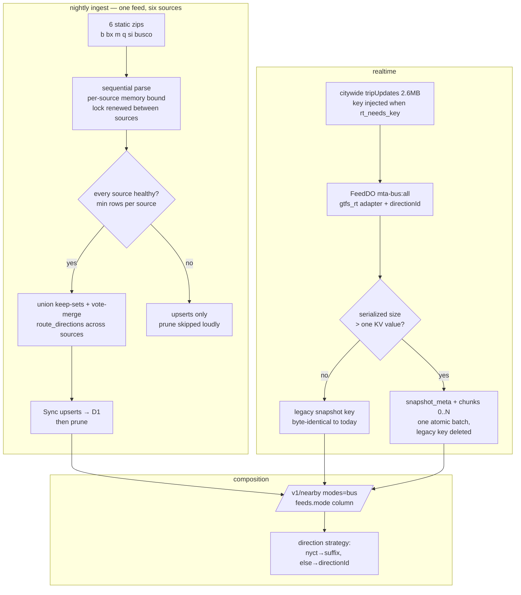

# MTA Bus Third Mode - Plan

## Goal Capsule

- **Objective:** MTA Bus becomes the third live mode (beads epic `gc-4wk`) — bus realtime through the existing FeedAdapter seam, six static GTFS sources ingested as one curated feed, bus rendering in `/v1/nearby` (and reachable via `/v1/departures`), key custody built but gracefully optional.
- **Authority:** this plan > the live-verified research recorded in Sources > `docs/plans/01-guiding-spec.md` > repo conventions. The spec's "MTA Bus needs a key, defer custody" note is superseded by this epic (Mario 2026-08-03) and by live verification — update `CLAUDE.md`'s deferral line as part of this work.
- **Stop conditions:** surface anything that changes the device-facing `/v1/nearby` contract shape beyond adding the bus system; surface if measured Worker CPU or storage behavior at bus scale contradicts the recorded measurements by an order of magnitude. All P1/P2 review findings fixed before done.
- **Tail:** `ce-code-review`, PR with green CI, then the ordered rollout in Definition of Done; the real API key is requested from Mario at deploy time, never invented.

---

## Product Contract

### Summary

Add `mta-bus` as a curated feed: nightly ingest of the six MTA bus static GTFS zips (five boroughs + MTA Bus Company) into the existing D1 tables under one `feed_id`, realtime trip updates from the citywide Bus Time GTFS-RT feed through the existing plain `gtfs_rt` adapter, and bus stops with direction-split arrivals appearing as the `bus` system in `/v1/nearby`. A new `feeds.mode` column makes mode membership explicit, FeedDO learns chunked snapshot persistence (bus state is ~20× the KV value limit) and optional API-key injection for `rt_needs_key` feeds.

### Problem Frame

The device design has three peer modes — rail / bus / bike — and two are live. Bus was deferred as "Phase 6 territory" on the assumption that Bus Time key custody was a hard prerequisite; live verification (2026-08-03) shows the trip-updates feed currently serves without a key, while MTA's docs still say one is required. The remaining real obstacles are scale ones: the citywide feed is 2.6 MB (vs ~100–400 KB per NYCT group), its reduced snapshot exceeds the DO storage per-value limit, bus static GTFS is six sources and ~12k+ stops, and the composition layer has two rail-shaped assumptions (mode derived from adapter; direction derived from NYCT platform suffixes) that must become data-driven.

### Requirements

**Data model and ingest**

- R1. `feeds` gains a `mode` column (`rail` | `bus` | `bike`), populated by curated seeds and carried through the ingest schema-sync tests; `/v1/nearby` mode membership reads it instead of inferring from adapter. Catalog rows carry `mode: None` (curated-only column — the sync layer binds every column of every row, so catalog row-building must emit it).
- R2. The `mta-bus` curated seed ingests all six static sources (`gtfs_b`, `gtfs_bx`, `gtfs_m`, `gtfs_q`, `gtfs_si`, `gtfs_busco` — verified live on the same S3 bucket as the subway zip) into stops/routes/stop_routes/route_directions under the single `mta-bus` feed id. For multi-source feeds, D1's `static_url` is display-only; the source list is authoritative from the seeds registry on every run.
- R3. Multi-source Sync stays convergent and guarded: the keep-set for Prune is built across **all six** sources; a failed or oversized download aborts the feed's prune; and a **hollow source** — a zip that parses but yields implausibly few rows — also aborts it loudly, gated by **absolute per-source floors** (≥200 stops and ≥10 routes per source; Staten Island, the smallest, carries roughly 600 stops and ~30 routes — calibrate the floors against the dry-run's recorded per-source counts). One borough is ~15–20% of the feed, under the existing 50% deletion guard; the per-source floor is what protects a single borough from silent deletion. Per-source floors must be absolute — D1 stores no per-source provenance under the single feed_id, so last-run comparisons are unavailable.
- R4. Ingest memory and runtime stay bounded: sources parse sequentially (one borough's stop_times in memory at a time), the D1 lock is renewed between sources, and the nightly cron absorbs the added minutes.

**Realtime**

- R5. `mta-bus` polls the citywide trip-updates feed through the existing `gtfs_rt` adapter (single `all` group) — no new adapter code; this is the config-only seam working as designed.
- R6. The base GTFS-RT parser captures `trip.direction_id` into `Arrival.directionId` (verified present on 100% of live bus trips; optional field, NYCT snapshots unaffected), and the field survives the wire to composition consumers.
- R7. FeedDO persists oversized snapshots chunked, under the format invariants in the KTD: distinct key namespace, exactly one format on disk after any successful persist, meta-governed restore with legacy-key fallback, byte-measured splitting, and a guarded refusal above the transactional-batch ceiling. Subway-scale snapshots keep writing the legacy single `snapshot` key byte-identically to today.
- R8. Key custody, built but optional: a `RT_FEED_KEYS` Worker secret (JSON map of feed id → key) is appended as `?key=` when the feed row has `rt_needs_key = 1`. A missing key **or an unparseable secret** degrades identically: keyless poll plus one counted warning that names the condition without any exception-message content (V8 SyntaxError messages embed source snippets — i.e. the secret). A keyless poll answered with 401/403 logs a distinct scrubbed warning naming probable enforcement onset, so MTA flipping enforcement on is distinguishable from transient fetch failures. The key never appears in logs — including error-path logs, where fetch failures for keyed feeds log scrubbed messages — nor in D1 or committed files.

**Composition**

- R9. Direction resolution becomes an adapter strategy: `nyct` keeps the platform-suffix rule; other adapters split arrivals by `Arrival.directionId` (absent → direction 0 with a counted warning, never dropped). Bus stops (no parent_station, no suffix) pass through as standalone groups with both direction entries populated from the realtime data.
- R10. `/v1/nearby?modes=bus` returns the bus system with feed-sourced route colors/pills, `direction_labels: null` (device renders compass tags per the design), and the established staleness contract. **Headsign sourcing is adapter-keyed like direction resolution:** the live bus feed publishes truncated stop horizons (854 of 4,748 trips carry a single stop_time_update; ~20% of trips end at a stop that is not a known terminal), so terminal-stop derivation stays NYCT-only and the plain `gtfs_rt` adapter composes headsigns from the `route_directions` dominant-headsign data alone — a mid-route stop must never render as a destination. `/v1/departures` accepts `mta-bus:<stop>` refs with entry buffer 0 (route_type 3) with no further change.

**Config and docs**

- R11. `mta-bus` joins `vars.CURATED_FEEDS`; `.env.example` documents the `RT_FEED_KEYS` secret (with the "documented-required, currently unenforced" reality and the wiki citation); README gains the bus mode; `CLAUDE.md`'s Phase-6 deferral line is updated; Mario is prompted for the real key at deploy — never invented or committed.

### Scope Boundaries

**Deferred to Follow-Up Work**

- Bus service alerts (the AlertDO pattern can take the Bus Time alerts feed later; `trunk.alert` stays null for bus).
- Bus vehicle positions / SIRI surfaces.
- Per-feed poll cadence configuration — bus polls at the shared 20 s cadence for now; the frozen-header gate already absorbs the feed's slower (~60–90 s observed) update rhythm.

**Outside this product's identity**

- No key-provisioning UI; the key is a deploy-time secret.

### Acceptance Examples

- AE1. **Given** the deployed Worker post-ingest, **when** `GET /v1/nearby?lat=40.6923&lon=-73.9873&modes=bus`, **then** the bus system lists nearby bus stops with route pills, direction-split `eta_min` arrivals, and `direction_labels: null`.
- AE2. **Given** a bus trip with `direction_id: 1` stopping at stop `305231`, **then** its arrival appears under `direction_id: 1` for that stop — not dropped the way a suffixless NYCT platform is.
- AE3. **Given** a snapshot whose serialized size is 2.6 MB, **when** FeedDO persists and later warm-restarts, **then** the restored snapshot equals the persisted one, no storage write was rejected, and exactly one snapshot format exists in storage.
- AE4. **Given** `rt_needs_key = 1` and no `RT_FEED_KEYS` entry, **then** the poll proceeds keyless with a single counted warning and data still flows.
- AE5. **Given** one borough zip download fails — or downloads but parses to zero stops — mid-ingest, **then** upserts from healthy sources still land, the prune step for `mta-bus` is skipped with a loud log, and no rows are deleted.

---

## Planning Contract

### Key Technical Decisions

- **`adapter: gtfs_rt`, not a new adapter.** The citywide feed is a plain single-group GTFS-RT dataset; groups (`all`), URL building, and parsing all exist. This makes mta-bus 90% a config change and doubles as a near-proof of the second-agency seam (`gc-xj2` completes it with a non-MTA feed).
- **Explicit `feeds.mode` column (migration 0002)** over inferring mode from adapter. `modeForFeed` currently maps non-gbfs → rail, which would render buses as trains; adapter describes *parsing*, mode describes *product surface* — a fourth agency could be a rail `gtfs_rt` feed, so inference is wrong in both directions. Null mode falls back to today's adapter inference (covers the migration-to-ingest window); ingest schema-sync tests, curated seeds, **and catalog row-building** carry the column.
- **Chunked snapshot persistence inside FeedDO** — alternatives eliminated on verifiable platform facts, not preference. *In-memory-only for oversized snapshots*: hibernation memory loss is the common case (~10 s idle, per the alarm-loop learning), so bus would serve "no data yet" on nearly every pocket-pull and the frozen-header gate would never engage — rejected on correctness. *SQLite-backed SQL storage*: an existing DO class can't switch backend without orphaning live subway state, and the 2 MB per-row limit is still under the verified 2.6 MB — buys nothing. *Sibling "big feed" DO*: chunking carries zero per-feed judgment, failing the sibling-extraction learning's own bar, and would force size-based routing guesswork. *Workers KV/R2 overflow*: outside the DO's gates, so persist-before-flip becomes unenforceable. **Format invariants that make the choice safe:** (i) chunked keys live in a distinct namespace (`snapshot_meta`, `snapshot_chunk:N`) — meta is never stored under the legacy `snapshot` key, so a rolled-back build can't misread it; (ii) after any successful persist exactly one format exists — a chunked write deletes the legacy key, and shrink-cleanup deletes surplus indices, all issued as one atomic batch (DO write coalescing / explicit transaction — **verify the atomicity semantics in a test, don't assert them in a comment**); (iii) restore is meta-first with legacy-key fallback (the fallback *is* the migration; no offline step); meta carries chunk count, total byte length, and stamps, and a count/length/parse mismatch on restore treats the state as no-snapshot **and deletes the bad keys**; (iv) the split is measured in **serialized bytes** (encode once, split the byte array — a UTF-16 character slice can triple in UTF-8 and reject the put only in production); (v) above 127 chunks (~11 MB, ~4× the verified bus snapshot) persist is **refused with a loud log**, previous persisted state intact, memory still serving. Persist-before-flip holds: the in-memory flip happens only after the whole batch resolves. **Storage-write economics (corrected in review):** DO storage bills write units per 4 KiB of data, not per key — an uncompressed 2.6 MB persist is ~666 write units, ≈ $2.88/day upper bound at the 20 s cadence (self-suspend reduces this; still real money). **Compression is therefore in scope, not deferred:** gzip the serialized snapshot via `CompressionStream` before chunking (repetitive JSON compresses hard; expect roughly 300–500 KB → a handful of chunks and ~5–8× fewer write units); `DecompressionStream` on restore; the meta entry records the encoding so legacy uncompressed chunked state (never shipped) is a non-case.
- **Key injection driven by data, not code:** `rt_needs_key` (already a column) selects the behavior; `RT_FEED_KEYS` (one wrangler secret, JSON `{"mta-bus": "<key>"}`) supplies the material. Keyless fallback keeps the feed alive while enforcement is off (verified live 2026-08-03: full data with no key and with a bogus key; MTA's wiki still documents the key as required — run keyed as soon as Mario supplies one). The composed URL is never logged, and the refresh error path logs scrubbed messages for keyed feeds (fetch errors can embed the URL in message/cause).
- **Direction strategy per adapter:** `nyct` → platform-suffix rule (unchanged); everything else → `Arrival.directionId` (100% present in the live bus feed). A gtfs_rt arrival with no directionId lands in direction 0 with a counted warning — visible, not silent. The `SnapshotArrival` wire type gains the optional field alongside the parser change so consumers typecheck.
- **One `mta-bus` feed, six static sources.** `CuratedFeed` grows a `static_sources` list (authoritative on every connected run; the `static_url` column keeps the first URL for display only); ingest parses sources sequentially and unions keep-sets before any prune. Duplicate ids across sources: identity is compared over **normalized fields** (trimmed/case-folded text, coordinates rounded to 5 decimals) — normalized-equal duplicates dedupe with a count; residual conflicts route to the feed's **prune-refusal path** (first-seen source's rows land, prune skipped loudly), never a run-killing error — the six zips are generated independently, and a one-digit coordinate drift must degrade to a loud nightly warning, not a permanent ingest outage. `route_directions` merges at the **vote level** across sources (union the headsign counters, then pick the dominant once), never row-level last-wins. **RT↔static id join pre-verified** (2026-08-03, Bronx zip vs live RT): stop ids join raw with 97.1% in-borough match, misses shaped like cross-borough refs the six-zip union covers; no id prefixing exists. The implementation gate still samples live RT stop/route ids against the merged tables and records the match rate — a sub-100% **route** match is a blocker requiring an id-normalization decision before U5.
- **Bus stops group standalone.** No parent_station in MTA bus GTFS; each curb stop is its own StopGroup (existing behavior). Direction toggling across the street is a device/Phase-5 concern, not composed here.
- **Measured, not guessed (spec gate):** live citywide feed = 2,618,930 bytes, 4,582 trips, 12,643 stops with arrivals; decode 57 ms + reduce 90 ms on the opti CPU; trimmed snapshot JSON = 2.60 MB → chunking is required, per-value KV is not viable. **Measurement context: Sunday 2026-08-03 ~14:20 ET (off-peak)** — capture one weekday AM-peak measurement during implementation and record it; weekday peak plausibly runs ~1.5–2× (compression makes the chunk ceiling a non-concern either way, but the record should be honest). Also measure DO isolate memory during a real decode+reduce cycle at bus scale — decoded protobuf graphs can run 10–20× wire size against the isolate's 128 MB.

### High-Level Technical Design

---

## System-Wide Impact

- **Chunked persistence touches every FeedDO instance, including live subway feeds.** Single-chunk snapshots keep writing the legacy `snapshot` key byte-identically, so subway DOs wake warm across the deploy. **Rollback story:** a worker rollback leaves subway serving normally (old code reads the legacy key new code kept writing); for a chunked bus snapshot, old code finds no legacy key → clean "no data yet" cold start, refresh recovers — bus dark briefly, subway unaffected, no 500s.
- **`Arrival.directionId` is additive across every boundary.** Persisted old snapshots deserialize fine (optional field, absent); NYCT snapshots gain the field and their composition path ignores it; FeedDO responses carry it automatically; `SnapshotArrival` gains the optional field; `departures.ts` filters by routeId only and is unaffected; the device contract (`DirectionEntry`) is unchanged.
- **`feeds.mode`:** only curated feeds surface, so null-mode catalog rows never render. Between migration and ingest, curated rows have mode NULL → adapter inference preserves today's behavior. The **worker deploy is the hard dependent**: new code's `SELECT … mode` against a pre-migration database 500s all of `/v1/nearby` including live rail/bike — the migration must precede the deploy (see rollout order). New ingest code against the old schema likewise aborts the nightly run — the migration must also precede the opti update.
- **`/v1/departures`:** bus refs work with zero code change once the `mta-bus` feeds row exists; before ingest runs they degrade along the existing unknown-feed path.
- **Ingest:** multi-source is contained inside `mta-bus`'s run; subway/bike run the single-source path unchanged; one bus source failing aborts only `mta-bus`'s prune.
- **Cross-cutting invariant (pin in review):** after any single failure — one source, one statement, one storage batch, one deploy step — D1 and DO storage each hold either the previous complete state or the new complete state, never a mixture, and never fewer rows than the survivor set.

---

## Implementation Units

### U1. `feeds.mode` column and mode-driven composition membership

- **Goal:** mode membership is explicit data end to end.
- **Requirements:** R1.
- **Dependencies:** none.
- **Files:** `api/migrations/0002_feed_mode.sql`, `ingest/src/gtfs_compass_ingest/tables.py`, `ingest/src/gtfs_compass_ingest/seeds.py`, `ingest/src/gtfs_compass_ingest/catalog.py` (catalog rows emit `mode: None` — sync binds every column of every row; omitting it is a KeyError that kills the nightly run), `ingest/tests/test_schema_sync.py`, `ingest/tests/test_catalog.py`, `api/src/nearby.ts` (`modeForFeed`, `FeedInfo.mode`), `api/src/routes/nearby.ts` (`loadFeedInfo` selects mode), `api/test/workers/nearby.test.ts`.
- **Approach:** additive migration (`ALTER TABLE feeds ADD COLUMN mode TEXT`); curated seeds set `rail`/`bike` (and `bus` arrives with U2); `modeForFeed` returns `feed.mode` with the current adapter-derived value as fallback for null. Rollback of 0002 is code-revert, not schema-revert (old code tolerates the extra column).
- **Patterns to follow:** migration 0001's additive style; `direction_labels`/`units` as the precedent for curated-only columns.
- **Test scenarios:** mode column round-trips through ingest schema sync; catalog row-building emits `mode: None` and a catalog sync at current column count succeeds; a `gtfs_rt` feed with `mode: 'bus'` composes under the bus system, not rail; a feed with null mode falls back to adapter inference; existing nearby suite unchanged.
- **Verification:** workers + ingest suites green; local migration applies cleanly.

### U2. Multi-source bus static ingest and curated seed

- **Goal:** one `mta-bus` feed built from six sources, convergent and guarded.
- **Requirements:** R2, R3, R4, R5 (the seed row is what turns realtime polling on); AE5.
- **Dependencies:** U1.
- **Files:** `ingest/src/gtfs_compass_ingest/seeds.py`, `ingest/src/gtfs_compass_ingest/static_gtfs.py`, `ingest/src/gtfs_compass_ingest/load.py` (lock renewal hook if needed), `ingest/tests/test_static_gtfs.py`, `ingest/tests/test_cli.py`, `ingest/tests/test_load.py`.
- **Approach:** `CuratedFeed.static_sources: list[str]` (default `[static_url]`; authoritative over the D1 column for connected runs); `run_static` iterates sources sequentially, renewing the D1 lock between sources, with a streamed per-source download cap (~10× the largest observed borough zip; breach = treated as a failed download); per-source health floors (≥200 stops, ≥10 routes — calibrated at dry-run) — an unhealthy source marks the feed prune-refused while healthy upserts land; merge policy: normalized-identical duplicates (trim/case-fold text, 5-decimal coords) dedupe with a count, residual conflicts route to prune-refusal with first-seen rows landing; `route_directions` merges headsign vote counters across sources before picking dominants; Sync once with merged sets so the keep-set spans all sources. Seed row: `id: mta-bus`, `adapter: gtfs_rt`, `mode: bus`, `rt_needs_key: 1`, verified URLs, MTA developers license URL, NYC bbox. **Catalog suppression lands here too:** add the MTA-bus Mobility Database ids to `SUPPRESSED_CATALOG_IDS` (mirroring `mdb-511`/`mdb-516`) with a `test_catalog.py` assertion; if the ids can't be confirmed during implementation, file a beads follow-up issue as part of the DoD instead of leaving it unassigned.
- **Execution note:** run `--dry-run static mta-bus` against the live zips during implementation; record row counts, per-source counts (to calibrate the floors), runtime, and the actual cross-source duplicate count in the PR body; sample live RT stop/route ids against the merged tables and record the match rate (route match < 100% is a blocker per the KTD); confirm the large scoped diff SELECTs round-trip the D1 HTTP API intact at bus scale.
- **Patterns to follow:** `run_gbfs_static` dispatch precedent; the D1 bulk-sync learning — superset-on-failure ordering and the lock-TTL time-bomb warning.
- **Test scenarios:** two-source fixture merges into one feed's tables; keep-set spans both sources; one source download failing → upserts land, prune skipped loudly, exit non-zero (AE5); one source parsing to zero stops **or to a few dozen rows** → same refusal (per-source floors, both zero and below-floor cases); normalized-identical duplicate across sources → deduped, counted; genuinely conflicting duplicate → first-seen rows land, prune refused, run continues; oversized download (cap breach) → treated as failed source; vote-level route_directions merge picks the cross-source dominant headsign; lock renewed between sources; new suppressed catalog ids load non-active (test_catalog.py).
- **Verification:** ingest suite green; dry-run against live zips completes with plausible counts (~12–16k stops, several hundred routes).

### U3. `Arrival.directionId` through parser and wire type

- **Goal:** direction facts survive reduction and reach composition consumers.
- **Requirements:** R6.
- **Dependencies:** none.
- **Files:** `api/src/adapters/types.ts`, `api/src/adapters/gtfs_rt.ts`, `api/src/nearby.ts` (`SnapshotArrival` optional field), `api/test/unit/adapters.test.ts`.
- **Approach:** optional `directionId?: 0 | 1` on `Arrival` and `SnapshotArrival`, populated from `trip_update.trip.direction_id` when present; NYCT parses through the same code and carries the field inertly.
- **Test scenarios:** trip with direction_id 0/1 → arrivals carry it; trip without → field absent; snapshot JSON round-trips the field; existing adapter tests unchanged.
- **Verification:** unit suite green; tsc clean across consumers.

### U4. FeedDO — chunked snapshot persistence and keyed fetch

- **Goal:** bus-scale snapshots persist and restore under the KTD's format invariants; keys inject from the secret.
- **Requirements:** R7, R8; AE3, AE4.
- **Dependencies:** none (parallel-safe with U1–U3).
- **Files:** `api/src/feed_do.ts`, `api/src/env.d.ts` (`RT_FEED_KEYS?: string`), `api/test/workers/feed_do.test.ts`.
- **Approach:** serialize snapshot → gzip via `CompressionStream` → if the compressed bytes fit one KV value **and** no chunked state exists, write the legacy `snapshot` key exactly as today (uncompressed object — subway's unchanged path); else split the **compressed byte array** at ~90 KiB into `snapshot_chunk:0..N` plus `snapshot_meta` (chunk count, total byte length, encoding, fetchedAtMs, headerTimestamp), written together with the legacy-key delete and any surplus-chunk deletes as **one atomic batch** — verify the coalescing/transaction semantics with a test; flip memory only after the batch resolves (persist-before-flip). **Format crossings are symmetric:** a chunked persist deletes the legacy key; a legacy persist deletes `snapshot_meta` and every chunk key in the same batch (an overnight bus snapshot shrinking under one value must not leave stale evening chunks for meta-first restore to resurrect). Restore: meta-first (validate count and joined length before decompress/parse; any mismatch → treat as no snapshot and delete the bad keys), legacy-key fallback. >127 chunks → refuse persist with a loud log, keep previous persisted state, memory still serves. Cleanup stays inside `refresh()`'s single-flight (reads never touch storage outside the constructor — keep it that way). Key injection: parse `RT_FEED_KEYS` once per isolate inside a try/catch — an unparseable secret degrades exactly like a missing one (keyless + counted warning carrying no exception content); append `key=` when `rt_needs_key`; missing key → one warning per DO lifetime, keyless fetch; a keyless 401/403 on an `rt_needs_key` feed logs the distinct enforcement-onset warning; never log the composed URL, and the catch block logs a scrubbed message for keyed feeds (fetch errors can embed the URL).
- **Patterns to follow:** the alarm-loop discipline doc (rules 2 and 3 must survive chunking); `curatedFeeds` memoization for the secret parse.
- **Test scenarios:** 2.6 MB synthetic snapshot compresses, chunks to N>1, persists, warm-restarts byte-equal, and storage holds no legacy key (AE3); ≤1-value snapshot writes the legacy key byte-identically (subway regression) and a pre-existing legacy snapshot restores (format-migration fallback); grow-then-shrink within chunked format leaves no surplus chunk keys; **chunked-then-legacy crossing** (persist chunked, shrink under one value, persist legacy) → restore returns the legacy snapshot and storage holds no meta/chunk keys; torn restore (chunk count mismatch / truncated bytes / failed decompress) → "no data yet" + bad keys deleted + next refresh recovers; multibyte-heavy snapshot chunks within the byte limit (the char-vs-byte trap); >127-chunk snapshot → persist refused, previous persisted state intact; `rt_needs_key` + key present → fetch URL carries it; + key absent → keyless fetch + one warning (AE4); **malformed `RT_FEED_KEYS`** → keyless fetch proceeds, data flows, no fragment of the secret in any console output; keyless 401/403 → distinct enforcement-onset warning; keyed feed with a **failing** fetch → no key material in any console output (error-path scrub).
- **Verification:** feed_do suite green including existing lifecycle tests; no change to alarm/suspend behavior.

### U5. Direction strategy and bus mode in composition

- **Goal:** `/v1/nearby` renders the bus system correctly from bus data.
- **Requirements:** R9, R10; AE1, AE2.
- **Dependencies:** U1, U3.
- **Files:** `api/src/nearby.ts`, `api/test/workers/nearby.test.ts`, `api/test/workers/departures.test.ts` (one bus-ref scenario).
- **Approach:** extract per-platform direction resolution into an adapter-keyed strategy beside `groupForRoute`: `nyct` → `nyctDirectionId(platformId)` (drop-with-warning unchanged); default → per-arrival `arrival.directionId ?? 0` with a counted warning when absent. **Headsign sourcing is part of the same strategy (R10):** `nyct` keeps terminal-stop derivation with route_directions fallback; plain `gtfs_rt` uses route_directions dominants only and ignores `terminalStopId` (measured truncated horizons make mid-route stops masquerade as terminals). Bus stops flow through the existing standalone-group path; trunks/colors machinery is unchanged and data-driven.
- **Patterns to follow:** `groupForRoute`'s adapter-strategy shape; existing suffixless-platform warning.
- **Test scenarios:** bus feed (adapter gtfs_rt, mode bus) with direction-split arrivals composes both direction entries (AE2); arrivals without directionId land in dir 0 with warning, not dropped; **a gtfs_rt arrival whose terminalStopId is a mid-route stop renders the route_directions headsign, not the mid-route stop name**; mixed `modes=rail,bus,bike` returns three systems with bus populated; bus trunk colors from routes rows with palette fallback; `/v1/departures` with a `mta-bus:` ref returns entries and 0 entry buffer on the walk overlay; NYCT suffix rule and NYCT terminal-headsign path regression-covered.
- **Verification:** full workers suite green; golden nearby test untouched or consciously extended.

### U6. Config, secrets documentation, and doc updates

- **Goal:** the feed is reachable, documented, and the deferral is retired.
- **Requirements:** R11.
- **Dependencies:** U1–U5 (documents what shipped).
- **Files:** `api/wrangler.jsonc` (`CURATED_FEEDS` + `mta-bus`), `.env.example`, `README.md`, `CLAUDE.md`, `CONCEPTS.md` (Mode entry — landed with this plan).
- **Approach:** README gains the bus mode in the architecture blurb, `/v1/nearby` docs, and a Bus Time subsection citing the key reality (documented-required per the MTA wiki, unenforced as verified 2026-08-03, `RT_FEED_KEYS` secret slot: `npx wrangler secret put RT_FEED_KEYS`) plus the rollout order; `.env.example` documents the secret's JSON shape; CLAUDE.md's "MTA Bus … deferred to Phase 6 territory" line is replaced with the live status. The `CURATED_FEEDS` flip ships with the worker deploy — a deploy before the first production ingest yields a transient empty-bus/404 window that the existing `configMissing` recovery absorbs (avoid by following the rollout order).
- **Test expectation:** none — configuration and docs; README examples verified against the deployed Worker at the tail.
- **Verification:** deploy + `curl "…/v1/nearby?lat=40.6923&lon=-73.9873&modes=bus"` returns populated bus stops (AE1); prompt Mario for the real key and install it when available.

---

## Verification Contract

| Gate | Command | Proves |
|---|---|---|
| API suites | `cd api && npm test` | U1/U3/U4/U5 scenarios incl. chunking format invariants and direction strategy |
| Ingest suites | `cd ingest && uv run pytest -q` | U1 schema sync + catalog column, U2 multi-source merge + prune guards |
| Migration | `npm run migrate:local` in dev; **`migrate:remote` strictly before the worker deploy and the opti update** | 0002 ordering that protects live modes |
| Live dry-run | `uv run gtfs-compass-ingest --dry-run static mta-bus` | six sources parse; row counts + duplicate counts recorded in PR |
| Live probe | deployed `/v1/nearby?modes=bus` + a `mta-bus:` departures ref | AE1/AE2 against production data |
| Review gate | `ce-code-review`; P1/P2 fixed | CLAUDE.md pipeline |

Spec criteria advanced: the second-agency seam (config-only realtime via plain `gtfs_rt`) is exercised for real; "verify, don't assume" satisfied with recorded live measurements; `entry_buffer_s` bus=0 acceptance criterion becomes testable end-to-end.

## Definition of Done

- U1–U6 landed; both suites green; CI green on the PR.
- **Ordered rollout executed:** (1) migration 0002 applied to remote D1; (2) opti checkout updated + production ingest run (seeds mode values, mta-bus row, six-source static); (3) worker deploy carrying the new code and `CURATED_FEEDS`; (4) `RT_FEED_KEYS` secret whenever Mario supplies the key (keyless fallback covers the gap). Step 1 strictly precedes 2 and 3.
- Live: deployed Worker serves populated `modes=bus`; measurements (ingest runtime, snapshot chunk count, refresh behavior) recorded in the PR body.
- CLAUDE.md deferral line updated; README/.env.example current; beads epic `gc-4wk` closed with a summary.
- No dead or experimental code in the diff.
