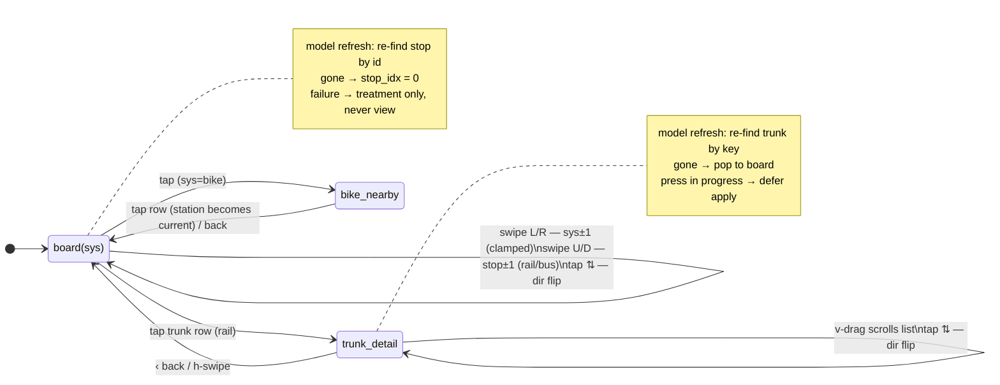

# feat: Phase 4 M2 — touch, system carousel, detail views, bike screens, fonts

Beads epic: `gc-4wk`-adjacent `gc-74h`. Machine: Mario's Mac (device flashing).

## Summary

Make the device interactive and visually finished: FT3168 touch through
esp_lvgl_port, the handoff's full gesture vocabulary driving a system
carousel (rail ↔ bus ↔ bike) and stop cycling, the trunk detail view (§2),
the bike station + nearby-compare screens (§3–4), direction flip, and the
font conversion pass — IBM Plex Sans at the handoff's true type ramp with
tabular numerals. Everything renders from the model the 30 s poll already
delivers; no new API surface. Staleness honesty, burn-in jitter, and the
degraded treatments carry to every new screen.

**Decisions made interactively with Mario (2026-08-03):** full gesture
vocabulary with pragmatic motion (short linear slides or instant; the
handoff's 260 ms cubic is unreachable on this panel — measured reasoning in
KTD-4); bike is a peer system in the carousel per the handoff; IBM Plex Sans
(tabular digits by default — no font surgery); detail/bike views render the
cached model only ("serve cache immediately" per handoff).

---

## Problem Frame

M1 shipped a read-only board: one renderer, no input, no view concept, fonts
mapped down to built-in even sizes. The handoff specifies a five-view
interactive surface with exact gesture thresholds and a state machine
(`sys, stopIdx[3], view, trunkIdx, dir`) that M1's `ui_state_t` cannot
express. Flow analysis found the hard problems are not the screens but the
races around them: the model refreshes every 30 s with **no stable identity**
(raw indices shift as arrival order and the BSSID-resolved position jitter),
full renders race a finger mid-press, and the minute decrement rebuilds the
board unconditionally. M2 is therefore state-and-identity work first,
screens second, motion last.

Constraints carried from M1 (docs/solutions/hardware-issues/waveshare-bsp-qspi-flush-ready-race.md):
never return to `bsp_display_start` (the flush-ready race); keep
`lvgl_port_add_disp` non-RGB registration, the 38-row DMA buffer, the 2-px
rounder, and the 16 KB LVGL task stack; verify every "first" on hardware —
the sim is structurally blind to stack/heap/transport failures.

---

## Requirements

- **R1 — Touch enumerates.** FT3168 reports coordinates through
  `bsp_touch_new` + `lvgl_port_add_touch` on the M1 display path (event-mode
  indev via INT GPIO 38). Verified on hardware before any gesture work.
- **R2 — Handoff gesture vocabulary.** Swipe = >50 px travel, dominant axis;
  tap = <15 px; >15 px drag suppresses tap. Swipe L/R = prev/next system
  (clamped, no wrap; in a detail view, first pops to board). Swipe U/D =
  stop cycling (board only). Tap row → trunk detail; tap bike screen →
  nearby compare; tap `⇅` pill → direction flip (the only flip path; `dir`
  is global per the handoff — board & detail, all trunks). Nearby compare
  exits like a detail view: horizontal swipe or `‹ back` pops to board
  **without changing the selected station**; only a row tap changes it.
- **R3 — System carousel.** Rail/bus/bike positions with live mode dots and
  per-system remembered stop index. Bus renders the §7 empty-mode *pattern*
  with bus-specific copy (e.g. "No bus service yet" — §7's literal text is
  bikeshare-shaped) until a bus feed exists. The staleness chip shows the
  **current system's** data age; transport-level failures
  (OFFLINE/NO_LOCATION) are global. When the current system's payload has
  `partial: true` (cold feed groups — a routine state after DO idle
  suspend), a subtle chip-adjacent indicator marks the board incomplete
  (M1 parked this explicitly for M2; logged-only is no longer acceptable).
- **R4 — Trunk detail (handoff §2).** One trunk, one direction, arrivals
  interleaved across lines sorted by ETA, per-train headsigns, alert text,
  40 px tabular countdowns, scrollable list (the only scrollable object),
  `‹ back`, dir flip in header, and the handoff footer hint with copy
  amended for M2 ("scroll for later · tap ⇅ to flip" — "shake refreshes"
  drops until M3 ships shake). Empty active direction gets a defined
  in-view treatment: one centered line inside the arrivals area
  ("No {direction} trains · tap ⇅ for {other}"), visually distinct from
  the §7 full-screen empty mode — a trunk alive in one direction is a
  different fact from an empty system.
- **R5 — Bike screens (handoff §3–4).** Station screen: 84 px heroes,
  segmented capacity bar, the degraded trio handled distinctly (`no_data`
  skeleton vs zero-stations empty mode vs `-1` sentinels → `—` heroes +
  hidden bar), and the "tap for nearby stations" footer hint. Nearby
  compare: 3-row list; tapping a row makes it current; swipe or `‹ back`
  exits without changing the selection (R2).
- **R6 — Identity and reconciliation.** Stops, trunks, and bike stations
  carry ids/keys in the model, and `ui_state_t` stores the **viewed entity
  identities** (per-system current stop/station id, viewed trunk key) —
  indices are derived cache only. On every model arrival a reconciler
  re-finds the viewed entities by identity (gone → pop to board / snap to
  stop 0). Raw indices never survive a model swap. **Deferral contract:**
  every full-render trigger (model apply, board minute decrement, STALE
  transition) routes through one render-request path that defers while a
  press or a transition animation is in progress, coalescing to a single
  render after; the stash is latest-wins and frees the displaced message;
  deferred apply seeds age as `initial_age_s + defer_time` so staleness is
  never under-reported. The input tracker's state lives on the indev, never
  on objects the dispatcher rebuilds. Connectivity failures never change
  the view, only the treatment.
- **R7 — View-aware ticking.** Minute decrement: board → full render (as
  M1); detail → in-place countdown label updates (scroll preserved); bike →
  no-op. Burn-in jitter re-rolls on every navigation and nudges the jitter
  container position on label-only minute ticks in long-dwell views.
- **R8 — Fonts.** IBM Plex Sans converted via lv_font_conv at the true ramp
  (14/15/16/17/18/20/24/27/30/36/40 + 84 digits-subset), 4 bpp, tabular
  digits, compiled into device and sim builds; OFL license text ships in the
  repo; the `⇅`/`‹` glyphs come from a merge or primitives (Plex lacks ⇅).
- **R9 — Motion.** Navigation transitions are instant or short linear slides
  (~120–150 ms, `OVER_*` variants), chosen after an on-hardware frame-time
  measurement. Same-axis swipe during an animation fast-forwards it (LVGL's
  built-in behavior on restart); anything else during an animation is
  dropped. 260 ms cubic is logged as polish debt, not attempted.
- **R10 — Sim parity.** The sim gains an SDL mouse indev so the same input
  tracker code runs on the Mac; keyboard shortcuts remain; `GC_DUMP` can
  capture every new screen.
- **R11 — Hardware verification.** Each new screen's first render, first
  live-data render, and first render under WiFi+TLS load are verified on
  device, with `uxTaskGetStackHighWaterMark` checks on the LVGL task.

---

## Key Technical Decisions

- **KTD-1 — Identity fields in the model, reconciler in pure C.** Add
  `id`/`key` to `model_stop_t`, `model_trunk_t`, `model_bike_station_t`
  (the API already sends them; confirm exact JSON keys in `api/src/nearby.ts`
  at implementation time). Reconciliation is a pure function
  (old state + new model → new state) in `components/ui` or `components/model`
  — host-testable, which is where the race bugs will actually be caught.
- **KTD-2 — One screen-level input tracker, not per-widget LVGL gestures.**
  LVGL's native gesture path needs `gesture_min_velocity` (a slow deliberate
  60 px drag never fires) and has no >15 px tap-wander suppression; the
  tracker implements the handoff thresholds exactly. Scroll arbitration:
  LVGL latches scroll **unilaterally** at its scroll limit — the tracker
  cannot "hand off"; it **observes** `lv_indev_get_scroll_obj` each poll and,
  once non-NULL, stands down (no swipe, no tap) for the rest of that press.
  `lv_indev_set_scroll_limit(indev, 15)` aligns LVGL's engagement with the
  handoff dead zone. The detail arrivals list is the only LVGL-scrollable
  object. Tap resolution happens against the model snapshot captured at
  press time, with hit regions padded to a **44 px minimum** (visual spec
  unchanged) — the pill and `‹ back` are otherwise ~25 px targets.
  `lv_indev_wait_release` suppresses the post-gesture click. Tap feedback is
  the instant view response itself (no pressed-state visuals — deliberate).
- **KTD-3 — Views are functions over (model, state), full-rebuild style.**
  M1's "delete and rebuild the whole tree" pattern extends to a view
  dispatcher: `ui_render(model, state)` branches on `state->view`. No screen
  objects are kept alive across navigations except during a transition
  animation. This keeps state handling trivial and jitter free (every
  navigation is a re-roll), at the cost M1 already accepted and measured.
- **KTD-4 — Pragmatic motion.** Research (vendored LVGL 9.5 source): every
  slide frame invalidates ~the full 410×502 → ~14 partial-buffer QSPI chunks
  per frame → single-digit fps during transitions; `lv_screen_load_anim` has
  no cubic-easing hook (stack-local anims). Decision: instant loads or short
  `OVER_LEFT/RIGHT/TOP/BOTTOM` linear slides, measured on hardware first.
  The slides carry the meaning (the handoff itself says fades are droppable).
- **KTD-5 — IBM Plex Sans, lv_font_conv only.** Tabular digits by default
  (verified via fontTools on google/fonts TTFs) — the pipeline is a single
  `lv_font_conv` invocation per size, no feature-freeze step. OFL 1.1
  alongside the generated `.c` files satisfies the repo's attribution
  directive. 84 px is subset to digits/`—`/`:` (~15–20 KB); full-ASCII
  sizes land ~4–22 KB each, total ≈ 100–150 KB flash — fine on 32 MB.
- **KTD-6 — Bus stays a bool; the carousel is data-driven.** No
  `model_rail_system_t` widening for bus until a feed exists (MTA Bus epic
  `gc-4wk`). The carousel renders per-system from a descriptor table, so bus
  becoming real is additive (model widening + descriptor entry), and
  "sys 1 is empty" is never hardcoded.
- **KTD-7 — Per-system data age, global transport status.** `ui_state_t`
  splits what M1 conflated: transport status (LIVE/OFFLINE/NO_LOCATION,
  from fetch outcomes) vs `age_s[3]` seeded from each system's
  `initial_age_s` and ticking at 1 Hz. STALE is evaluated per system;
  a system with no data never renders "stale."

---

## High-Level Technical Design

View/navigation state machine (handoff state × flow-analysis reconciliation):

Input routing: one tracker owns the pointer; LVGL scroll owns exactly one
object (detail arrivals list) and receives the press only after the tracker
resolves a vertical axis on it. Everything else — rows, pill, back, bike
rows — is tracker tap hit-testing against press-time snapshots.

---

## Implementation Units

### U1. Model identity + state shape + reconciler

**Goal:** the data foundations every other unit stands on: ids/keys in the
model, the expanded `ui_state_t`, and the pure reconciliation function.
**Requirements:** R6, R3 (state fields), R7 (age split).
**Dependencies:** none.
**Files:** `firmware/components/model/include/model.h`,
`firmware/components/model/model.c`,
`firmware/components/ui/include/ui.h`,
`firmware/test/host/test_model.c` (extend; keep `main()` at end of file).
**Approach:** add `id` (stop), `key` (trunk), `id` (bike station) string
fields with caps; parse from the nearby payload (confirm JSON key names
against `api/src/nearby.ts` — the handoff contract shows `"id"`/`"key"`).
Extend `ui_state_t`: `sys`, `view`, `dir`, `age_s[3]`, transport status,
and **per-system viewed-entity identity** — `stop_id[3]` (rail stop id /
bike current-station id; bus unused) and `trunk_key` for the open detail —
written on every navigation/selection. `stop_idx[3]` remains only as the
render-time cache the reconciler corrects; identity strings are what
`ui_reconcile(old_state, new_model)` re-finds by, keeping it pure without
needing the old model.
**Execution note:** test-first — the reconciler is pure C and its cases are
exactly the flow-analysis races.
**Test scenarios:** viewed stop survives refresh (index updates, view
kept); viewed stop gone → board + stop 0; viewed trunk gone → detail pops;
trunk order shuffles → key re-found at new index; bike current-station
selection survives station reorder; parser populates ids on live fixture;
over-cap clamps unchanged; age seeding per system (rail vs bike differ);
empty-model reconcile (never-fetched) is a no-op.
**Verification:** host suite passes under ASan/LSan; fixture round-trip
shows ids.

### U2. Touch bring-up + input tracker + sim mouse

**Goal:** hardware touch working end-to-end and the gesture tracker that
implements the handoff thresholds, exercised identically in the sim.
**Requirements:** R1, R2, R10.
**Dependencies:** none (parallel with U1).
**Files:** `firmware/main/main.c` (keep the `lv_display_t *` from
`gc_display_start`, add `bsp_touch_new(NULL, &tp)` +
`lvgl_port_add_touch`), `firmware/components/ui/ui_input.c` +
`include/ui_input.h` (new, LVGL-only), `firmware/sim/main.c`
(`lv_sdl_mouse_create`).
**Approach:** tracker records press point/time, accumulates travel, resolves
tap (<15 px at release) vs swipe (>50 px dominant axis, fires once
mid-press), suppresses tap after >15 px drag, calls
`lv_indev_wait_release` after a swipe resolves. Emits a small callback
vocabulary (`on_tap(x,y)`, `on_swipe(dir)`) that `main.c`/sim route into
state changes. First on-device milestone: log raw coordinates before any
UI wiring (the M1 plan's R1 "touch enumerates" was never exercised).
**Patterns to follow:** `gc_display_start()`'s bypass-aware BSP usage;
component dependency discipline (`ui_input` requires lvgl only).
**Test scenarios:** (sim, scripted pointer) tap under 15 px fires tap;
35 px drag fires neither (dead zone is correct per handoff); 60 px
horizontal with dominant axis fires swipe-left exactly once; vertical drag
starting on a scrollable object engages LVGL scroll and the tracker stands
down; **mixed-axis: 40 px scroll down then 60 px right never fires swipe**
(scroll latch suppresses for the whole press); tap after >15 px wander is
suppressed; a tap just outside the pill's visual bounds but inside its
44 px hit region resolves as pill tap.
**Verification:** device logs finger coordinates; sim mouse drives the same
tracker; swipe events print in both.

### U3. View dispatcher, system carousel, view-aware runtime

**Goal:** the navigation core: views as a dispatch over (model, state),
carousel with live mode dots, per-system chip, press-deferred model apply,
view-aware minute tick and jitter.
**Requirements:** R2 (board pill flip), R3, R6 (deferral contract), R7,
R9 (hook points).
**Dependencies:** U1, U2.
**Files:** `firmware/components/ui/ui_board.c` (refactor: extract chrome +
board renderer), `firmware/components/ui/ui_views.c` + `include/ui.h`
(dispatcher seam replacing bare `ui_board_show`),
`firmware/main/main.c` (consume_cb/tick_cb rework), `firmware/sim/main.c`
(keys: h/l system, j/k stop, Enter detail, Esc/b back, d flip).
**Approach:** `ui_render(model, state)` branches on view; chrome (chip,
battery, jitter container) is shared. Carousel from a per-system descriptor
table (KTD-6); bus renders the §7 pattern with bus-specific copy; bike
board is U5's screen. Chip reads `age_s[state->sys]` (KTD-7) plus the
`partial` indicator (R3). **All full-render triggers** (model apply, board
minute decrement, STALE transition) route through one render-request path
that defers while pressed **or animating** and coalesces after — R6's
deferral contract (latest-wins stash, displaced message freed, deferred
apply seeds `age = initial_age_s + defer_time`). Board rows become
direction-aware here (`soonest()` reads `dir`, no-arrival rows render `—`)
and the board's pill tap flips — **U3 owns `ui_board.c`** (R2's board
half). Minute tick: board full render (through the request path) / detail
label update (U4 hook) / bike no-op; jitter nudge via `lv_obj_set_pos` on
label-only ticks. Failure paths set treatment, never view. Sim: `GC_VIEW`
env var (`detail:0`, `bike`, `nearby`) sets the view before the `GC_DUMP`
settle loop so headless capture reaches every screen (R10).
**Test scenarios:** (sim) swiping left at sys=0 clamps; mode dots track
sys; per-system chip shows bike age on bike screen while rail is stale;
bus position shows its empty mode with dots at position 1; model arriving
mid-press defers (scripted press + fixture swap); two fixture swaps during
one press → exactly the second applies, its age includes the defer time;
fixture swap scripted during a slide defers until the slide ends; minute
tick scripted mid-swipe on board defers; board pill tap flips `dir` and
rows re-read the active direction; `partial: true` fixture shows the
indicator; OFFLINE in detail view keeps the view with banner + 60%
opacity; NO_LOCATION with a prior model degrades in place, without a
prior model shows the location-unknown screen (the M1 plan's R10
empty-mode pattern).
**Verification:** sim walkthrough of every transition in the state diagram;
device shows carousel with live dots; stack HWM logged after first
carousel lap.

### U4. Trunk detail view

**Goal:** handoff §2 exactly: header cluster, direction-aware interleaved
arrivals, alert display, scroll, flip, back, empty and degraded treatments.
**Requirements:** R4, R2 (tap/back/flip), R7 (label-tick hook).
**Dependencies:** U3; U6 for final fonts (40 px countdown — until U6 lands,
36 px stand-in).
**Files:** `firmware/components/ui/ui_detail.c` (new),
`firmware/components/ui/ui_tokens.h` (extend with §2 geometry),
`firmware/sim/main.c` (Enter opens detail for first trunk).
**Approach:** render `directions[state->dir]` only, sorted by ETA (already
sorted per-direction in the model; interleave across routes of the trunk).
Alert banner per severity; `directions_mask` gates which direction shows
it. The arrivals list is the sole scrollable object (KTD-2); scroll offset
preserved across same-trunk refresh, clamped. (Board-level
direction-awareness and the board pill live in U3, which owns
`ui_board.c` — U4 owns the detail header's flip only.) Footer hint per R4's
amended copy; the empty-direction line renders inside the arrivals area.
**Test scenarios:** flip in detail swaps arrival set without popping;
empty active direction shows the in-view hint (not blank, no auto-pop);
alert with `directions_mask` for one direction only shows on that side;
refresh with the trunk still present preserves scroll; refresh with the
trunk gone pops to board (U1 reconciler drives it); `~` prefix appears on
countdowns when degraded; negative/zero/no-data leave-by semantics render
distinctly where applicable (CONCEPTS.md: null alert conflates three
sources — render one "no alert" state, never invent distinctions).
**Verification:** GC_DUMP frames match handoff §2 geometry; on-device
first-render + HWM check with live data.

### U5. Bike station screen + nearby compare

**Goal:** handoff §3–4: heroes, capacity bar, degraded trio, compare list,
station selection.
**Requirements:** R5, R2 (taps), R7 (no-op tick).
**Dependencies:** U3; U6 for 84 px heroes (until then, largest available).
**Files:** `firmware/components/ui/ui_bike.c` (new),
`firmware/components/ui/ui_tokens.h` (§3–4 geometry),
`firmware/sim/main.c` (key to jump to bike system).
**Approach:** hero numbers = classic+electric and docks; capacity bar
segments proportional to capacity with 2 px gaps; the degraded trio
(R5) renders distinctly — `no_data` → skeleton-style, zero stations →
§7 empty with `nearest_distance_label`, `-1` sentinels → `—` heroes +
hidden bar + muted note; `capacity == -1` with real counts → counts shown,
bar hidden. Compare list: 3 rows, tap sets `stop_idx[bike]` to that
station (identity-based per U1).
**Test scenarios:** all four degraded permutations render per spec (facts
not conflated: no-data ≠ zero); selection survives a refresh that reorders
stations; entry from carousel and back-out restore board position;
**exiting nearby-compare via swipe or `‹ back` leaves the current station
unchanged** (only a row tap changes it); bar proportions match counts on
the live fixture.
**Verification:** GC_DUMP frames vs §3–4; on-device first render + HWM.

### U6. Font conversion pipeline (IBM Plex Sans)

**Goal:** the true type ramp with tabular numerals in both builds, with
licensing done right.
**Requirements:** R8.
**Dependencies:** none (land before U4/U5 finalize; board swaps ramp too).
**Files:** `firmware/components/ui/fonts/` (generated `.c` + OFL.txt +
README with the exact regeneration commands), `firmware/tools/genfonts.sh`
(new — pinned lv_font_conv invocations), `firmware/components/ui/CMakeLists.txt`,
`firmware/sim/CMakeLists.txt`, `firmware/lv_conf.h` +
`firmware/sdkconfig.defaults` (retire unused built-in Montserrat sizes),
`firmware/components/ui/ui_tokens.h` (font tokens), `README.md` (regen note).
**Approach:** static-instance the weights needed (400/600/700/800), one
`lv_font_conv --format lvgl --bpp 4 --lv-include "lvgl.h"` per ramp size,
ASCII subset; 84 px digits-only subset; `⇅`(U+21C5) and `‹`(U+2039) — `‹`
is in Plex; merge U+21C5 from DejaVu Sans or draw the flip icon as
primitives (decide at implementation by eyeballing both; primitives match
how other handoff icons are drawn). `LV_FONT_DECLARE` via a single
`gc_fonts.h`. Renamed per OFL reserved-name rules if subsetting requires.
**Test scenarios:** none behavioral — build-level: both targets compile
with the new fonts; a GC_DUMP frame shows countdown digits column-aligned
as the seconds tick (tabular proof); flash delta logged and under ~200 KB.
**Verification:** side-by-side GC_DUMP before/after for Mario; device
binary size check.

### U7. Motion, hardware verification pass, docs

**Goal:** transitions at the fidelity the hardware supports, the R11
verification sweep, and docs/tracker hygiene.
**Requirements:** R9, R11.
**Dependencies:** U3–U6.
**Files:** `firmware/components/ui/ui_views.c` (transition hooks),
`README.md` (sim keys, new screens), beads issues update.
**Approach:** measure a full-screen render+flush on hardware first (log
frame time); pick instant vs 120–150 ms `OVER_*` linear slides from data;
same-axis swipe mid-animation fast-forwards (LVGL restart-guard behavior),
cross-axis/tap dropped. Run the R11 sweep: each screen's first render,
live-data render, WiFi+TLS-load render, HWM after each; raise the LVGL
stack if headroom < ~4 KB. Update `docs/solutions/` if new hardware
lessons emerge; close/annotate beads issues.
**Test scenarios:** none new — this unit executes the verification
checklist and records numbers.
**Verification:** frame-time numbers in the PR description; HWM table; all
sim keys documented; Mario eyeballs motion on device.

---

## Scope Boundaries

**In:** everything above.

**Deferred to Follow-Up Work:**
- 260 ms cubic-bezier transitions (polish debt — revisit only if U7's
  measurements surprise; hand-rolled container anims would be the path).
- Compass tags for `direction_labels: null` feeds (second-agency concern;
  NYC feeds always label. Bare `⇅` pill ships in M2).
- Bus system model widening (KTD-6; MTA Bus epic `gc-4wk` owns it).
- Shake-to-refresh, PWR-button home, touch low-power (M3 / IMU territory;
  the FT5x06 driver has no sleep support — M3 will need a direct
  `ID_G_PMODE` write).
- `note` field on trunks (handoff API sketch has it; model doesn't —
  confirm whether the API sends it; add in a data pass if so).
- CONCEPTS.md entries for "trunk"/"board"/"chip" screen vocabulary
  (feed back via ce-compound after M2 lands).

**Out (not this phase):** new API endpoints or payload changes beyond
confirming existing id/key fields; accounts/pairing/phone geolocation
(Phase 5, `gc-x8n`); the `0 min` eta investigation (`gc-y70`, opti-side —
M2 renders whatever the server sends).

---

## Risks & Dependencies

- **Touch is unproven on the bypass path.** The BSP's own ordering is
  mirrored (touch reset GPIO 9 is *separate* from LCD reset GPIO 8 — the
  BSP comment claiming shared is stale), but R1 is sequenced first so a
  surprise costs hours, not the milestone.
- **Stack depth on new screens.** Detail/bike layouts are new deepest-flex
  candidates; M1's crash class. Mitigation: HWM checks per screen in U3–U5
  verification, not just U7.
- **Transition memory:** during a slide both widget trees are alive and
  rendered; with full-rebuild views this is bounded (two trees), but U7
  measures before committing to slides.
- **`gc-y70` (server 0-min etas)** may make countdowns look wrong in
  testing — known, opti-side, not an M2 blocker.
- **Sim/device LVGL config drift:** fonts change both `lv_conf.h` and
  Kconfig; U6 updates both and the build fails loudly if they diverge
  (device compiles fonts unconditionally).

---

## Sources & Research

- `docs/design/transit-watch-handoff.md` — gestures (line ~67), motion
  (~77–82), §2 detail, §3–4 bike, §7 empty modes, type ramp (~150),
  fidelity note (~15: tabular numerals are the hard requirement).
- `docs/solutions/hardware-issues/waveshare-bsp-qspi-flush-ready-race.md` —
  display-path constraints M2 must not violate.
- Vendored-source research (pinned versions): LVGL 9.5.0 gesture mechanics
  (`lv_indev.c` — 50 px gesture limit, scroll-steals-gesture, mid-press
  firing, `lv_indev_wait_release`), screen-load animation internals
  (`lv_display.c`, `lv_refr.c` — both trees render, no cubic hook, no extra
  framebuffer for MOVE/OVER), esp_lvgl_port 2.8.0 touch event-mode wiring,
  FT5x06 driver quirks (I2C 0x38, INT GPIO 38 event mode, polling A/B
  fallback via `int_gpio_num = NC`).
- Font research: lv_font_conv capabilities (no OpenType feature support —
  tabular must be default or frozen); fontTools-verified tabular-by-default:
  IBM Plex Sans, Roboto, B612; Inter/Public Sans need pyftfeatfreeze; OFL
  redistribution obligations; empirical 4 bpp flash costs from vendored
  Montserrat.
- Flow analysis (2026-08-03): 13 ranked edge cases — identity
  reconciliation, press races, view-aware ticking, per-system staleness,
  degraded trios — folded into R6/R7 and U1/U3–U5 test scenarios.
