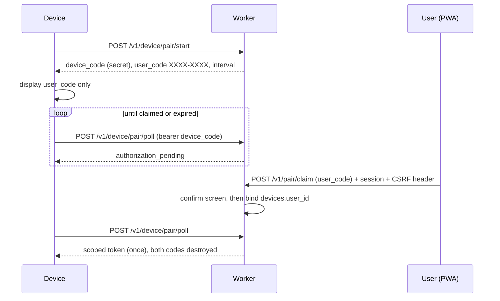
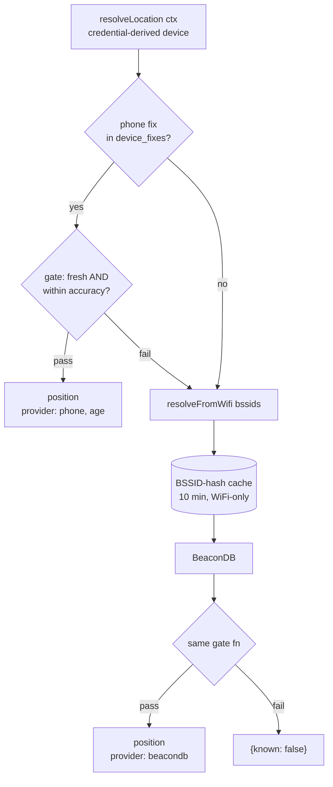

# Phase 5 — Accounts, Pairing, Phone Relay, Config UI - Plan

## Goal Capsule

- **Objective:** give gtfs-compass identity (beads epic `gc-x8n`): magic-link accounts, RFC 8628 device pairing with scoped device tokens, a paired phone relaying its GPS fix to the device, a config-UI PWA, and the retention purge promised since Phase 3.
- **Authority:** this plan > `docs/plans/01-guiding-spec.md` Phase 5 > repo conventions. Three deliberate supersessions, each recorded as a KTD: the phone→device *operational* relay (the spec only ever had phone GPS as a diagnostic reference), the eight-character pairing code (spec says six), and per-user `locate_log` access alongside the operator `DIAG_TOKEN`.
- **Stop conditions:** stop and ask before changing the device-facing wire contract beyond what M2/M3 define — firmware lives on the other machine. Stop if any design opens a non-hibernatable socket, caches a per-device answer under a device-agnostic key, or reaches around the relay seam with direct SQL. All P1/P2 review findings fixed before done.
- **Tail:** `ce-code-review` per milestone PR. Milestones ship in order; each is independently useful to a real user (see the milestone table).

---

## Product Contract

### Summary

Accounts arrive as email magic links (mapparty's pattern), devices pair by displaying an eight-character code the user types into the web UI, and each paired device gets narrowly-scoped read-only tokens — never a session. A paired phone POSTs its GPS fix to a small relay table; the device consumes it as one provider in the locate chain, so it keeps working with the phone switched off. A PWA served from the same Worker owns configuration, and `locate_log` finally gets the scheduled purge and privacy disclosure the spec demands once rows become an identified person's location history.

### Problem Frame

Everything the device does today is anonymous: favorites travel in query strings, `device_id` is untrusted free-form text, and `locate_log` accumulates with no owner and no expiry. The spec's Phase 5 closes that. One thing has changed since it was written — BeaconDB coverage is thin enough in practice that Mario has called phone-supplied GPS "the only real viable solution," promoting the phone from diagnostic instrument to operational provider. The risk Mario named explicitly is multi-user scale: this phase introduces the project's first per-user and per-device *write* paths, where a wrong storage choice is expensive to unwind.

### Requirements

**Accounts and sessions**

- R1. Email magic-link sign-in: ≥128-bit CSPRNG token, SHA-256 at rest, single-use enforced by conditional UPDATE with a rows-affected check, 10-minute expiry (ASVS 6.5.5). The emailed URL carries the token in the **fragment** and is consumed only by a **POST** from an interstitial — mail-gateway scanners issue GETs and must not burn the token.
- R2. Sign-in never reveals whether an address has an account: identical status and body, and no observable branch in the **inline** path (the send happens in `waitUntil` after the response; the budget check happens inline, before it). The claim is "no observable inline branch," not a wall-clock timing assertion — see Open Questions.
- R3. Sessions are opaque 128-bit tokens stored hashed in D1, delivered as `__Host-`prefixed `Secure; HttpOnly; SameSite=Lax; Path=/` cookies, rotated on authentication, 30-day sliding renewed at half-life so reads don't write, 180-day absolute. **Every state-changing route — including the pre-session `/v1/auth/redeem` — requires a custom request header and an `Origin` check; an absent `Origin` is a 403.**
- R4. Abuse budgets live in D1, not in isolate-local buckets (which attempts defeat by spreading across isolates): per-address send budget, and a global daily cap **split into a reserved slice for addresses with existing accounts and a smaller slice for unknown ones** — so an attacker spraying unknown addresses cannot lock out existing users. A repeat request inside the window resends the same unexpired token. A documented break-glass (operator mints a session row directly) means lockout is never terminal.
- R4b. **Registration is allowlist-gated by default** (Mario, 2026-08-03): `AUTH_ALLOWED_EMAILS` lists permitted addresses, and an unlisted address receives the identical silent 200 that R2 requires — no enumeration leak, no email sent, no row created. Clearing the variable is the deliberate opt-in to open registration; self-hosters set their own list. This is separate from console mode's allowlist requirement, which remains unconditional.
- R5. `AUTH_MODE=single` skips login and binds everything to a fixed synthetic user. It is an auth bypass: exact-string match only, anything unset or unrecognized fails closed to multi-user, CSRF and `Origin` checks still enforced, and the PWA shows a persistent banner.

**Device pairing and tokens**

- R6. Pairing follows RFC 8628: the device POSTs to start, receives a high-entropy `device_code` (hashed at rest) plus a short `user_code`, displays only the `user_code`, and polls until claimed. The short code names a pending request; it never authenticates anything by itself.
- R7. `user_code` is 8 characters from RFC 8628's confusion-free consonant alphabet (`BCDFGHJKLMNPQRSTVWXZ`), rendered `XXXX-XXXX` (~34.5 bits), normalized server-side, expiring in 5 minutes. **Attempt budgets are counted per authenticated claimer and per IP in D1 — including attempts against codes that do not exist** — because a per-code counter is no defense against spraying the live-code space. A code is destroyed after 5 failed attempts against it.
- R8. Claiming requires a live browser session plus an explicit confirm screen. That screen is a security control against RFC 8628 §5.4 code-phishing: it states plainly that codes must come from a device physically in hand, and it renders device-supplied metadata as escaped, length-capped, explicitly-untrusted text.
- R9. Device credentials are **separately-grantable, separately-revocable scopes** — `read:departures`, `read:config`, `read:fix` — not one blanket token. **`read:fix` defaults OFF** (Mario, 2026-08-04): a freshly paired device never receives a position until the user grants it in the config UI, so a stolen or second-hand board is not a tracking device, and a stationary board simply never gets the grant. The grant doubles as the relay's fan-out control (R11). A device token is never exchangeable for a session, can never read the account email or enumerate devices or write configuration, and `read:fix` returns only the *current* fix, never history. Tokens are prefixed (`gtfsc_dev_`), hashed under a unique index, sent as `Authorization: Bearer` (never a query param), track `last_used_at`, and are revocable per device. A rotation response header is **specified and unimplemented** so firmware can adopt it without a breaking change.
- R10. `/v1/departures` and `/v1/nearby` keep their anonymous query-string modes byte-identical — shipped firmware uses them. Authentication is strictly additive.

**Phone location relay**

- R11. **The phone posts its position for the account, not for a device** (Mario, 2026-08-04): the request names no device, the server writes the fix to every one of that user's devices **holding the `read:fix` grant**, and each device reads its own row with its own token. Naming a device would have created the plan's primary IDOR surface for no benefit — with an account-scoped post there is nothing to spoof, since the session identifies the user and the grant list identifies the recipients, and the phone needs no device-selector UI. With no fix present the device falls through to the existing chain, and the acceptance test is that **the device works normally with the phone powered off**.
- R12. **The accuracy gate lives at read time only, in exactly one place.** The relay stores whatever the phone reports (recording `accuracyM`); the provider chain gates it, and a gated fix **falls through to the next provider** rather than terminating the chain. Gating on write would make AE7's read-side scenario unreachable and turn the chain's phone gate into dead code. Fixes carry `provider: "phone"` and their own `captured_at`.
- R13. Freshness is explicit and modeled on Garmin's `Position.Quality`: a last-known fix is a distinct state, not a fix with an old timestamp. The device renders relative age and provider ("via phone, 3 min ago"); absent or gated location renders `{"known": false}`, never a stale number.
- R14. Relay state is latest-wins, never queued — a stale queued fix is worse than none. It lives in a dedicated `device_fixes` table keyed by `devices.id`, one row per device, behind a `putFix`/`getFix`/`clearFix` seam so the storage choice stays swappable.
- R15. **No cache may key a per-device answer under a device-agnostic key.** The existing 10-minute BSSID-hash cache stays scoped to the WiFi sub-chain; two devices seeing the same access points must never share a resolved position.

**Config UI**

- R16. The PWA is served from the same Worker as `/v1/*` (same origin: no CORS, first-party cookies) via Workers Static Assets, with API paths reaching the Worker first and unknown `/v1/*` paths returning JSON 404 rather than the SPA shell.
- R17. The geolocation capture button ships in the first milestone, honoring every spec gotcha: secure context, user-gesture triggered, `maximumAge: 0`, raw accuracy surfaced, specific copy for `PERMISSION_DENIED`, and a LAN-IP "needs HTTPS" explainer.
- R18. Configuration is phone-authored and server-authoritative; the device caches its last config and never edits. Covers favorites (ordered), named origins, per-(favorite, origin) walk times showing `source`, and a device list with name, last-seen, firmware version, scope toggles (including the default-off `read:fix`), and unpair.
- R18b. **Origin selection follows the spec: coarse location picks it.** Authenticated `/v1/departures` reuses the `lat`/`lon`/`acc` parameters the endpoint already accepts — the server matches that position to the nearest named origin and uses its `walk_times` row as the manual tier. **When location is unknown and more than one origin exists, the response carries arrivals with no leave-by** (Mario, 2026-08-04): the same discipline as the empty-`m` dash and the negative `l` — a value that cannot be computed is absent, never guessed. With exactly one origin, that origin is unambiguous and is used.
- R19. Security headers, scoped by delivery path because statically-served assets never enter the Worker and so cannot carry a per-request nonce: the **Worker-served auth interstitial** gets a nonce-based CSP and `Referrer-Policy: no-referrer` (it is a dedicated route, not an SPA route, because it is the most security-critical page in the app); the **statically-served SPA** ships with zero inline script under a `script-src 'self'` / `style-src 'self'` policy delivered through the Static Assets `_headers` file. Neither uses `unsafe-inline`. Both carry `frame-ancestors 'none'` and `nosniff`.

**Privacy and retention**

- R20. A Cron Trigger purges `locate_log` on a **two-tier schedule** (Mario, 2026-08-03): raw coordinate columns (`est_lat`/`est_lon`/`ref_lat`/`ref_lon`) are nulled after `LOCATE_LOG_PRECISE_DAYS` (default 14) while the derived metrics that answer the actual question — `delta_m`, accuracies, `bssid_count`, `provider`, `ts` — survive to `LOCATE_LOG_RETENTION_DAYS` (default 90), after which the row is deleted. The residual map keeps full fidelity on recent data; the movement history ages out fast. The same trigger sweeps expired `magic_tokens` and `pairing_codes`. The handler records rows affected and a completion timestamp; "has not run in N days" is an alert condition.
- R21. One-click "delete all my location history" and account deletion that verifiably cascades — including the relay row, which the `device_fixes` FK cascade covers for free. This requires attribution to exist in the first place: authenticated locate paths populate `locate_log.user_id` and `device_row_id` from the resolved credential (both stay NULL on the anonymous path), because every insert in the codebase today hardcodes `user_id` to NULL and the existing cascade therefore reaches zero rows.
- R22b. **The README records the standards posture explicitly** (Mario, 2026-08-04): gtfs-compass targets OWASP ASVS L1/L2; NIST SP 800-63 conformance is **not** a goal, because NIST forbids email as an out-of-band authenticator and email is this project's single factor — so the user's mailbox security *is* their account security. Passkeys are the standards-track answer and stay in Scope Boundaries; they fail here on account recovery, whose usual fallback is the email we would have removed. Stating this is the point: an OSS project should not imply an alignment it does not have.
- R22. The README states plainly what is collected and why: BSSIDs forwarded to BeaconDB and never stored, phone fixes as relay state, diagnostic rows opted-in and purged on the deployed schedule, and Resend named as a third-party processor of email addresses. The "No authentication yet" section is rewritten in the same milestone that makes it false.

### Scope Boundaries

**Deferred to Follow-Up Work**

- MapLibre stop-picking (confirmed with Mario) — lists plus the capture button first.
- Hibernatable-WebSocket relay delivery; polling ships, and the DO interface stays RPC-shaped so the swap is a handler-plus-firmware change, never a data-model migration.
- Device-token rotation *implementation* (header specified now).
- Passkeys / WebAuthn.
- Any firmware work — token storage, code display, fix fetching. **This plan defines the wire contract only.**

**Outside this product's identity**

- No third-party identity providers; magic link plus the single-user escape hatch is the whole auth surface.
- No server-side storage of BSSIDs, in any phase.

### Acceptance Examples

- AE1. **Given** a sign-in request for an address with no account, **then** the response is byte-identical to one for an existing account and no account is created.
- AE2. **Given** an emailed link fetched by a scanner (GET, no JS), **then** the token is not consumed and the user's later POST still signs them in.
- AE3. **Given** a cross-site POST of an attacker's magic token to `/v1/auth/redeem`, **then** it is rejected on the missing custom header — the victim is never signed into the attacker's account.
- AE4. **Given** a pairing code typed correctly by a logged-in user, **then** the device's next poll returns its token exactly once and a replay returns not-found.
- AE5. **Given** 5 failed attempts against one code, **then** that code is destroyed; **and given** a claimer spraying guesses at codes that do not exist, **then** their per-claimer budget is consumed and further attempts are refused.
- AE6. **Given** a device token used against an account-scoped route, or a freshly-paired device (which has no `read:fix` grant by default) attempting to read a fix, **then** the response is 403.
- AE6b. **Given** a user with two paired devices where only one holds `read:fix`, **when** the phone posts a position, **then** only the granting device receives it.
- AE6c. **Given** two named origins and a request with no resolvable location, **then** the response carries arrivals and no leave-by values; **given** exactly one origin, **then** its walk times are used.
- AE7. **Given** a phone fix 20 s old at 12 m accuracy, **when** the device fetches, **then** it receives that position with provider and age; **given** the same fix at 900 m, **then** the fix is skipped **and BeaconDB is consulted** rather than returning unknown.
- AE8. **Given** two devices in one household seeing identical access points, **then** neither ever receives the other's phone-derived position.
- AE9. **Given** the phone is powered off and no fix was ever posted, **then** the device's locate flow is byte-identical to today's.
- AE10. **Given** an account deletion, **then** rows in all dependent tables are gone, including every device's relay row.
- AE11. **Given** `locate_log` rows older than the window, **when** the purge runs, **then** they are deleted, rows inside survive, and the run records its count.

---

## Planning Contract

### Key Technical Decisions

- **The relay is a small D1 table, not a per-device Durable Object** (Mario, 2026-08-04, correcting an earlier draft of this plan). A fix is one row written either way, so the marginal arithmetic decides it: at 10,000 devices, D1 is ~$22/month against the DO path's ~$29 (DO requests bill at $0.15/M *on top of* the Worker request both designs pay), and **D1 is free up to roughly 7,000 devices** on the 50M included row-writes — or ~80,000 at the once-a-minute posting cadence the wearable conventions actually recommend. The DO is never cheaper. What a DO *would* buy is write isolation from the single-primary database that also serves session validation, favorites, and departures composition — a real property at a scale that would demand re-architecting other things anyway. **Rejected homes stay rejected on correctness:** Workers KV propagates in "up to 60 seconds or more" (the device would read a stale fix) and Cache API contents "do not replicate outside the originating data center" (phone and device hit different colos).
- **Fixes get their own table, not a column on `devices`.** That row is on the auth hot path — every device request resolves its token against it — and rewriting it every few seconds would put relay traffic in contention with authentication.
- **The upgrade path is the interface, not the storage.** `putFix` / `getFix` / `clearFix` is a two-function seam over D1; moving it to a DO later is a contained change behind those names, with no data-model migration. **Trigger condition to take it:** sustained relay writes contending with auth-path latency, or approaching the 50M/month included write budget — roughly 7,000 active devices at the modeled cadence. Until then, the DO is documented, not built.
- **The freshness horizon is 120 seconds.** Under it, a relayed fix is a position; past it, it is `QUALITY_LAST_KNOWN` — surfaced with its age, never silently used as current. Long enough to survive a phone screen-lock (mobile browsers suspend `watchPosition`, so real traffic is bursty rather than a steady heartbeat), short enough that a walking user's position stays honest. With D1 there is no hibernation gap to design around, which is one of the simplifications the storage choice buys.
- **Never open a standard WebSocket.** This survives from the DO analysis and is independent of it: standard sockets bill wall-clock at 128 MB while non-hibernatable — Cloudflare's own example is $416/month for 100 objects versus $10 with the hibernation API. Polling is the transport; if push ever becomes worth it, it is hibernatable sockets or nothing.
- **Extending the locate chain requires splitting it first — the current shape cannot host a per-device provider.** Three defects verified against `locate.ts`: (a) the empty-BSSID short circuit returns `{known:false}` before any provider runs, making a phone fix unreachable whenever the device skips its radio scan; (b) `runChain` breaks on the first fix and gates *after* the loop, so a coarse phone fix would terminate resolution instead of falling through — directly contradicting AE7; (c) **the 10-minute cache is module-global and keyed only on the sorted MAC hash, so two devices in one household share a cache entry** — putting a per-device answer above it leaks one owner's phone position to another's device. The restructure: `resolveFromWifi(bssids, env)` keeps the hash cache and the `definitive`/negative-caching logic; a new ordered `resolveLocation(ctx)` composes phone → wifi → unknown, gating **each outcome inside the loop** with reject-and-continue. The gate stays a single exported function with one implementation — constraint #5 survives. **This is not a pure rename:** moving the gate above the cache means `resolveFromWifi` now returns an *ungated* outcome and its 10-minute cache stores ungated positions, so a cached coarse fix must still be rejected by the composer on a cache hit (a test scenario, not an assumption). The existing suite's direct `resolveLocation(bssids, env)` call sites split between the two functions accordingly.
- **The phone applies at the shared seam, so `/v1/nearby` gets it too.** `routes/nearby.ts` calls `resolveLocation` as well; wiring the phone only into `routes/locate.ts` would give the same device a phone position from one endpoint and a WiFi position from the other in the same minute, with nearby's distance sort and walk heuristic using the worse one.
- **One phone-fix ingress, not two — and it does not do what its name suggests.** `POST /v1/locate/ref` today does **not** insert a row: it `UPDATE`s the newest *unpaired* `locate_log` estimate for a device within a 60-second window and returns 404 when none exists (row insertion lives on `POST /v1/locate` behind `log: true`). Rather than adding a second, divergently-authenticated endpoint, the relay extends `/v1/locate/ref`: session **or** DIAG_TOKEN authenticates; **`relay: true` writes the DO and short-circuits the pairing entirely**, returning 200 whether or not an unpaired estimate exists; `log: true` keeps today's pairing behavior, including its 404. Without that short-circuit, a phone posting a relay fix with no device WiFi scan in the last 60 seconds — the normal case — would fall into the 404 branch.
- **Sessions, tokens, and pairing rows live in D1.** Cost inverts at this scale (60M authenticated requests read ~240M D1 rows against 25 *billion* included versus ~$25/month on KV), and correctness settles it regardless: single-use redemption needs a compare-and-set that KV's eventual consistency cannot provide. Cloudflare's generic "KV for sessions" guidance targets thousands of RPS.
- **The escape hatch is a design property, not a migration plan** — and the D1 relay strengthens it. Every piece of Phase 5 state now lives in D1, which exports to portable SQL (`wrangler d1 export`) with 30-day point-in-time restore; nothing important lives in a Durable Object, which has no bulk export path at all. The existing feed DOs stay what they are: caches of upstream data, abandonable rather than migratable.
- **Pairing is RFC 8628, not an invention** — it supplies the confusion-free alphabet, the displayed-`user_code`/secret-`device_code` split that makes 34.5 bits acceptable, and the 5-attempt reference figure. Eight characters rather than the spec's six (Mario), on a screen with room to spare.
- **Email behind a narrow seam, Resend as default.** MailChannels' free Workers path was terminated in August 2024; any tutorial showing the keyless POST is dead. `AUTH_EMAIL_PROVIDER` selects `resend`, `cloudflare-routing` (zero-cost, pre-verified recipients only), or `console`. Console requires positive opt-in *plus* an allowlist; a configured provider with a missing key is a hard failure, never a silent downgrade to printing tokens.
- **`DIAG_TOKEN` stays an operator bypass; per-user diagnostics add session-plus-ownership.** The scoping is enforced **in the credential resolver, not in the route** — the existing handler is an unscoped `SELECT *`, and a naively-added session branch would hand every user everyone else's location history.
- **Two device identity spaces stay separate.** `locate_log.device_id` holds anonymous client-chosen text and drives today's daily cap; paired devices get a distinct `device_row_id` referencing `devices(id)`, whose ids are **server-minted and never client-supplied**. Merging them would let an anonymous caller who learns a paired device's id burn its cap and inject rows into an identified user's history.
- **Email normalization happens in application code, not by column collation.** `COLLATE NOCASE` requires SQLite's 12-step table rebuild — not an additive ALTER — on a table every account table cascades to, and it is ASCII-only besides. Lowercase-and-trim before insert and lookup instead.
- **`walk_times` precedence, reconciling the departures plan's two statements:** server-side rows are the *manual* tier for authenticated callers; request-param `walk=` is the manual tier for anonymous ones; heuristic is the fallback for both. One tier, two sources — and the fork lives in the **route layer**: `routeDepartures` resolves `{refs, walkSeconds, origin}` from either a query string or D1 and hands `composeDepartures` the shape it takes today, so `departures.ts` and `walk.ts` never learn about auth.

### High-Level Technical Design

Pairing, following RFC 8628:

Location resolution after the chain split — note the gate is per-provider, and the WiFi cache sits *below* it:

---

## Milestones

Each milestone is a PR, and the third column is the test of "independently useful" — a milestone that cannot fill it is mis-sequenced.

The outcome column is stated in terms of what ships **without firmware**, since firmware is explicitly out of scope — a milestone whose value depends on the other machine's track cannot gate itself. Where a real device would be the client, a scripted harness (curl or a test client exercising the same wire contract) stands in, and that harness is part of the milestone's verification.

| M | Units | What is usable when it ships (no firmware required) |
|---|---|---|
| M1 | U1, U2, U3, U4, U9, U11 | Sign in on a phone; read real GPS accuracy at a platform entrance; old locate rows stop accumulating |
| M2 | U5, U6, U10 | Pair a **harness-simulated** device from the browser, see it listed with its scopes, unpair it |
| M3 | U7, U14, U8 | A phone fix is stored and served through the device wire contract; the chain still resolves with no fix present |
| M4 | U15, U13 | Favorites authored once and served to any token-bearing client |
| M5 | U16, U12 | Delete location history and the account, with the privacy story documented |

M1 deliberately front-loads the capture button: it is the cheapest test of this phase's central premise — that phone GPS beats BeaconDB where Mario actually stands — it needs nothing but a session, and it is the one milestone whose value is fully realized without any device at all.

---

## Implementation Units

| U | Title | Key files | Depends on |
|---|---|---|---|
| U1 | Auth schema migration | `api/migrations/0003_*.sql` | — |
| U2 | Credential resolver (`auth.ts`) | `api/src/auth.ts` | U1 |
| U3 | Email sender seam | `api/src/email.ts` | U1 |
| U4 | Magic-link request/redeem | `api/src/routes/auth.ts` | U2, U3 |
| U9 | PWA plumbing + local capture button | `api/wrangler.jsonc`, `config-ui/` | U2 |
| U11 | Cron plumbing + retention purge | `api/src/index.ts` | U1 |
| U5 | RFC 8628 pairing | `api/src/routes/pair.ts` | U2 |
| U6 | Device-token resolution + scopes | `api/src/auth.ts` | U5 |
| U10 | Device list, pairing entry, unpair | `config-ui/`, `api/src/routes/config.ts` | U9, U6 |
| U7 | Relay store (`device_fixes`) | `api/src/relay.ts` | U1 |
| U14 | Capture button POSTs a fix | `config-ui/`, `api/src/routes/locate.ts` | U9, U7 |
| U8 | Locate chain split + phone provider | `api/src/locate.ts` | U6, U7 |
| U15 | Favorites, origins, walk-times CRUD | `config-ui/`, `api/src/routes/config.ts` | U10 |
| U13 | Authenticated departures mode | `api/src/routes/departures.ts` | U15, U6 |
| U16 | Deletion and cascade | `api/src/routes/config.ts`, `api/src/relay.ts` | U15, U7 |
| U12 | Privacy narrative | `README.md` | all |

Per-milestone exit criterion, not a unit: `README.md`, `.env.example`, and `CONCEPTS.md` are updated in the same PR that changes endpoints, env vars, or setup — the standing directive forbids deferring docs. U12 carries only the R22 privacy narrative, which genuinely needs the whole picture.

### U1. Auth schema migration

- **Goal:** the tables, indexes, and identity decisions the rest of the phase depends on.
- **Requirements:** R1, R3, R6, R9, R20; and the identity rulings in the KTDs.
- **Files:** `api/migrations/0003_auth_and_pairing.sql`, `ingest/tests/test_schema_sync.py`.
- **Approach:** add `magic_tokens` (token_hash unique, address binding, nonce hash, expires_at, used_at), `pairing_codes` (device_code_hash unique, user_code, per-code attempts, expires_at, claimed_by/at), `auth_budgets` (sharded daily counters — a single global row is one hot row under D1's single-primary write path), and `device_fixes` (one row per device, `devices.id` PK with `ON DELETE CASCADE`, lat/lon/accuracy/captured_at/received_at) — kept off `devices` itself because that row is read on every device request. Harden existing tables: unique index on `devices.token_hash`; `devices.scopes`, `revoked_at`, `last_used_at`; `sessions.token_hash` and `last_used_at`; `user_id` indexes on sessions/favorites/origins; `locate_log` indexes on `(device_id, ts)` and `ts`; a nullable `locate_log.device_row_id` referencing `devices(id)` kept distinct from the legacy anonymous `device_id`; and an index supporting R20's two-tier purge (raw-column nulling at 14 days, row deletion at 90). **Two version counters, both required by U15's ETag:** `users.config_version`, bumped on any favorites/origins/walk_times write, and `feeds.data_version`, stamped by ingest — without the second, a recolored route serves stale to the device forever. Seed the fixed synthetic user row that `AUTH_MODE=single` binds to, since `sessions.user_id` has a FK to `users`. Email is normalized in application code; **do not** attempt `COLLATE NOCASE` (table rebuild, cascades, ASCII-only). `devices.id` is server-minted.
- **Test scenarios:** migration applies over a database carrying Phase 1–4 rows; every new index exists per `PRAGMA index_list`; the ingest schema-sync test still passes; both version counters bump observably; the synthetic user row exists and satisfies the sessions FK.
- **Verification:** `npm run migrate:local` clean; both suites green.

### U2. Credential resolver (`auth.ts`)

- **Goal:** one chokepoint that mints, validates, rotates, revokes, and **scopes** every credential.
- **Requirements:** R3, R5; and the `locate_log` scoping ruling.
- **Files:** `api/src/auth.ts`, `api/src/env.d.ts`, `api/test/workers/auth.test.ts`.
- **Approach:** mirror `locate.ts`'s seam shape — exported types, pure functions, policy in exactly one place, no classes. Resolves a request to `{kind:"session", userId} | {kind:"device", deviceId, userId, scopes} | null`, and **returns the ownership predicate that data routes must apply** rather than trusting each route to remember — the reason being that today's `locate_log` read is an unscoped `SELECT *`. Session mint/validate/slide/rotate/revoke per R3; CSRF header plus `Origin` check with absent-`Origin` rejection; `AUTH_MODE=single` short-circuit with fail-closed parsing.
- **Execution note:** implement the resolver test-first — every later unit trusts it, and its denials are the security contract.
- **Test scenarios:** session round-trip and expiry; sliding renewal writes only past half-life; rotation invalidates the prior token; missing custom header → 403; cross-origin and **absent** `Origin` → 403; `AUTH_MODE=single` yields the synthetic user; unrecognized `AUTH_MODE` fails closed to multi-user; a device credential never resolves to a session kind.
- **Verification:** auth suite green; no data route reaches user rows without the resolver's predicate.

### U3. Email sender seam

- **Goal:** delivery that is optional without being insecure, and cannot be turned into a lockout.
- **Requirements:** R1 (delivery), R4 (budgets).
- **Files:** `api/src/email.ts`, `api/test/workers/email.test.ts`.
- **Approach:** narrow `EmailSender` interface with `resend` (plain HTTPS POST, no SDK), `cloudflare-routing` (pre-verified recipients only — document the constraint), `console` (log plus response body, requiring positive opt-in *and* a non-empty allowlist). Budgets are sharded D1 counters checked **inline before responding**; the known-account slice is reserved so unknown-address spraying cannot exhaust sign-in for existing users. Send failures increment an observable counter — a `waitUntil` send that throws is otherwise a silent 200.
- **Patterns to follow:** the `FeedAdapter` / `locate.ts` provider-seam discipline; the workers-test fetch stub means the sender needs an injectable seam.
- **Test scenarios:** each provider selected by env; provider `resend` with no key → hard failure, no token minted; `console` without allowlist → refuses; unknown-slice exhaustion still permits a known-account send; budget check precedes the response; no provider emits a token to any log outside console mode's deliberate line.
- **Verification:** email suite green; grep confirms no accidental token logging.

### U4. Magic-link request and redemption

- **Goal:** sign-in that survives mail scanners, leaks nothing, and cannot be CSRF'd.
- **Requirements:** R1, R2, R4, R4b; AE1, AE2, AE3.
- **Files:** `api/src/routes/auth.ts`, `api/src/index.ts`, `api/test/workers/auth.test.ts`.
- **Approach:** `POST /v1/auth/request` returns an identical body for every input — unknown address, known address, and **allowlist miss (R4b)** alike — with the budget check inline and the send in `waitUntil`; a request inside the window resends the existing token. The emailed URL carries the token in the **fragment**; the callback is a **dedicated Worker-served route** (not an SPA route) with a nonce'd CSP and `Referrer-Policy: no-referrer`, whose script reads `location.hash` and POSTs to `/v1/auth/redeem`. Redeem performs the single-use conditional UPDATE, checks rows-affected, **and enforces the custom header plus `Origin`** — without which a hosted page can auto-POST an attacker's token and sign the victim into the attacker's account. A `__Host-` nonce cookie set at request time is matched at redemption; because `SameSite=Lax` means that cookie is absent on a cross-site POST, a mismatch routes to an interstitial that **names the address being signed in**, rather than a bare confirm button.
- **Test scenarios:** unknown, known, and non-allowlisted addresses all byte-identical with no inline branch (AE1, R4b) and no row created for the latter two; GET does not consume, later POST succeeds (AE2); cross-site POST without the custom header → 403 (AE3); nonce mismatch shows the naming interstitial and remains redeemable; replay → 400; expired → 400; concurrent double-redeem proves the rows-affected check; budget exhausted → same 200, no send.
- **Verification:** auth suite green including the concurrency and CSRF cases.

### U9. PWA plumbing and the local capture button

- **Goal:** the cheapest possible test of this phase's premise, shipped first.
- **Requirements:** R16, R17, R19.
- **Files:** `api/wrangler.jsonc` (`assets`), `config-ui/`, `api/package.json`, `api/test/workers/router.test.ts` (the `GET /` → 404 assertion changes **here**, deliberately).
- **Approach:** Workers Static Assets with `not_found_handling: "single-page-application"` and `run_worker_first` for `/v1/*` and `/internal/*`. Ship the shell, the sign-in screen, and a capture button that **only displays raw accuracy locally** — no POST, no relay dependency. Security headers per R19, including the `_headers` file for the static side. **This unit also owns the config-ui build contract, which three later units depend on:** name the bundler and its output directory, point `assets.directory` at it, add the build script to `api/package.json`, make `deploy` run it before `wrangler deploy` (today it is only migrations-then-deploy), and add the config-ui build-and-test command as its own Verification Contract row — `npm test` covers no UI code today, so U10 and U15's UI scenarios would otherwise have no runner.
- **Execution note:** verify in a real browser against the **deployed** Worker; geolocation is secure-context-only and `wrangler dev` on a LAN IP fails silently — the spec warns this costs an afternoon.
- **Test scenarios:** `/v1/*` reaches the Worker even when an asset shares the name; an **unknown** `/v1/*` path returns JSON 404, not the SPA shell (a device parsing JSON that receives an HTML 200 fails in the worst way); unknown UI paths serve the shell; `/internal/*` unaffected; no asset contains an inline `<script>`, and the `_headers` CSP is present on the shell.
- **Verification:** deployed probe loads the shell; the button returns a position and accuracy on a phone over HTTPS.

### U11. Cron plumbing and retention purge

- **Goal:** stop accumulating identified data before adding more of it.
- **Requirements:** R20; AE11.
- **Files:** `api/src/index.ts` (`scheduled` export), `api/wrangler.jsonc` (`triggers.crons`), `api/test/workers/retention.test.ts`.
- **Approach:** a Cron Trigger, not a DO alarm — there is no polling loop here, and the alarm-loop discipline exists for a different shape. Runs R20's two tiers in bounded batches on the `ts` index: null the raw coordinate columns past `LOCATE_LOG_PRECISE_DAYS` (14), delete rows past `LOCATE_LOG_RETENTION_DAYS` (90). Sweeps expired `magic_tokens`/`pairing_codes` (nothing else deletes them, and `pair/start` is unauthenticated). Records rows affected and completion time.
- **Test scenarios:** rows past 14 days keep their metrics but lose raw coordinates; rows past 90 days are deleted; in-window rows are untouched (AE11); a row that already had its coordinates nulled is not re-processed; batching bounds one invocation; expired auth rows swept; a purge with nothing to do is a clean no-op that still records; the counters are observable.
- **Verification:** retention suite green; a deployed run visible in `wrangler tail`.

### U5. RFC 8628 device pairing

- **Goal:** a device gets credentials without ever holding a password.
- **Requirements:** R6, R7, R8; AE4, AE5.
- **Files:** `api/src/routes/pair.ts`, `api/src/index.ts`, `api/test/workers/pair.test.ts`.
- **Approach:** `POST /v1/device/pair/start` (unauthenticated, **per-IP D1 budget on starts** as well as attempts, since it writes rows anonymously) mints a 256-bit `device_code` hashed at rest plus the 8-character `user_code`; `POST /v1/device/pair/poll` (bearer `device_code`, never a query param) returns `authorization_pending` then the token exactly once, destroying both codes; `POST /v1/pair/claim` (session + CSRF) normalizes input, charges the **per-claimer and per-IP** budget including misses, and requires the R8 confirm screen.
- **Patterns to follow:** the atomic-claim shape from `docs/solutions/design-patterns/d1-http-api-idempotent-bulk-sync.md` — conditional UPDATE plus rows-affected, never read-then-write.
- **Test scenarios:** happy path returns the token once, replay → not found (AE4); 5 failures destroy a code; spraying nonexistent codes consumes the claimer budget and is then refused (AE5); expired code rejected; claim without session → 401, without CSRF header → 403; normalization accepts lowercase and dashes; two devices cannot claim one code; the token is never returned to the claiming browser; device metadata renders escaped.
- **Verification:** pair suite green; budgets proven D1-backed.

### U6. Device-token resolution and scopes

- **Goal:** a token extracted from flash exposes the minimum possible surface.
- **Requirements:** R9; AE6.
- **Files:** `api/src/auth.ts`, `api/test/workers/auth.test.ts`.
- **Approach:** bearer resolution by hash on the unique index, checking `revoked_at`, sliding `last_used_at` rather than writing per request, returning granted scopes. Scope is enforced in the resolver, not by route convention. The rotation header is documented in the route comment and README, unimplemented. **Framing correction:** the goal is not merely "cannot hurt the account" — once the relay lands, this token reads the owner's live position, so `read:fix` is separately grantable and separately revocable, and the device list surfaces `last_used_at` so theft is visible.
- **Test scenarios:** a test per denied route (email, device list, config write, pair claim) → 403 (AE6); a `read:departures`-only token reading a fix → 403; revoked → 401; unknown → 401; query-param token rejected; `last_used_at` slides without per-request writes.
- **Verification:** auth suite green with one denial test per route.

### U10. Device list, pairing entry, unpair

- **Goal:** pairing becomes usable by a person, in the same milestone it becomes possible.
- **Requirements:** R8, R18 (device half).
- **Files:** `config-ui/`, `api/src/routes/config.ts`, `api/test/workers/config.test.ts`.
- **Approach:** the code-entry field and confirm screen from R8, plus a device list showing name, last-seen, firmware version, per-scope toggles, and unpair (revoke). Session-authenticated, scoped to the owning user by the resolver's predicate. The `read:fix` toggle is the privacy control *and* the relay's fan-out control (R9/R11), so the UI should say what granting it means in plain language — this device will receive your phone's live position — rather than presenting three interchangeable checkboxes.
- **Test scenarios:** claim flow end to end from the UI's endpoint; a freshly claimed device shows `read:fix` off; another user's devices invisible and unmodifiable; unpair revokes and a subsequent device call → 401; scope toggle takes effect on the next device request; revoking `read:fix` stops future fan-out to that device; device-supplied name renders escaped.
- **Verification:** config suite green; a real pairing completed against the deployed Worker.

### U7. The relay store

- **Goal:** per-device current fix, behind a seam narrow enough that the storage choice stays reversible.
- **Requirements:** R11, R14; AE7 (storage half), AE10 (clear half).
- **Files:** `api/src/relay.ts`, `api/migrations/0003_auth_and_pairing.sql` (the `device_fixes` table lands with U1's migration), `api/test/workers/relay.test.ts`.
- **Approach:** a `device_fixes` table keyed by `devices.id` with `ON DELETE CASCADE`, one row per device, holding `{lat, lon, accuracyM, capturedAt, receivedAt}` — deliberately **not** columns on `devices`, whose row is on the auth hot path. Three exported functions and nothing else: `putFixForUser(userId, fix)` (writes one row per device holding `read:fix`, latest-wins, **with one refinement:** a newly-arrived fix does not replace a strictly more accurate one still inside the 120 s horizon, so a momentary coarse reading can't erase a good position the device is about to read), `getFix(deviceId)`, `clearFix`. The write function takes a *user*, never a device — that signature is what makes R11's account-scoped post structurally incapable of targeting someone else's device. Callers never write SQL against the table directly; that discipline is what keeps the documented DO upgrade a two-function change.
- **Patterns to follow:** the seam shape of `locate.ts` and `walk.ts` — exported functions, no class, policy in one place.
- **Test scenarios:** put→get round-trip; a user with two devices where one lacks `read:fix` writes exactly one row (AE6b); a user with no granting devices writes nothing and does not error; latest-wins under rapid puts; a coarse fix does not displace a fresher, more accurate one inside the horizon; absence is distinct from staleness; a fix past the horizon reads as last-known-with-age, not as a position; `clearFix` removes the row; two device ids never share state; deleting a device cascades its fix away.
- **Verification:** relay suite green; no SQL against `device_fixes` outside `relay.ts`.

### U14. Capture button posts a fix

- **Goal:** the relay's write path, from the only client that can produce a fix.
- **Requirements:** R11 (write half), R17.
- **Files:** `config-ui/`, `api/src/routes/locate.ts`, `api/test/workers/locate.test.ts`.
- **Approach:** extend the existing `/v1/locate/ref` per the single-ingress KTD: session **or** `DIAG_TOKEN`; `relay: true` calls `putFixForUser` **ungated** (the gate is read-side, R12) and short-circuits the 60-second pairing lookup so it returns 200 with no unpaired estimate present; `log: true` keeps today's pairing-and-404 behavior. **The request names no device** (R11) — the session identifies the user, the grant list identifies the recipients, so there is no ownership parameter to validate and no device-selector UI. **Attribution lands here:** authenticated writes populate `locate_log.user_id` and `device_row_id`, without which R21's history deletion has nothing to delete. Batching follows the wearable convention — no more than about once a minute, flush on foreground.
- **Test scenarios:** a session-authenticated post writes fixes for the user's granting devices and returns 200 with no unpaired estimate present; the same post writes nothing for another user's devices (structurally, since the seam takes a user); posting without the CSRF header → 403; `relay` and `log` are independent; the DIAG_TOKEN path retains today's pairing-update behavior including its 404 (regression); a coarse fix is stored (gating is read-side) and still pairs as a reference under `log`; authenticated rows carry `user_id` and `device_row_id` while anonymous rows keep both NULL.
- **Verification:** locate suite green; a real fix posted from a phone lands in the DO.

### U8. Locate chain split and the phone provider

- **Goal:** the phone becomes a provider without breaking the chain or leaking across devices.
- **Requirements:** R12, R13, R15; AE7, AE8, AE9.
- **Files:** `api/src/locate.ts`, `api/src/routes/locate.ts`, `api/src/routes/nearby.ts`, `api/test/workers/locate.test.ts`.
- **Approach:** split `resolveFromWifi` (keeps the BSSID-hash cache and negative-caching, now returning an **ungated** outcome) from an ordered `resolveLocation(ctx)` composing phone → wifi → unknown. Gate **each** provider outcome inside the loop with reject-and-continue, using the single exported gate function. Apply at the shared seam so `/v1/nearby` inherits it. The empty-BSSID short circuit moves below the phone provider so a device that skips its radio scan can still be located. Existing direct `resolveLocation(bssids, env)` call sites in the locate suite split between the two functions — the gate-behavior tests belong to the composer.
- **Test scenarios:** fresh accurate fix wins and reports provider/age; a 900 m fix is skipped **and BeaconDB is consulted** (AE7 — the regression the current control flow would fail); a **cached** coarse WiFi fix is still rejected on a cache hit (the consequence of moving the gate above the cache); two devices with identical BSSIDs never share a phone-derived position (AE8); no fix ever posted → chain byte-identical to today (AE9); a fix past the 120 s horizon falls through; zero-BSSID request with a phone fix resolves; `/v1/nearby` uses the same resolution as `/v1/locate` for the same device; the gate value comes from the same env var as every other provider.
- **Verification:** locate and nearby suites green; AE9's byte-identical assertion protects shipped firmware.

### U15. Favorites, origins, and walk-times CRUD

- **Goal:** configuration a person can actually author.
- **Requirements:** R18 (config half).
- **Files:** `config-ui/`, `api/src/routes/config.ts`, `api/test/workers/config.test.ts`.
- **Approach:** session-authenticated CRUD scoped by the resolver's predicate, bumping `users.config_version` on every write; favorites carry `sort_order`; walk times are per (favorite, origin) and display `source` so estimates look different from confirmed values. `GET /v1/config/:device_id` serves a device its own config by token with an ETag of `{users.config_version}.{feeds.data_version}` — both counters land in U1, and the feed half is required or a recolored route serves stale forever.
- **Test scenarios:** CRUD round-trips scoped to the owner; another user's rows invisible; ETag returns 304 unchanged and changes when either version moves; ordering persists; a device token reads config and cannot write it.
- **Verification:** config suite green.

### U13. Authenticated departures mode

- **Goal:** server-side favorites, without teaching the composition layer about auth.
- **Requirements:** R10, R18, R18b; AE6c; and the walk_times precedence ruling.
- **Files:** `api/src/routes/departures.ts`, `api/test/workers/departures.test.ts`.
- **Approach:** `routeDepartures` resolves `{refs, walkSeconds, origin}` from **either** the query string or D1 and hands `composeDepartures` the identical shape it takes today — `departures.ts` and `walk.ts` stay auth-unaware. Origin selection per R18b: the existing `lat`/`lon`/`acc` params match to the nearest named origin, whose `walk_times` row becomes the manual tier; with no resolvable location and more than one origin, the response carries no leave-by rather than a guess. Expanding favorites into refs must respect `MAX_STOP_REFS`; over-cap behavior is defined, not discovered.
- **Test scenarios:** authenticated mode returns the same shape as anonymous for equivalent input; anonymous query-string mode byte-identical to today (regression); a position near the home origin selects home's walk times and a position near the office selects the office's (the spec's own acceptance criterion); unknown location with two origins returns arrivals and no leave-by, with one origin returns that origin's times (AE6c); walk_times rows act as the manual tier for authenticated callers while params still do for anonymous; over-cap favorites expansion behaves as defined; warm latency stays inside the spec's 300 ms criterion.
- **Verification:** departures suite green including the latency gate.

### U16. Deletion and cascade

- **Goal:** the privacy promises are verifiably kept.
- **Requirements:** R21; AE10.
- **Files:** `api/src/routes/config.ts`, `api/src/relay.ts`, `api/test/workers/retention.test.ts`.
- **Approach:** one-click history deletion and account deletion as authenticated routes, relying on FK cascades — tested explicitly, because D1's `PRAGMA foreign_keys` behavior is unverified in this repo. `device_fixes` cascades from `devices`, so the relay row needs no special handling; unpair calls `clearFix` directly so a revoked device stops exposing a position immediately rather than at its next overwrite.
- **Test scenarios:** account deletion empties all dependent tables including `device_fixes` (AE10); the deleted user's attributed `locate_log` rows are gone while legacy anonymous rows survive for the retention purge to handle (the test that would pass vacuously without U14's attribution); history deletion removes only the requesting user's rows and leaves devices paired; unpair clears the fix immediately; deletion is idempotent.
- **Verification:** retention suite green; cascade proven by query, not assumed.

### U12. Privacy narrative

- **Goal:** the README tells the truth about identity and data.
- **Requirements:** R22, R22b.
- **Files:** `README.md`, `CONCEPTS.md`.
- **Approach:** replace "No authentication yet" with the real model (session vs scoped device token, what each can do, and that `read:fix` is off until granted); record the ASVS-not-NIST standards posture per R22b; document sign-in, pairing, and the relay including the phone-off guarantee; state what is collected — BSSIDs forwarded to BeaconDB and never stored, phone fixes as relay state, diagnostic rows opted-in and purged at the **deployed** retention value, Resend named as a processor of email addresses. `CONCEPTS.md` gains Session, Device Token, Scope, Pairing Code, and Relayed Fix.
- **Test expectation:** none — documentation, verified against deployed behavior.
- **Verification:** a reader can sign in and pair a device using only the README.

---

## Risks & Dependencies

- **The email provider is a single point of authentication failure.** Resend's free tier is 100/day and R4's cap fails closed, so an attacker spraying unknown addresses could lock everyone out — which is exactly why R4 reserves a slice for existing accounts. Containment: 30-day sliding sessions mean an outage blocks only *new* sign-ins, and the documented break-glass (operator mints a session row) makes lockout non-terminal. *Owner: Mario for key custody and tier monitoring; U3 for the split and break-glass.*
- **Resend becomes the project's first third-party processor of personal data,** and email-as-single-factor means the user's mailbox *is* the account. Disclosed in R22. *Owner: U12.*
- **The device token lives in ESP32 flash with flash encryption and secure boot off by default,** so extraction is easy for anyone holding the device — the threat being *steal, extract, return, then track remotely*, or a second-hand board arriving with a live token. Two mitigations are available to this plan and both are in it: the scope split, and `read:fix` defaulting off (R9) so the tracking capability is never granted by accident. Flash encryption is the real compensating control and belongs to the firmware track — recorded here as **not in place today**. *Owner: firmware track for the control; U6/U10 for the default.*
- **Firmware TLS chain validation is an unstated dependency of the whole credential model.** ESP32 projects routinely ship with it disabled; if this one does, bearer tokens are interceptable on exactly the hostile networks the WiFi-scan feature implies. Explicit line item in the contract handoff, not an assumption. *Owner: firmware track.*
- **D1 write throughput on the auth path is unmeasured** — Cloudflare publishes no writes/sec figure. This plan routes rate limiters into D1, where a single global counter would be one hot row; hence the sharded counters in U1 and the isolate bucket kept in front so most abuse never reaches D1. Add a load check before M2 lands. *Owner: U1/U3.*
- **`/internal/*` remains unauthenticated** (rate-limited only). This phase gives the origin a UI and makes it publicly interesting. Either gate it behind `DIAG_TOKEN` in M1 or record the decision to leave it open. *Owner: U9 — see Open Questions.*
- **A silently-failing cron means retention silently does not happen** — hence the recorded count and the alert condition in R20. *Owner: U11.*
- **Device metadata is attacker-controlled text** rendered in the confirm screen and device list, which is why R8 and R19 pair escaping with a nonce'd CSP. *Owner: U5/U10/U9.*

## Open Questions

All four previously-blocking questions were resolved in a brainstorm on 2026-08-04 and now live in the requirements: origin selection by coarse location with no-leave-by when it is unknown (R18b), `read:fix` shipped default-off (R9), account-scoped relay with grant-driven fan-out (R11), and the ASVS-not-NIST posture (R22b). Two of them turned out to be the same decision, and one was already settled by the guiding spec.

**Deferred — record the answer, don't block**

- Whether sign-in needs constant-time behavior beyond R2's "no observable inline branch," or whether wall-clock timing differences are accepted as out of scope. (Recommendation: accept them — a cross-internet timing oracle is not the threat model at this scale, and a wall-clock assertion in the Workers harness would be flaky. R2's wording already reflects this; the question is whether Mario wants it stronger.)
- Whether redeeming a magic link invalidates that user's other pending tokens (suggest yes).
- Server-side enforcement of RFC 8628's `interval` / `slow_down` and an absolute poll ceiling per `device_code`.
- Whether `/internal/*` gets gated in this phase or a later one.
- Passkeys as the eventual second factor — the NIST posture above is why it may matter later.

---

## Verification Contract

| Gate | Command | Proves |
|---|---|---|
| API suites | `cd api && npm test` | every unit's scenarios; the anonymous-mode regressions |
| Typecheck | `cd api && npx tsc --noEmit` | contract types across the auth seam |
| Ingest suites | `cd ingest && uv run pytest -q` | schema-sync unaffected |
| Migration | `npm run migrate:local`, then `:remote` **before** deploy | ordering that protects live routes |
| Config UI build + tests | per U9's build contract | UI-side scenarios in U9/U10/U15, which `npm test` does not reach |
| Device harness | scripted client exercising the device wire contract | M2–M4 outcomes without firmware |
| Browser probe | deployed capture button on a phone over HTTPS | R17's secure-context and permission paths |
| Latency gate | authenticated `/v1/departures` warm | the spec's <300 ms criterion survives the added auth reads |
| Review gate | `ce-code-review` per milestone PR; P1/P2 fixed | `CLAUDE.md` pipeline |

Spec criteria closed: second device inherits favorites; unpairing revokes without touching the account; expired or used pairing codes rejected; `AUTH_MODE=single` skips login; account deletion cascades; retention purge removes aged rows; LAN-IP config UI explains the HTTPS requirement rather than failing silently.

## Definition of Done

- All units landed across the five milestone PRs, each green in CI.
- The device with today's firmware works unchanged at every step — the anonymous-mode regressions are the proof.
- Cost-cliff guards in place: no non-hibernatable socket exists anywhere, and no SQL touches `device_fixes` outside the relay seam (the property that keeps the documented DO upgrade a two-function change).
- No cache keys a per-device answer under a device-agnostic key (AE8 is the test).
- `RESEND_API_KEY` requested from Mario at deploy; console mode unreachable in the deployed configuration.
- README/`.env.example`/`CONCEPTS.md` updated per milestone, not deferred; the "No authentication yet" claim gone.
- Beads epic `gc-x8n` closed; firmware follow-ups (token storage, code display, fix fetch, TLS validation, flash encryption) filed against the firmware track.
- No dead or experimental code in the diff.

## Sources & Research

- Cloudflare DO [pricing](https://developers.cloudflare.com/durable-objects/platform/pricing/) / [limits](https://developers.cloudflare.com/durable-objects/platform/limits/) / [lifecycle](https://developers.cloudflare.com/durable-objects/concepts/durable-object-lifecycle/) / [WebSockets](https://developers.cloudflare.com/durable-objects/best-practices/websockets/) — the cost model, hibernation timing, and the $416-vs-$10 socket example.
- [D1 limits](https://developers.cloudflare.com/d1/platform/limits/), [KV concepts](https://developers.cloudflare.com/kv/concepts/how-kv-works/), [Workers Static Assets](https://developers.cloudflare.com/workers/static-assets/) — the 10 GB ceiling, KV's propagation delay, free asset serving.
- [RFC 8628](https://www.rfc-editor.org/rfc/rfc8628) — pairing flow, alphabet, entropy, attempt limits, and §5.4's code-phishing attack.
- OWASP [Authentication](https://cheatsheetseries.owasp.org/cheatsheets/Authentication_Cheat_Sheet.html) / [Session Management](https://cheatsheetseries.owasp.org/cheatsheets/Session_Management_Cheat_Sheet.html) / [CSRF](https://cheatsheetseries.owasp.org/cheatsheets/Cross-Site_Request_Forgery_Prevention_Cheat_Sheet.html), ASVS 5.0 V6/V7, and [NIST SP 800-63B-4](https://pages.nist.gov/800-63-4/sp800-63b.html) with [ASVS issue #1046](https://github.com/OWASP/ASVS/issues/1046) — the divergence the standards posture records.
- [MailChannels EOL](https://support.mailchannels.com/hc/en-us/articles/26814255454093-End-of-Life-Notice-Cloudflare-Workers), Cloudflare's [Resend tutorial](https://developers.cloudflare.com/workers/tutorials/send-emails-with-resend/).
- Wearable conventions: [Wear OS location](https://developer.android.com/training/wearables/apps/location-detection) (availability decoupled from last fix, batching, flush-on-wake), [standalone apps](https://developer.android.com/training/wearables/apps/standalone-apps) (use direct networking, not the phone), [Garmin `Position.Quality`](https://developer.garmin.com/connect-iq/api-docs/Toybox/Position.html) (last-known as a distinct state), [Tiles freshness](https://developer.android.com/design/ui/wear/guides/m2-5/surfaces/tiles-principles) (relative age of cached data).
- Repo precedents: `api/src/locate.ts` and `api/src/walk.ts` (the seam shape the relay copies; the chain, cache, and gate this plan restructures), `docs/solutions/design-patterns/d1-http-api-idempotent-bulk-sync.md` (atomic claim), `docs/solutions/architecture-patterns/durable-object-alarm-loop-discipline.md` (why the existing feed DOs are caches, not state of record).
