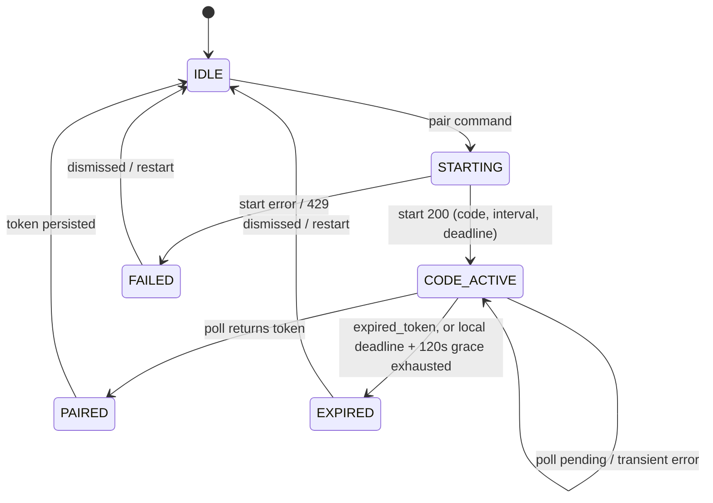
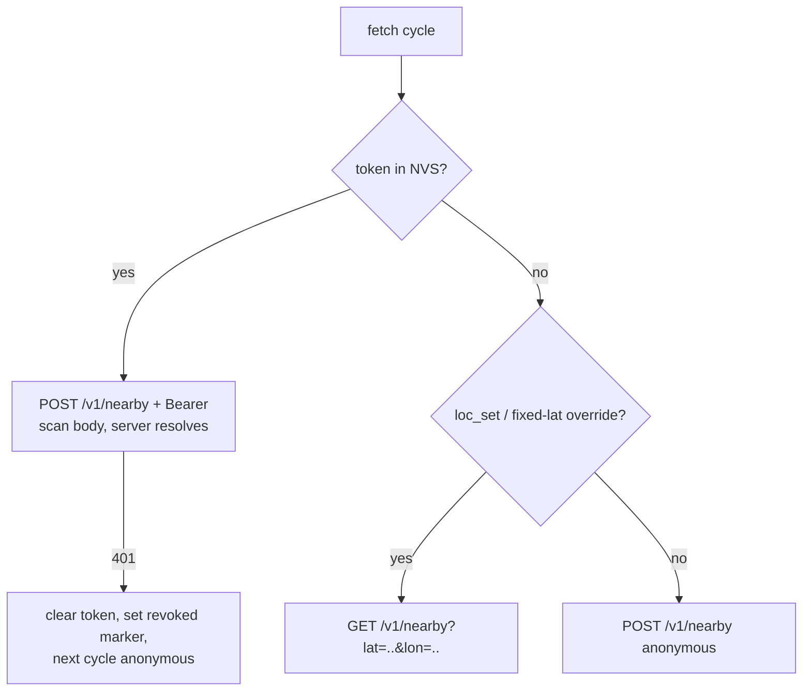

# feat: Firmware RFC 8628 pairing + device token

## Summary

Give the board a device identity: a console-initiated RFC 8628 pairing flow that displays the user code on screen, stores the issued token in NVS, and sends it as a Bearer header on `/v1/nearby` — with an honest on-screen "unpaired" state when the token is revoked. Includes one small server change (`/v1/nearby` returns 401 for a presented-but-invalid device token) and pins the wake-cadence/freshness contract shared with the M3 power epic (gc-g6f).

---

## Problem Frame

The phone-relay feature (Phase 5 M3, deployed in PRs #13/#14) is unreachable from the only device that exists. `firmware/main/net_task.c` sets exactly one header on its `/v1/nearby` POST, so every board resolves anonymously and the phone provider — which requires a device credential carrying `read:fix` — never runs. A second blocker in the same file: with `loc_set`/`CONFIG_GC_DEV_FIXED_LAT` active, the board builds `GET /v1/nearby?lat=..&lon=..` and supplies coordinates itself, bypassing server-side resolution entirely.

Research invalidated one bead assumption: `/v1/nearby` is anonymous-capable and does not pass through `authorize()`, so a revoked or unknown `gtfsc_dev_` token today produces a silent anonymous 200, not a 401. The revocation signal has to be created (decision: make nearby 401 on a presented-but-invalid token) rather than merely handled.

Only after this epic does gc-x8n.4 (render provider/age from `quality`/`captured_at`) have anything to render, and only then does gc-cls (freshness instrumentation) read anything but zeros.

---

## Requirements

**Pairing flow**

- R1. A `pair` console command starts a session: `POST /v1/device/pair/start`, then poll `POST /v1/device/pair/poll` with `Authorization: Bearer <device_code>` at the advertised `interval` (5 s) until token, expiry (`expires_in` 300 s), or error.
- R2. While a session is active, the board shows a pairing screen with the dash-formatted 8-character `user_code` and remaining time; the `device_code` is never displayed or logged.
- R3. Poll semantics per RFC 8628 §3.5 on HTTP 400: `authorization_pending` → keep polling; `expired_token` → session over, screen shows expired with restart instruction; network errors and 429 → keep the 5 s cadence, never tighter.
- R4. On success, the `access_token` is stored verbatim (`gtfsc_dev_` prefix included) in NVS and used from the next fetch onward. Returned scopes are informational only — the firmware never assumes `read:fix`. The token is never logged or displayed in full (mirroring R2's `device_code` rule); console surfaces report presence, not value.

**Authenticated requests and revocation**

- R5. Every `/v1/nearby` request from a token-holding board carries `Authorization: Bearer <token>`; the token never appears in a URL.
- R6. Server change: `/v1/nearby` returns 401 when a presented device token is invalid or revoked. Requests with no Authorization header stay byte-identical anonymous (regression-guarded).
- R7. Firmware on 401: clear the stored token, record a local "was revoked" marker, continue anonymously on the next cycle without hard failure, and surface an unpaired indicator on screen.
- R8. The rotation header (`X-GC-Device-Token`) is ignored this epic (bead decision; no route emits it).

**Location-resolution honesty**

- R9. A token-holding board always uses server-side resolution (POST with scan body). The fixed-location override (`loc_set` / `CONFIG_GC_DEV_FIXED_LAT`) applies only when no token is stored; `gc_status` reports both the override and pairing state.
- R10. Mode filtering behavior is preserved across the override rework (the GET branch is the only place `modes=` exists today; the POST path's server-default of all modes is equivalent and acceptable).

**UI honesty**

- R11. "Unpaired after revocation" renders as its own state (chip variant or marker), distinct from stale, offline, and no-location — extending the Snapshot null-vs-empty convention. A never-paired board shows no such indicator. When states coincide, unpaired outranks offline and no-location in the single-valued chip: a revoked token is a durable user-facing fact, a connectivity blip is transient.

**Shared contract with M3**

- R12. The wake-cadence/freshness contract is written down (this plan + CONCEPTS.md): a relayed fix reads `current` at ≤120 s (`FIX_HORIZON_S`), serves `last_known` to 4 h (`FIX_LAST_KNOWN_MAX_AGE_S`), and is refused past that. The 4 h ceiling is added to CONCEPTS.md (currently absent) and a note lands on gc-g6f.

**Open-source hygiene**

- R13. README gains pairing instructions for the firmware section — pair, approve in the config UI, then grant `read:fix` from the device list to activate the relay (a fresh pairing carries no location scope by design) — plus unpair behavior; `.env.example` is confirmed unchanged (no new env vars on either side).

---

## Key Technical Decisions

- **Revocation signal = nearby 401s on presented-but-invalid tokens** (Mario, this session): the alternatives — probing a gated route, or inferring from missing `quality` fields — cost an extra request or violate labeled honesty. Headerless anonymous requests keep the shipped byte-identical contract.
- **Pairing entry = console command** (Mario, this session): anonymous boards are fully functional, so auto-showing a pairing screen on untokened boot would regress M1/M2. A gesture/settings surface is deferred as new design territory outside the handoff doc.
- **Rotation header ignored** (Mario, this session, per bead): adopt when the server implements rotation; the header contract exists so that adoption is non-breaking.
- **Pairing state machine is a pure, host-testable module**: following the `ui_state.c`/`ui_nav.c` discipline, the FSM owns transitions and next-action decisions; `net_task` executes HTTP and feeds results back. This makes the protocol edge cases (pending, expired, network flake, restart) testable without hardware.
- **Token storage extends the `wifi_creds.c` NVS pattern**: namespace `"gc"`, small get/set/clear triplet, NVS wins over compile-time seeds. On 401 the token is erased and a `revoked` marker is set (cleared on next successful pair) — locally the board *can* distinguish "had a token, lost it" from "never paired" even though the wire cannot.
- **Override precedence: token beats override**: pairing is an explicit user action expressing intent to use server-side resolution (and eventually the relay). Making the override unpaired-only removes the "must `loc_clear` before testing the relay" trap while keeping the desk-testing tool for unpaired boards.
- **Pairing polls interleave with normal fetches inside `net_task`**: the single-network-task discipline holds; the per-fetch `esp_http_client` init/cleanup pattern makes interleaving cheap, and the board stays functional during a pairing session.

---

## High-Level Technical Design

Pairing flow, end to end:

```mermaid
sequenceDiagram
    participant C as console (pair cmd)
    participant N as net_task
    participant S as Worker API
    participant U as UI (LVGL side)
    C->>N: start-pairing signal
    N->>S: POST /v1/device/pair/start
    S-->>N: user_code, device_code, interval 5s, expires_in 300s
    N-->>U: pairing state (code, deadline) via queue
    loop every interval, until token/expiry
        N->>S: POST /v1/device/pair/poll (Bearer device_code)
        S-->>N: 400 authorization_pending | 200 access_token | 400 expired_token
    end
    N->>N: store token in NVS (gtfsc_dev_...)
    N-->>U: paired; return to prior view
    N->>S: POST /v1/nearby (Bearer gtfsc_dev_...)
```

Pairing FSM (pure module; directional, not implementation specification):



Request-path decision each poll cycle:



---

## Implementation Units

### U1. API: 401 on presented-but-invalid device tokens

- **Goal:** `/v1/nearby` rejects a request carrying an invalid/revoked `gtfsc_dev_` token with 401 instead of silently serving it anonymously.
- **Requirements:** R6
- **Dependencies:** none
- **Files:** `api/src/routes/nearby.ts`, `api/test/workers/nearby.test.ts`, `api/test/workers/locate.test.ts`
- **Approach:** Gate in `routeNearby` itself, leaving `resolveCredential`'s exported contract untouched: when the request carries a non-null `Authorization` header and the resolved credential is not a device credential, return 401 before composing. This covers invalid/revoked `gtfsc_dev_` tokens, non-Bearer headers, empty Bearer, and non-device Bearer strings uniformly, works in both `AUTH_MODE` settings, and leaves `/v1/locate`'s DIAG and anonymous call sites provably unaffected — the shared `resolveCredential` seam must not change return shape. Session-cookie handling and headerless requests are untouched. Revoked and never-existed tokens stay indistinguishable in the response (Unpair concept).
- **Test scenarios:**
  - Valid device token with a stored fix → 200 with `provider`/`quality` (existing behavior preserved).
  - Revoked token → 401. Never-existed well-formed `gtfsc_dev_` token → 401 with identical body.
  - Malformed Authorization header (non-Bearer, empty Bearer) → 401.
  - No Authorization header → 200, byte-identical anonymous response (regression pin, extends the existing R10/AE9 guard; exercise under the `AUTH_MODE` the production Worker runs).
  - Session-cookie request (config-ui path) unaffected by the change.
  - `/v1/locate` with a malformed or invalid device token → behavior unchanged and byte-identical (regression pin on the shared `resolveCredential` seam).
- **Verification:** `api` test suite green; deployed before U4 hardware verification so the 401 path is real.

### U2. Pairing FSM (pure, host-testable)

- **Goal:** A platform-free pairing state machine encoding the RFC 8628 client protocol: states, timing, and next-action outputs.
- **Requirements:** R1, R3
- **Dependencies:** none
- **Files:** `firmware/components/model/pair_fsm.c`, `firmware/components/model/include/pair_fsm.h`, `firmware/components/model/CMakeLists.txt`, `firmware/test/host/test_pair_fsm.c`, `firmware/test/host/CMakeLists.txt`
- **Approach:** Inputs are events (start command, start response, poll outcome, tick with current time); outputs are the state plus a next-action (send start, poll at deadline, persist token, give up). No HTTP, no NVS, no LVGL — `net_task` executes actions. The local `expires_in` deadline is a backstop, not a verdict: the server extends collection by 120 s after a claim (`PAIR_DELIVERY_TTL_S`), so the FSM keeps polling through that grace window and only the server's `expired_token` (or grace exhaustion) ends the session. Placement in `components/model` follows the existing host-test compile list; a sibling component is fine if cleaner at implementation time.
- **Test scenarios:**
  - Happy path: start → code active → N pending polls → token → PAIRED; poll spacing asserts a floor at the advertised interval (never sooner — exact spacing may jitter with WiFi scans).
  - `expired_token` mid-session → EXPIRED; restart from EXPIRED begins a fresh session with a new code.
  - Local deadline (`expires_in`) passes with no server verdict → polling continues at cadence through a 120 s grace window; EXPIRED only on server `expired_token` or grace exhaustion (a last-second browser approval must still pair).
  - Poll returns 200 with a malformed or token-less body → treated as transient, stays CODE_ACTIVE (a proxy hiccup must not kill the session).
  - Transient poll failure (network error, 429) → stays CODE_ACTIVE, next poll no sooner than the interval (never tightens cadence).
  - Start failure / 429 on start → FAILED, no poll ever issued.
  - Token arrives → exactly one persist action emitted (idempotent against duplicate poll responses), and the persist action clears the revoked marker (a revoked-then-repaired board shows no unpaired chip).
- **Verification:** host test binary green under ASan.

### U3. net_task pairing execution, token NVS, console command

- **Goal:** The board can actually pair: console `pair` starts a session, `net_task` drives the FSM over HTTPS, and the token lands in NVS.
- **Requirements:** R1, R2 (state published for UI), R4
- **Dependencies:** U2
- **Files:** `firmware/main/net_task.c`, `firmware/main/net_task.h`, `firmware/main/wifi_creds.c`, `firmware/main/wifi_creds.h`, `firmware/main/console.c`, `firmware/main/main.c`
- **Approach:** Extend the NVS triplet pattern with `gc_token_get/set/clear` plus the `revoked` marker (namespace `"gc"`; both NVS-persisted, so the marker survives reboots until the next successful pair clears it). Console gains `pair` (and a `token_clear` debug command). No runtime console→net_task channel exists today — this unit introduces one: the command signals `net_task` via a FreeRTOS task notification or small command queue, and the loop's fixed 30 s `vTaskDelay` becomes an interruptible timed wait whose timeout is the sooner of the next fetch deadline and the FSM's next action deadline. That restructuring is what makes the 5 s pairing cadence coexist with the 30 s fetch cadence. Re-issuing `pair` while a session is CODE_ACTIVE re-displays the existing code and remaining time; it never starts a new session. Pairing state (phase, `user_code` string, seconds remaining) publishes by extending `gc_net_msg_t`, with the queue contract pinned: every published message carries the complete current state (net status, model pointer, pairing state) so the length-1 overwrite queue can never drop a dimension. The `device_code` lives only in `net_task` memory and is never logged; the `access_token` is likewise never logged in full — `gc_status` and console output report pairing state and token presence (prefix and device_id at most), never the value.
- **Test scenarios:** protocol logic is covered by U2's host tests; this unit's HTTP/NVS glue is hardware-verified.
  - `Test expectation: none beyond U2 — glue layer; hardware verification below.`
- **Verification:** on hardware against the deployed Worker: `pair` produces a code on the console and screen; approving it in the config UI lands a token in NVS (`gc_status` reports its presence, never its value); reboot keeps the token; gc-x8n.3 (browser verification, tracked in the gc-x8n epic) covers the end-to-end approval.

### U4. Authenticated nearby, 401 fallback, override precedence

- **Goal:** Token-holding boards send `Authorization: Bearer` on every nearby fetch, always via server-side resolution; 401 drops cleanly to anonymous with the revoked marker set.
- **Requirements:** R5, R7, R9, R10
- **Dependencies:** U1 (server 401 exists), U3 (token in NVS)
- **Files:** `firmware/main/net_task.c`, `firmware/test/host/test_pair_fsm.c` (or a small sibling host test for the request-plan helper)
- **Approach:** Restructure `fetch_once()`'s branch at the fixed-lat override: the decision becomes a small pure helper (token present? override set?) per the request-path flowchart, so precedence is host-testable. Token present → POST with scan + Bearer header, override ignored. No token → current behavior (override GET, else anonymous POST). On 401: clear token, set revoked marker, publish the unpaired status, retry anonymously next cycle — never a hard failure or reboot. 422 keeps mapping to `GC_NET_NO_LOCATION`.
- **Test scenarios:**
  - Request-plan helper: (token, override) → POST+auth; (no token, override) → GET fixed; (no token, no override) → anonymous POST; (token, no override) → POST+auth.
  - 401 status mapping: distinct from OFFLINE mapping (existing non-200 → OFFLINE must not swallow 401).
- **Verification:** on hardware: pair, then grant `read:fix` from the config UI device list — without this grant the relay stays dark by design, and the epic's goal is unmet even with everything else working. With the grant in place: a paired board with `loc_set` active still POSTs (relay reachable without `loc_clear`); revoking the device in the config UI flips the board to anonymous + unpaired indicator within one poll cycle; anonymous operation continues normally afterward.

### U5. UI: pairing screen and unpaired state

- **Goal:** A pairing screen showing the dash-formatted user code and countdown while a session is active, and a distinct unpaired-after-revocation indicator.
- **Requirements:** R2, R11
- **Dependencies:** U3 (pairing state reaches the UI side)
- **Files:** `firmware/components/ui/include/ui_state.h`, `firmware/components/ui/ui_state.c`, `firmware/components/ui/ui_views.c`, `firmware/components/ui/ui_nav.c`, `firmware/test/host/test_nav.c`
- **Approach:** New `ui_view_t` member rendered via the existing (view, sys) dispatch; full-screen states (skeleton, empty, no-location) are the layout precedent. STARTING reuses the existing skeleton/loading pattern; FAILED renders the same session-over screen as EXPIRED, with the restart instruction. The user code renders in a full-alphabet face — `gc_plex_40` today; generating a larger face via `firmware/tools/genfonts.sh` is an implementation-time choice (the hero face is a digits-only subset and cannot render consonants). The countdown decrements locally in the UI's existing 1 s tick from the published deadline (the departures minutes convention) rather than relying on per-second publishes. The revoked marker renders as a chip variant alongside the existing `…`/`offline`/`no location` states, with the R11 precedence rule (unpaired outranks offline/no-location). Reconcile rules in `ui_state.c`: active pairing session forces the pairing view; completion or dismissal returns to the prior view; model updates during pairing do not steal the screen; re-issuing `pair` re-displays the active session's code after a dismiss.
- **Execution note:** budget layout depth against the 16 KB LVGL task stack and verify the first pairing-screen render on hardware with TLS traffic active — this exact combination produced M1's worst crash class, and the simulator structurally cannot catch it.
- **Test scenarios:**
  - Reconcile: pairing-active state forces pairing view from any (view, sys); PAIRED/EXPIRED/dismiss restores the prior view exactly.
  - Reconcile: a model apply arriving mid-pairing leaves the pairing view in place.
  - Nav: back/swipe gestures on the pairing screen dismiss without cancelling the session (session lifecycle belongs to the FSM, not the view).
  - Chip: revoked marker → unpaired variant; never-paired → no indicator; unpaired renders distinctly from stale/offline/no-location.
- **Verification:** host tests green; on hardware, code is legible and matches the config UI prompt; sim spot-check for layout only.

### U6. Shared contract docs and hygiene

- **Goal:** The wake-cadence/freshness contract is written down where M3 planning will find it; README and CONCEPTS.md reflect the new reality.
- **Requirements:** R12, R13
- **Dependencies:** none (can land with any unit)
- **Files:** `CONCEPTS.md`, `README.md`
- **Approach:** CONCEPTS.md: extend the Fix Quality concept with the 4 h refusal ceiling (`FIX_LAST_KNOWN_MAX_AGE_S`, `api/src/relay.ts`) and add Pairing/Device Token terms if absent. README: firmware section gains pairing instructions (console `pair`, config-UI approval, the `read:fix` grant step, unpair behavior) and notes two expected behaviors: re-pairing an already-paired board leaves the previous device row active server-side until revoked from the config UI, and a paired board at a scan-blind desk (previously served by `loc_set`) shows no-location until a phone fix lands. Update gc-g6f with a note pointing at this plan's contract section, and confirm `.env.example` needs nothing.
- **Test scenarios:** `Test expectation: none — documentation unit.`
- **Verification:** M3 planning can start from the contract section without re-deriving the constants; README pairing steps work as written.

---

## Wake-Cadence / Freshness Contract (shared with gc-g6f)

The relay's constants (`api/src/relay.ts`) are the fixed side of the contract: a relayed fix is `current` at ≤120 s, `last_known` to 4 h, refused past 4 h. The board's side — how often it asks — is what M3 chooses.

- Today (this epic): the board polls every 30 s while awake, so a paired board consumes a phone fix within one `FIX_HORIZON_S` window of it landing. No cadence change is part of this epic.
- M3's constraint: Mario's stated goals are motion-activated wake, minimal phone battery, and never pulling the phone out. That points at movement-triggered phone posting (iOS significant-location-change or a leave-home Shortcut), not a heartbeat. The contract M3 must honor: a glance that follows human movement will usually find a `last_known` fix (minutes-to-hours old, inside the 4 h window) — so the board renders age honestly (gc-x8n.4) rather than expecting `current`, and M3's wake pattern must not assume the phone posts on any schedule.
- Measurement caveat carried from gc-g6f's notes: power-model measurements taken before this epic lands do not reflect the real request pattern (authenticated nearby costs extra D1 reads and a possible `last_used_at` write).

---

## Scope Boundaries

**In scope:** everything under Implementation Units, including the single server change (U1).

**Deferred to follow-up work**

- Rotation header adoption (`X-GC-Device-Token` persist-and-switch) — when the server implements rotation.
- A gesture/settings pairing entry on the device — new interaction design outside the handoff doc; console entry is sufficient for the current single-user reality.
- Bearer auth on `/v1/locate` — the firmware does not call it; revisit if that changes.
- Flash encryption for the stored token — the guiding spec's standing caveat; mitigated by narrow scopes and `read:fix` defaulting off. No new work here.
- M3 implementation (IMU wake, deep sleep, AXP2101 rails) — stays in gc-g6f; this plan only pins the shared contract.
- Freshness instrumentation (gc-cls) and quality/age rendering (gc-x8n.4) — unblocked by this epic, tracked separately.

---

## Risks & Dependencies

- **LVGL stack overflow on first pairing render** — the M1 crash class; mitigated by shallow layout and the U5 execution note. Symptom signature if hit: corrupted-backtrace `vTaskSwitchContext` panic.
- **TLS heap pressure from interleaved pairing polls** — pairing adds a 5 s HTTPS cadence on top of the 30 s fetch for up to 300 s; the per-fetch internal-heap logging is the watchpoint. If headroom shrinks dangerously, serialize pairing polls with fetches instead of interleaving.
- **The nearby 401 change touches other token presenters** — config-ui and phone posts are session-authenticated and unaffected; only device tokens hit this path. The byte-identical anonymous regression test is the guard.
- **Pairing under flaky WiFi** — sessions die at 300 s; the EXPIRED screen must make restarting obvious (one console command).
- **Deploy ordering** — U1 must be deployed to the production Worker before U4's hardware verification; until then a revoked token still yields silent anonymous 200s.

---

## Sources & Research

- Bead gc-0u6 (epic, this plan) and gc-g6f (M3 coupling notes) — problem statement and contract coupling.
- `api/src/routes/pair.ts`, `api/src/auth.ts` (`resolveDeviceToken`, `DEVICE_TOKEN_ROTATION_HEADER`), `api/src/relay.ts` (`FIX_HORIZON_S`, `FIX_LAST_KNOWN_MAX_AGE_S`), `api/src/locate.ts` (provider chain), `api/src/routes/nearby.ts` — the deployed contract this firmware consumes.
- `firmware/main/net_task.c` (`fetch_once`, override branch, status mapping), `firmware/main/wifi_creds.c` (NVS pattern), `firmware/main/console.c` (command registration), `firmware/components/ui/` (view dispatch, `ui_state.c` reconcile discipline, fonts in `gc_fonts.h`).
- `docs/plans/2026-08-03-004-feat-phase-5-accounts-pairing-relay-plan.md` — server-side design, firmware definition-of-done, flash-encryption posture.
- `docs/solutions/hardware-issues/waveshare-bsp-qspi-flush-ready-race.md` — the TLS-heap/LVGL-stack crash class behind U5's execution note.
- `docs/solutions/architecture-patterns/durable-object-alarm-loop-discipline.md` — the null-vs-empty status convention R11 extends.
- CONCEPTS.md — Device Scope, Unpair, Fix Quality, Relay Seam, Snapshot: canonical terms used throughout.
